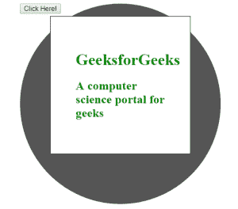
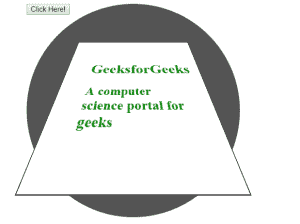

# HTML | DOM 样式透视属性

> 原文:[https://www . geesforgeks . org/html-DOM-style-perspective-property/](https://www.geeksforgeeks.org/html-dom-style-perspective-property/)

HTML DOM 中的**样式透视属性**用于确定元素距离 **Z** 平面的距离。它提供元素的三维视图。

**语法:**

*   它返回透视属性。

    ```html
    object.style.perspective
    ```

*   它设置透视属性。

    ```html
    object.style.perspective = "none|length|initial|inherit"
    ```

**属性值:**

*   **无:**为默认值。它将视角设置为零或视角未设置。
*   **长度:**设置从视图中放置元素的距离。
*   **初始:**它将元素设置为其初始位置。
*   **继承:**元素从父元素继承其属性。

**示例:**本示例显示了 DOM 样式的透视属性。

```html
<!DOCTYPE html>
<html>

<head>

    <style>
        #circle {
            height: 400px;
            width: 400px;
            margin-left: 50px;
            background-color: #555;
            border-radius: 50%;
        }
        #container {
            padding: 50px;
            margin: 0 60px;
            border: 1px solid black;
            background-color: white;
            transform: rotateX(15deg);
        }
        h1, h2 {
            color:green;
            font-weight:bold;
        }
    </style>
</head>

<body>
    <div id="circle">

        <button onclick="myGeeks()"> 
            Click Here! 
        </button> 

        <div id="container">
            <h1>GeeksforGeeks</h1>

            <h2>
                A computer science portal for geeks
            </h2>
        </div>
    </div>

    <!-- Script to display perspective property -->
    <script>
        function myGeeks() {
            document.getElementById("circle").style.perspective
                    = "100px";
        }
    </script>
</body>

</html>                    
```

**输出:**
**点击按钮前:**

**点击按钮后:**


**支持的浏览器:***DOM Style 透视属性*支持的浏览器如下:

*   谷歌 Chrome 36.0
*   Internet Explorer 10.0
*   Firefox 16.0
*   Safari 6.1
*   Opera 23.0