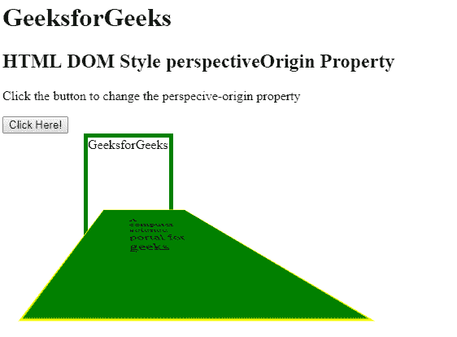
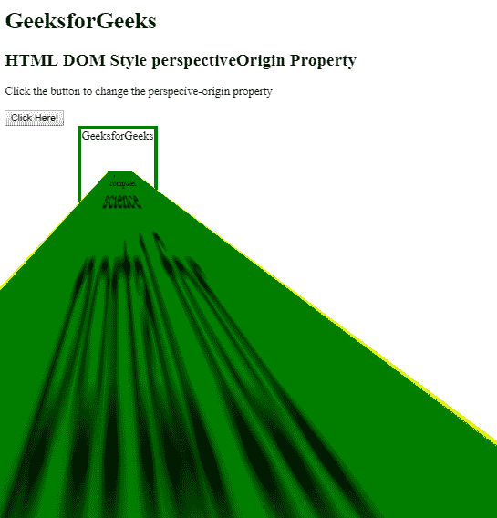
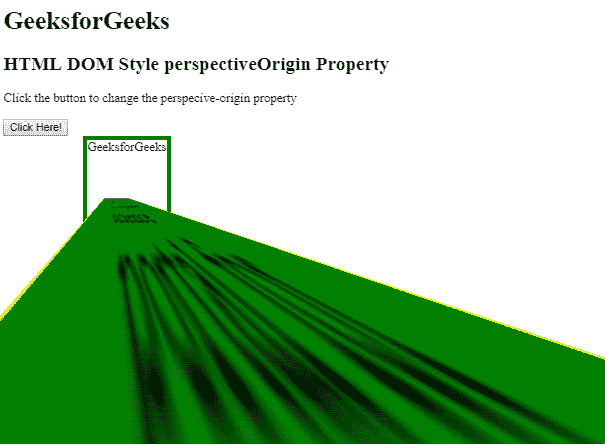

# HTML | DOM 样式透视图原点属性

> 原文:[https://www . geesforgeks . org/html-DOM-style-perspectivorigin-property/](https://www.geeksforgeeks.org/html-dom-style-perspectiveorigin-property/)

HTML DOM 中的 **perspectiveOrigin** 属性用于描述基于 x 轴和 y 轴的 3D 元素的精确位置。该属性可以更改三维元素的底部位置。**透视原点**属性定义了一个元素，实际定位的是子元素，而不是绝对的父元素本身。

**语法:**

*   它返回透视原点属性。

    ```html
    object.style.perspectiveOrigin
    ```

*   它用于设置透视原点属性。

    ```html
    object.style.perspectiveOrigin = "x-axis y-axis|initial|inherit"
    ```

**返回值:**返回一个字符串值，代表元素的透视原点属性

**属性值:**

*   **x 轴:**表示透视原点的水平位置。x 轴的可能值如下所示:
    *   **百分比(%):** 用百分比设置 x 轴。
    *   **长度:**定义 x 轴的长度。
    *   **左侧:**设置 x 轴左侧位置。
    *   **中心:**设置 x 轴的位置中心。
    *   **右:**我把 x 轴的位置设置对了。
*   **y 轴:**表示透视原点的垂直位置。y 轴的可能值如下所示:
    *   **百分比(%):** 用百分比来设定 y 轴的位置。
    *   **长度:**根据长度设置位置。
    *   **顶部:**设置 y 轴的顶部位置。
    *   **中心:**设置 y 轴的中心位置。
    *   **底部:**设置 y 轴的底部位置。
*   **初始值:**将透视原点属性设置为默认值。
*   **继承:**透视原点属性从其父属性继承。

**例 1:** 用于设置 DOM 样式的 perspectiveOrigin 属性。

```html
<!DOCTYPE html> 
<html> 

<head> 
    <title> 
        HTML DOM Style perspectiveOrigin Property
    </title> 

    <style>
        #box1 {
            margin-left: 100px;
            height: 150px;
            width: 100px;
            border: 5px solid green;

            /* For Chrome, Safari, Opera browsers */
            -webkit-perspective: 150px; 
            perspective: 150px;
        }

        #box2 {
            padding: 50px;
            position: absolute;
            border: 1px solid yellow;
            background-color: green;

            /* For Chrome, Safari, Opera browsers */
            -webkit-transform: rotateX(80deg);
            transform: rotateX(80deg);
        }
    </style>
</head>

<body> 
    <h1>GeeksforGeeks</h1> 

    <h2>
        HTML DOM Style perspectiveOrigin Property
    </h2> 

    <p>
        Click the button to change the
        perspecive-origin property
    </p>

    <button onclick="myGeeks()">
        Click Here!
    </button>

    <div id="box1">GeeksforGeeks
        <div id="box2">
            A computer science portal for geeks
        </div>
    </div>

    <!-- script to set perspectiveOrigin property -->
    <script>
        function myGeeks() {

            // For Chrome, Safari and Opera browsers
            document.getElementById("box1").style.WebkitPerspectiveOrigin
                    = "30px 10%"; 

            document.getElementById("box1").style.perspectiveOrigin
                    = "30px 10%";
        }
    </script>
</body> 

</html>                                
```

**输出:**
**点击按钮前:**

**点击按钮后:**


**例 2:** 用于设置 DOM 样式的 perspectiveOrigin 属性。

```html
<!DOCTYPE html> 
<html> 

<head> 
    <title> 
        HTML DOM Style perspectiveOrigin Property
    </title> 

    <style>
        #div1 {
            margin-left:100px;
            height: 100px;
            width: 100px;
            border: 5px solid green;

            /* For Chrome, Safari and Opera browsers */
            -webkit-perspective: 25px; 
            perspective: 25px;
        }

        #div2 {
            padding: 30px;
            position: absolute;
            border: 1px solid yellow;
            background-color: green;

            /* For Chrome, Safari and Opera browsers */
            -webkit-transform: rotateX(75deg);
            transform: rotateX(75deg);
        }
    </style>

    <body> 
        <h1>GeeksforGeeks</h1> 

        <h2>
            HTML DOM Style perspectiveOrigin Property
        </h2> 

        <p>
            Click the button to change the
            perspecive-origin property
        </p>

        <button onclick="myGeeks()">Click Here!</button>

        <div id="div1">GeeksforGeeks
            <div id="div2">
                A computer science portal for geeks
            </div>
        </div>

        <script>

        function myGeeks() {

            /* For Chrome, Safari and Opera browsers */
            document.getElementById("div1").style.WebkitPerspectiveOrigin
                    = "30% 70%";

            document.getElementById("div1").style.perspectiveOrigin
                    = "30% 70%";
        }
    </script>
</body> 

</html>                    
```

**输出:**
**之前点击按钮:**

**之后点击按钮:**


**支持的浏览器:***DOM Style perspective origin 属性*支持的浏览器如下:

*   谷歌 Chrome 36.0
*   互联网浏览器 10.0/边缘
*   Firefox 16.0
*   Opera 23.0
*   苹果 Safari 6.1