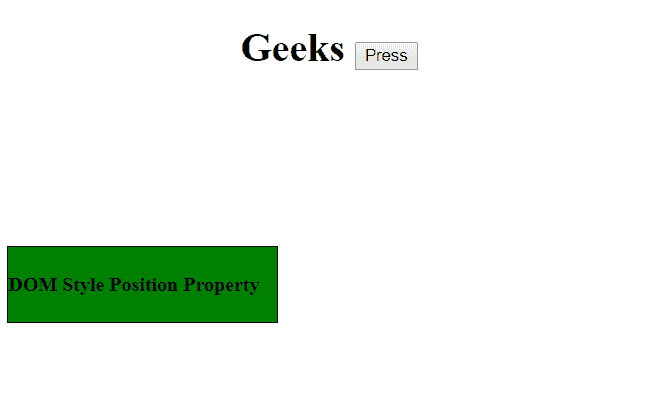

# HTML | DOM 样式位置属性

> 原文:[https://www . geesforgeks . org/html-DOM-style-position-property/](https://www.geeksforgeeks.org/html-dom-style-position-property/)

**位置属性** *设置*或*返回*元素使用的定位方法类型。它可以是静态的、相对的、绝对的或固定的。

**语法:**

*   返回位置语法:

    ```html
    object.style.position
    ```

*   设置位置语法:

    ```html
    object.style.position = "static | absolute | fixed | relative | 
    sticky | initial | inherit"
    ```

**返回值:**返回表示元素位置类型的字符串。

**属性:**

1.  **static:** It is the default property. The appearance of elements in the document remains static in accordance with the document flow.
    **Example:**

    ```html
    <!DOCTYPE html>
    <html>

    <head>
        <h1>
          <center>Geeks 
             <button onclick="position()">
              Press
             </button>
          </center> 
      </h1>
        <br>

        <style>
            #gfg {
                border: 1px solid black;
                background-color: green;
                width: 215px;
                height: 60px;
                position: relative;
                top: 100px;
            }
        </style>
    </head>

    <body>

        <div id="gfg">

                <h4>DOM Style Position Property</h4>

        </div>

        <script>
            function position() {

                //  change position from reletive 
                //  to static.
                document.getElementById(
                  "gfg").style.position = "static";
            }
        </script>

    </body>

    </html>
    ```

    **输出:**

    *   点击按钮前:
        
    *   点击按钮后:
        
2.  **absolute:** It positions the element relative to the first positioned element.
    **Example:**

    ```html
    <!DOCTYPE html>
    <html>

    <head>
        <h1>
          <center>Geeks
             <button onclick="position()">
              Press
             </button>
          </center> 
      </h1>
        <br>

        <style>
            #gfg {
                border: 1px solid black;
                background-color: green;
                width: 215px;
                height: 60px;
                position: relative;
                top: 100px;
            }
        </style>
    </head>

    <body>

        <div id="gfg">
            <p>
                <h4>DOM Style Position Property</h4></p>

        </div>

        <script>
            function position() {

                //  Set position from
                //  reletive to absolute.
                document.getElementById(
                  "gfg").style.position = "absolute";
            }
        </script>

    </body>

    </html>
    ```

    **输出:**

    *   点击按钮前:
        
    *   点击按钮后:
        
3.  **fixed:** It positions the elements relative to the browser window.
    **Example:**

    ```html
    <!DOCTYPE html>
    <html>

    <head>
        <h1>
         <center>Geeks 
             <button onclick="position()">
              Press
             </button>
          </center>
      </h1>
        <br>

        <style>
            #gfg {
                border: 1px solid black;
                background-color: green;
                width: 215px;
                height: 60px;
                position: relative;
                top: 100px;
            }
        </style>
    </head>

    <body>

        <div id="gfg">
             <h4>DOM Style Position Property</h4>
        </div>

        <script>
            function position() {
                document.getElementById(
                  "gfg").style.position = "fixed";
            }
        </script>

    </body>

    </html>
    ```

    **输出:**

    *   点击按钮前:
        
    *   点击按钮后:
        
4.  **relative:** It positions the elements relative to the normal position, so “right:40” signifies an addition of 40 pixels to the element’s RIGHT position.
    **Example:**

    ```html
    <!DOCTYPE html>
    <html>

    <head>
        <h1>
        <center>Geeks 
             <button onclick="position()">
              Press
             </button>
          </center> 
      </h1>
        <br>

        <style>
            #gfg {
                border: 1px solid black;
                background-color: green;
                width: 215px;
                height: 60px;
                position: relative;
                top: 100px;
            }
        </style>
    </head>

    <body>

        <div id="gfg">
           <h4>DOM Style Position Property</h4>

        </div>

        <script>
            function position() {
                document.getElementById(
                  "gfg").style.position = "relative";
            }
        </script>

    </body>

    </html>
    ```

    **输出:**

    *   点击按钮前:
        
    *   点击按钮后:
        
5.  **sticky:** It positions the elements based on the scroll position of the user.The scrolling operation is performed between relative and fixed property values. By default, the scroll position is set at relative value.
    **Example:**

    ```html
    <!DOCTYPE html>
    <html>

    <head>
        <h1>
        <center>Geeks 
             <button onclick="position()">
              Press
             </button>
          </center> 
        </h1>
        <br>

        <style>
            #gfg {
                border: 1px solid black;
                background-color: green;
                width: 215px;
                height: 60px;
                position: relative;
                top: 100px;
            }
        </style>
    </head>

    <body>

        <div id="gfg">
                <h4>DOM Style Position Property</h4>
        </div>

        <script>
            function position() {
                document.getElementById(
                  "gfg").style.position = "sticky";
            }
        </script>

    </body>

    </html>
    ```

    **输出:**

    *   点击按钮前:
        
    *   点击按钮后:
        

    **注意:** Internet Explore 不支持该属性值，Apple Safari 从 6.1 版本开始支持该属性。

6.  **initial:** It sets the position to it’s default value.
    **Example:**

    ```html
    <!DOCTYPE html>
    <html>

    <head>
        <h1>
        <center>Geeks 
             <button onclick="position()">
              Press
             </button>
          </center> 
      </h1>
        <br>

        <style>
            #gfg {
                border: 1px solid black;
                background-color: green;
                width: 215px;
                height: 60px;
                position: relative;
                top: 100px;
            }
        </style>
    </head>

    <body>

        <div id="gfg">
           <h4>DOM Style Position Property</h4>

        </div>

        <script>
            function position() {
                document.getElementById(
                  "gfg").style.position = "initial";
            }
        </script>

    </body>

    </html>
    ```

    **输出:**

    *   点击按钮前:
        
    *   点击按钮后:
        
7.  **inherit:** It inherits the position values of the parent element.
    **Example:**

    ```html
    <!DOCTYPE html>
    <html>

    <head>
        <h1>
        <center>Geeks 
             <button onclick="position()">
              Press
             </button>
          </center> 
      </h1>
        <br>

        <style>
            #gfg {
                border: 1px solid black;
                background-color: green;
                width: 215px;
                height: 60px;
                position: relative;
                top: 100px;
            }
        </style>
    </head>

    <body>

        <div id="gfg">
                <h4>DOM Style Position Property</h4>

        </div>

        <script>
            function position() {
                document.getElementById(
                  "gfg").style.position = "inherit";
            }
        </script>

    </body>

    </html>
    ```

    **输出:**

    *   点击按钮前:
        
    *   点击按钮后:
        

    **浏览器支持:**T2 DOM 位置属性支持的浏览器如下:

    *   谷歌 Chrome
    *   微软公司出品的 web 浏览器
    *   火狐浏览器
    *   歌剧
    *   旅行队