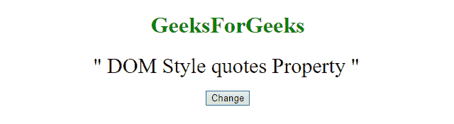
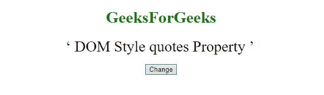
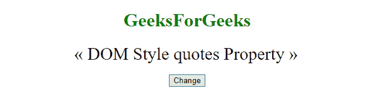

# HTML | DOM 样式引用属性

> 原文:[https://www . geesforgeks . org/html-DOM-style-quotes-property/](https://www.geeksforgeeks.org/html-dom-style-quotes-property/)

HTML DOM 中的**样式引用属性**用来表示 HTML [< q >](https://www.geeksforgeeks.org/html-q-tag/) 元素。
此标签用于设置/返回嵌入报价的引号类型。可以使用 **getElementById()** 方法访问该元素。

**语法:**

*   获取属性:

    ```html
    object.style.quotes
    ```

*   设置属性:

    ```html
    object.style.quotes = "none|string string string string|
    initial|inherit"

    ```

**返回值:**返回< q >标签的报价类型。

**属性值:**

*   **无:**此为默认。它指定开引号和闭引号的值不会产生任何引号。
*   **字符串字符串字符串:**指定要使用的引号。前两个值定义了第一级报价嵌入，后两个值定义了第二级报价嵌入，等等
*   **初始值:**将该属性设置为默认值。
*   **继承:**从其父元素继承该属性。

**引号字符和实体编号:**

| 引号 | 实体编号 |
| 双引号 | \0022 |
| 单引号 | \0027 |
| 单引号，左引号 | \2039 |
| 单个直角引用 | \203A |
| 双左引号 | \00AB |
| 双，直角引用 | \00BB |
| 左引号(单高-6) | \2018 |
| 右引号(单高-9) | \2019 |
| 左引号(双高-6) | \201C |
| 右引号(双高-9) | \201D |
| 双引号(双低-9) | \201E |

**示例-1:** 更改引号属性。

```html
<!DOCTYPE html> 
<html> 
    <head> 
        <title>DOM Style quotes Property </title> 
    </head> 

    <body> 
        <center> 
            <h1 style = "color:green;width:50%;" id = "sudo"> 
                GeeksForGeeks 
            </h1> 

            <q id="myQ" style = "color:black;
                                 width:50%;
                                 font-size: 30px;">
            DOM Style quotes Property 
            </q>
            <br> 
            <button type = "button" onclick = "geeks()"> 
                Change 
            </button> 

            <script> 
            function geeks() { 

            // Change quotes
            document.getElementById(
            "myQ").style.quotes = "'‘' '’'"; 
            } 
            </script> 
        </center> 
    </body> 
</html> 
```

**输出**

*   **之前点击按钮:**
    
*   **点击按钮后:**
    

**示例-2:** 使用实体编号更改报价属性。

```html
<!DOCTYPE html> 
<html> 
    <head> 
        <title>DOM Style quotes Property </title> 
    </head> 

    <body> 
        <center> 
            <h1 style = "color:green;width:50%;" id = "sudo"> 
                GeeksForGeeks 
            </h1> 

            <q id="myQ" style = "color:black;
                                 width:50%; 
                                 font-size: 30px;">
            DOM Style quotes Property 
            </q>
            <br> 
            <button type = "button" onclick = "geeks()"> 
                Change 
            </button> 

            <script> 
            function geeks() { 

            // Change quote.
            document.getElementById(
            "myQ").style.quotes = "'\253' '\273'"; 
            } 
            </script> 
        </center> 
    </body> 
</html>                  
```

**输出**

*   **之前点击按钮:**
    
*   **点击按钮后:**
    

**支持的浏览器:**支持的浏览器 *HTML | DOM Style 引号属性*如下:

*   谷歌 Chrome
*   边缘
*   Mozilla Firefox
*   歌剧
*   旅行队