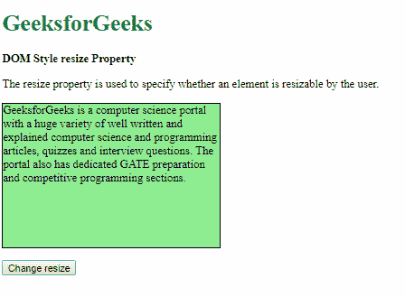
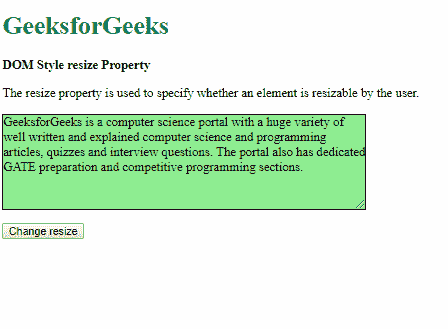
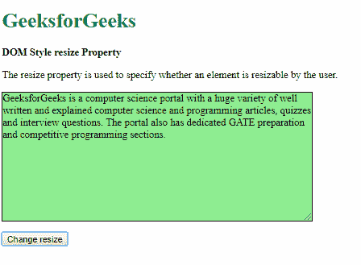
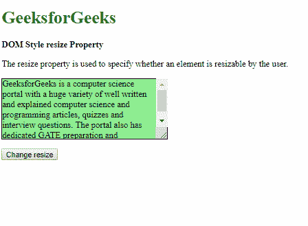
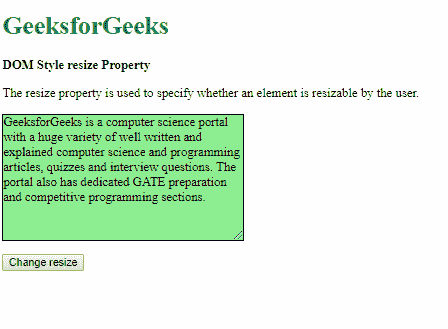
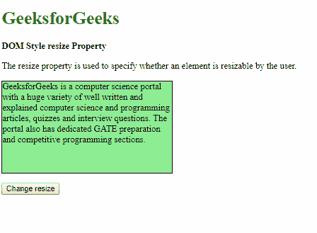
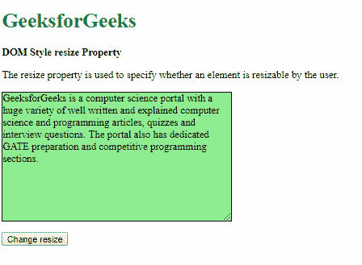
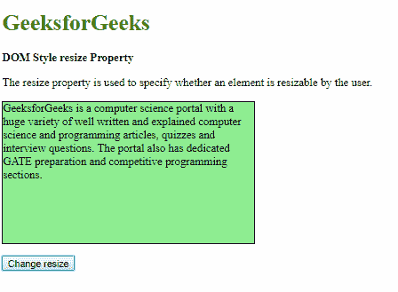
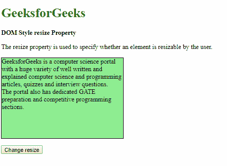
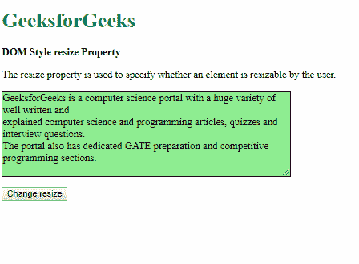

# HTML | DOM 样式调整大小属性

> 原文:[https://www . geesforgeks . org/html-DOM-style-resize-property/](https://www.geeksforgeeks.org/html-dom-style-resize-property/)

HTML DOM 中的 **Style resize** 属性用于指定用户是否可以调整元素的高度和宽度。

**语法:**

*   它返回调整大小属性:

    ```html
    object.style.resize
    ```

*   用于设置调整大小属性:

    ```html
    object.style.resize = "both|horizontal|vertical|none|initial|
    inherit"
    ```

**属性值:**

1.  **both:** This value enables the user to change both height and width of the element.

    **示例-1:**

    ```html
    <!DOCTYPE html>
    <html>

    <head>
        <title>
          DOM Style resize Property
        </title>
        <style>
            .content {
                background-color: lightgreen;
                border: 1px solid;
                height: 200px;
                width: 300px;
                overflow: auto;
            }
        </style>
    </head>

    <body>
        <h1 style="color: green">
          GeeksforGeeks
        </h1>
        <b>
          DOM Style resize Property
        </b>
        <p>
            The resize property is used to 
          specify whether an element is 
          resizable by the user.
        </p>
        <p class="content">
            GeeksforGeeks is a computer 
          science portal with a huge variety
          of well written and explained 
          computer science and programming 
          articles, quizzes and interview
          questions. The portal also has 
          dedicated GATE preparation and 
          competitive programming sections.
        </p>
        <button onclick="setResize()">
          Change resize
        </button>

        <!-- Script to set resize to both -->
        <script>
            function setResize() {
                elem = document.querySelector('.content');
                elem.style.resize = 'both';
            }
        </script>
    </body>

    </html>
    ```

    **输出:**

    *   Before clicking the button:

        

    *   After clicking the button:

        

2.  **horizontal:** This value enables the user to change only the width of the element.

    **示例-2:**

    ```html
    <!DOCTYPE html>
    <html>

    <head>
        <title>
          DOM Style resize Property
        </title>
        <style>
            .content {
                background-color: lightgreen;
                border: 1px solid;
                height: 200px;
                width: 300px;
                overflow: auto;
            }
        </style>
    </head>

    <body>
        <h1 style="color: green">
          GeeksforGeeks
        </h1>
        <b>
          DOM Style resize Property
        </b>
        <p>
            The resize property is used to 
          specify whether an element is
          resizable by the user.
        </p>
        <p class="content">
            GeeksforGeeks is a computer science
          portal with a huge variety of well
          written and explained computer science
          and programming articles, quizzes and
          interview questions. The portal also
          has dedicated GATE preparation and 
          competitive programming sections.
        </p>
        <button onclick="setResize()">
          Change resize
        </button>

        <!-- Script to set resize to horizontal -->
        <script>
            function setResize() {
                elem = document.querySelector('.content');
                elem.style.resize = 'horizontal';
            }
        </script>
    </body>

    </html>
    ```

    **输出:**

    *   点击按钮前:
        
    *   点击按钮后:
        
3.  **vertical:** This value enables the user to change only the height of the element.

    **示例-3:**

    ```html
    <!DOCTYPE html>
    <html>

    <head>
        <title>
          DOM Style resize Property
        </title>
        <style>
            .content {
                background-color: lightgreen;
                border: 1px solid;
                height: 200px;
                width: 300px;
                overflow: auto;
            }
        </style>
    </head>

    <body>
        <h1 style="color: green">
          GeeksforGeeks
      </h1>
        <b>
          DOM Style resize Property
      </b>
        <p>
            The resize property is used to 
          specify whether an element is 
          resizable by the user.
        </p>
        <p class="content">
            GeeksforGeeks is a computer science
          portal with a huge variety of well 
          written and explained computer
          science and programming articles, 
          quizzes and interview questions. 
          The portal also has dedicated GATE 
          preparation and competitive programming 
          sections.
        </p>
        <button onclick="setResize()">
          Change resize
      </button>

        <!-- Script to set resize to vertical -->
        <script>
            function setResize() {
                elem = document.querySelector('.content');
                elem.style.resize = 'vertical';
            }
        </script>
    </body>

    </html>
    ```

    **输出:**

    *   Before clicking the button:

        

    *   After clicking the button:

        

4.  **none:** This value disables the user from changing the height and width of the element.

    **示例-4:**

    ```html
    <!DOCTYPE html>
    <html>

    <head>
        <title>
          DOM Style resize Property
      </title>
        <style>
            .content {
                background-color: lightgreen;
                border: 1px solid;
                height: 200px;
                width: 300px;
                overflow: auto;
                resize: vertical;
            }
        </style>
    </head>

    <body>
        <h1 style="color: green">
          GeeksforGeeks
      </h1>
        <b>
          DOM Style resize Property
      </b>
        <p>
            The resize property is used to
          specify whether an element is
          resizable by the user.
        </p>
        <p class="content">
            GeeksforGeeks is a computer science
          portal with a huge variety of well written
          and explained computer science and 
          programming articles, quizzes and 
          interview questions. The portal also has 
          dedicated GATE preparation and competitive 
          programming sections.
        </p>
        <button onclick="setResize()">
          Change resize
      </button>

        <!-- Script to set resize to none -->
        <script>
            function setResize() {
                elem = document.querySelector('.content');
                elem.style.resize = 'none';
            }
        </script>
    </body>

    </html>
    ```

    **输出:**

    *   Before clicking the button:

        

    *   After clicking the button:

        

5.  **initial:** This is used to set this property to its default value.

    **示例-5:**

    ```html
    <!DOCTYPE html>
    <html>

    <head>
        <title>
          DOM Style resize Property
      </title>
        <style>
            .content {
                background-color: lightgreen;
                border: 1px solid;
                height: 200px;
                width: 300px;
                overflow: auto;
                resize: horizontal;
            }
        </style>
    </head>

    <body>
        <h1 style="color: green">
          GeeksforGeeks
      </h1>
        <b>
          DOM Style resize Property
      </b>
        <p>
            The resize property is used to specify
          whether an element is resizable by the user.
        </p>
        <p class="content">
            GeeksforGeeks is a computer science 
          portal with a huge variety of well written
          and explained computer science and 
          programming articles, quizzes and 
          interview questions. The portal also has
          dedicated GATE preparation and competitive
          programming sections.
        </p>
        <button onclick="setResize()">
          Change resize
      </button>

        <!-- Script to set resize to initial -->
        <script>
            function setResize() {
                elem = document.querySelector('.content');
                elem.style.resize = 'initial';
            }
        </script>
    </body>

    </html>
    ```

    **输出:**

    *   Before clicking the button:

        

    *   After clicking the button:

        

6.  **inherit:** This inherits the property from its parent.

    **示例-6:**

    ```html
    <!DOCTYPE html>
    <html>

    <head>
        <title>
          DOM Style resize Property
      </title>
        <style>
            #parent {
                resize: both;
            }

            .content {
                background-color: lightgreen;
                border: 1px solid;
                height: 200px;
                width: 300px;
                overflow: auto;
            }
        </style>
    </head>

    <body>
        <h1 style="color: green">
          GeeksforGeeks
      </h1>
        <b>
          DOM Style resize Property
      </b>
        <p>
            The resize property is used to
          specify whether an element is
          resizable by the user.
        </p>
        <div id="parent">
            <p class="content">
                GeeksforGeeks is a computer science
              portal with a huge variety of well
              written and explained computer science
              and programming articles, quizzes and
              interview questions. The portal also
              has dedicated GATE preparation and 
              competitive programming sections.
            </p>
        </div>
        <button onclick="setResize()">
          Change resize
      </button>

        <!-- Script to set resize to inherit -->
        <script>
            function setResize() {
                elem = document.querySelector('.content');
                elem.style.resize = 'inherit';
            }
        </script>
    </body>

    </html>
    ```

    **输出:**

    *   Before clicking the button:

        

    *   After clicking the button:

        

**支持的浏览器:**由 *DOM Style resize* 属性支持的浏览器如下:

*   谷歌 Chrome
*   火狐浏览器
*   歌剧
*   苹果 Safari