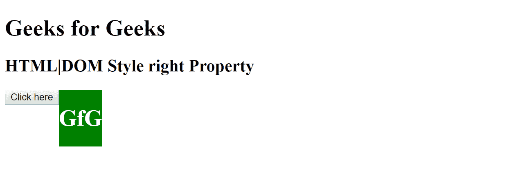
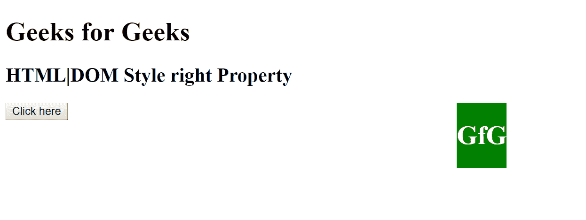
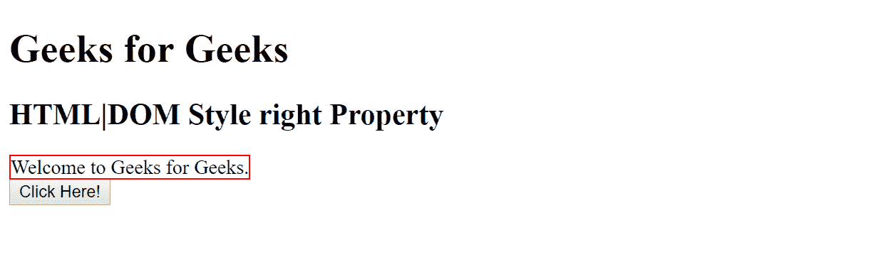
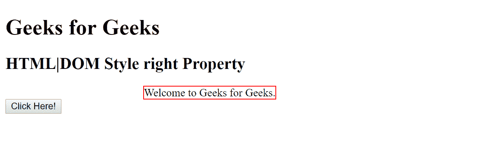

# HTML | DOM 样式权限属性

> 原文:[https://www . geesforgeks . org/html-DOM-style-right-property/](https://www.geeksforgeeks.org/html-dom-style-right-property/)

HTML DOM 中的 Style right 属性用于设置或返回定位元素的正确位置，包括填充、滚动条、边框和边距。
**语法:**

*   用于归还产权:

    ```html
    object.style.right
    ```

    *   It is used to set the right property:

    ```html
    object.style.right = "auto|length|%|initial|inherit"
    ```

    **返回值:**它返回一个字符串，代表定位元素的正确位置

    **属性值描述**:

    *   **自动-** 该值由浏览器自动设置默认的右侧值。*   **长度-** 该值以指定的长度单位设置正确的值。该指定长度可以是正的，也可以是负的。*   **%-** 百分比值以父元素宽度的指定百分比设置右值。*   **初始值-** 该值将右侧属性设置为浏览器的默认值。*   **inherit-** This value sets the right property to the value from its parent element.

    **例 1:**

    ```html
    <!DOCTYPE html>
    <html>

    <head>
        <title>
            HTML | DOM Style right Property
        </title>
        <style>
            #GfG {
                position: absolute;
                background-color: green;
                color: white;
            }
        </style>
    </head>

    <body>

        <h1> Geeks for Geeks </h1>
        <h2> HTML|DOM Style right Property </h2>

        <button onclick="myFunction()">Click here</button>

        <GfG id="GfG">
            <h1>GfG</h1>
        </GfG>

        <script>
            function myFunction() {
                document.getElementById("GfG")
                .style.right = "100px";
            }
        </script>

    </body>

    </html>
    ```

    **输出:**

    *   之前点击按钮:
    *   After click on the button:
    

    **例 2:**

    ```html
    <!DOCTYPE html>
    <html>

    <head>
        <title>
            HTML | DOM Style right Property
        </title>
        <style>
            #myGfG {
                border: 1px solid #FF0000;
                position: relative;
            }
        </style>
    </head>

    <body>

        <h1> Geeks for Geeks </h1>
        <h2> HTML|DOM Style right Property </h2>

        <GfG id="myGfG">Welcome to Geeks for Geeks.</GfG>
        <br>

        <button type="button" onclick="myFunction()">
         Click Here!
        </button>

        <script>
            function myFunction() {
                document.getElementById("myGfG")
                    .style.right = "-200px";
            }

            < GfG id = "myGfG" > Welcome to Geeks
            for Geeks. < /GfG> < br >

            < button type = "button"
            onclick = "myFunction()" > Click Here! < /button>

            < script >
                function myFunction() {
                    document.getElementById("myGfG")
                        .style.right = "-200px";
                }
        </script>

    </body>

    </html>
    </script>

    </body>
    </html>
    ```

    **输出:**

    *   之前点击按钮:
        *   After click on the button:
    

    **支持的浏览器:***DOM 样式权限属性*支持的浏览器如下:

    *   谷歌 Chrome
    *   微软公司出品的 web 浏览器
    *   火狐浏览器
    *   歌剧
    *   旅行队