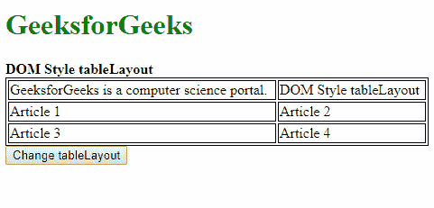
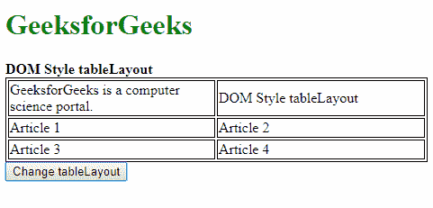
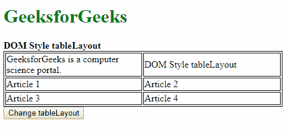
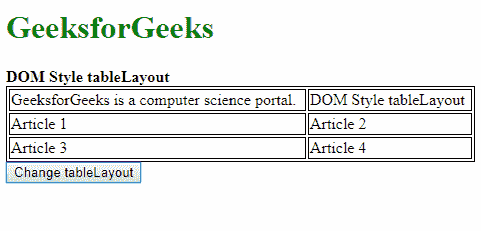

# HTML | DOM 样式 tableLayout 属性

> 原文:[https://www . geesforgeks . org/html-DOM-style-table layout-property/](https://www.geeksforgeeks.org/html-dom-style-tablelayout-property/)

DOM Style **tableLayout** 属性用于**设置**或**返回**表格及其单元格、行和列的布局方式。

**语法:**

*   它返回表格布局属性

    ```html
    object.style.tableLayout
    ```

*   用于设置表格布局属性

    ```html
    object.style.tableLayout = "auto | fixed | initial | inherit"
    ```

**返回值:**它返回一个字符串值，该值代表用于表格的表格布局算法。

**属性值:**

*   **固定:**该值用于根据表格宽度设置列宽，与内容无关。
*   **auto:** 此值用于根据单元格中最宽的不可破解内容设置表格和列的宽度。这是默认值。
*   **初始值:**用于将该属性设置为默认值。
*   **继承:**这将从其父级继承属性。

**示例-1:** 使用固定值。

```html
<!DOCTYPE html>
<html>

<head>
    <title>
        DOM Style tableLayout property
    </title>
    <style>
        table,
        td {
            border: 1px solid;
        }

        #table1 {
            width: 100%;
        }
    </style>
</head>

<body>
    <h1 style="color: green">
      GeeksforGeeks
  </h1>
    <b>
      DOM Style tableLayout
  </b>

    <table id="table1">
        <tr>
            <td>GeeksforGeeks is a 
              computer science portal.</td>
            <td>DOM Style tableLayout</td>
        </tr>
        <tr>
            <td>Article 1</td>
            <td>Article 2</td>
        </tr>
        <tr>
            <td>Article 3</td>
            <td>Article 4</td>
        </tr>
    </table>

    <button onclick="changetableLayout()">
      Change tableLayout
  </button>

    <script>
        function changetableLayout() {
            document.querySelector(
              "#table1").style.tableLayout = 
              "fixed";
        }
    </script>

</body>

</html>
```

**输出:**

*   点击按钮前:
    
*   点击按钮后:
    

**示例-2:** 使用自动值。

```html
<!DOCTYPE html>
<html>

<head>
    <title>
        DOM Style tableLayout property
    </title>
    <style>
        table,
        td {
            border: 1px solid;
        }

        #table1 {
            width: 100%;
            table-layout: fixed;
        }
    </style>
</head>

<body>
    <h1 style="color: green">
      GeeksforGeeks
  </h1>
    <b>
      DOM Style tableLayout
  </b>

    <table id="table1">
        <tr>
            <td>GeeksforGeeks is a 
              computer science portal.</td>
            <td>DOM Style tableLayout</td>
        </tr>
        <tr>
            <td>Article 1</td>
            <td>Article 2</td>
        </tr>
        <tr>
            <td>Article 3</td>
            <td>Article 4</td>
        </tr>
    </table>

    <button onclick="changetableLayout()">
      Change tableLayout
  </button>

    <script>
        function changetableLayout() {
            document.querySelector(
              "#table1").style.tableLayout =
              "auto";
        }
    </script>

</body>

</html>
```

**输出:**

*   点击按钮前:
    
*   点击按钮后:
    

**示例-3:** 使用初始值。

```html
<!DOCTYPE html>
<html>

<head>
    <title>
        DOM Style tableLayout property
    </title>
    <style>
        table,
        td {
            border: 1px solid;
        }

        #table1 {
            width: 100%;
            table-layout: fixed;
        }
    </style>
</head>

<body>
    <h1 style="color: green">
      GeeksforGeeks
  </h1>
    <b>DOM Style tableLayout</b>

    <table id="table1">
        <tr>
            <td>GeeksforGeeks is a 
              computer science portal.</td>
            <td>DOM Style tableLayout</td>
        </tr>
        <tr>
            <td>Article 1</td>
            <td>Article 2</td>
        </tr>
        <tr>
            <td>Article 3</td>
            <td>Article 4</td>
        </tr>
    </table>

    <button onclick="changetableLayout()">
      Change tableLayout
  </button>

    <script>
        function changetableLayout() {
            document.querySelector(
              "#table1").style.tableLayout =
              "initial";
        }
    </script>

</body>

</html>
```

**输出:**

*   点击按钮前:
    
*   点击按钮后:
    

**示例-4:** 使用继承值。

```html
<!DOCTYPE html>
<html>

<head>
    <title>
        DOM Style tableLayout property
    </title>
    <style>
        #parent {
            table-layout: fixed;
        }

        table,
        td {
            border: 1px solid;
        }

        #table1 {
            width: 100%;
        }
    </style>
</head>

<body>
    <h1 style="color: green">
      GeeksforGeeks
  </h1>
    <b>DOM Style tableLayout</b>

    <div id="parent">
        <table id="table1">
            <tr>
                <td>GeeksforGeeks is a
                  computer science portal.</td>
                <td>DOM Style tableLayout</td>
            </tr>
            <tr>
                <td>Article 1</td>
                <td>Article 2</td>
            </tr>
            <tr>
                <td>Article 3</td>
                <td>Article 4</td>
            </tr>
        </table>
    </div>

    <button onclick="changetableLayout()">
      Change tableLayout
  </button>

    <script>
        function changetableLayout() {
            document.querySelector(
              "#table1").style.tableLayout =
              "inherit";
        }
    </script>

</body>

</html>
```

**输出:**

*   点击按钮前:
    
*   点击按钮后:
    

**支持的浏览器:***tableLayout*属性支持的浏览器如下:

*   谷歌 Chrome
*   微软公司出品的 web 浏览器
*   火狐浏览器
*   歌剧
*   苹果 Safari