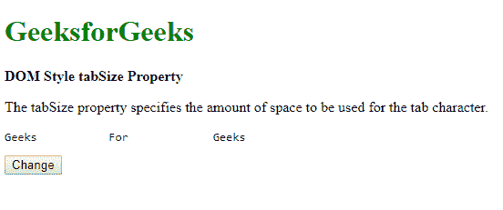

# HTML | DOM 样式标签大小属性

> 原文:[https://www . geesforgeks . org/html-DOM-style-tabsize-property/](https://www.geeksforgeeks.org/html-dom-style-tabsize-property/)

HTML DOM 中的 **Style tabSize 属性**用于**设置**或**返回** **用于代替制表符**的空格长度。

**语法:**

*   获取标签大小属性

    ```html
    object.style.tabSize
    ```

*   设置标签大小属性

    ```html
    object.style.tabSize = "number|length|initial|inherit"
    ```

**属性值**

*   **数字:**用于指定每个制表符要使用的空格字符数。默认值为 8。
*   **长度:**用于指定制表符的长度。大多数浏览器当前不支持该值。
*   **初始值:**用于将属性设置为默认值。
*   **inherit:** 用于从元素的父元素继承值。

**例-1:** 使用**“数”**属性。

```html
<!DOCTYPE html>
<html>

<head>
    <title>
      DOM Style tabSize Property
    </title>
</head>

<body>
    <h1 style="color: green">
      GeeksforGeeks
    </h1>
    <b>
      DOM Style tabSize Property
    </b>
    <p>
        The tabSize property specifies 
      the amount of space to be used 
      for the tab character.
    </p>
    <pre id="ts">
     Geeks    For    Geeks
    </pre>

    <button onclick="GFG()">
      Change
    </button>

    <script>
        function GFG() {
            ele = document.getElementById("ts");
            ele.style.tabSize = "16"
        }
    </script>

</body>

</html>
```

**输出:**

*   点击按钮前:
    
*   点击按钮后:
    

**示例-2:** 使用**“初始”**属性。

```html
<!DOCTYPE html>
<html>

<head>
    <title>
      DOM Style tabSize Property
    </title>
    <style>
      #ts {
          tab-size: 16;
       }
    </style>
</head>

<body>
    <h1 style="color: green">
      GeeksforGeeks
    </h1>
    <b>DOM Style tabSize Property</b>
    <p>
        The tabSize property specifies
      the amount of space to be used 
      for the tab character.
    </p>
    <pre id="ts">
      Geeks        For        Geeks
    </pre>

    <button onclick="GFG()">Change</button>

    <script>
        function GFG() {
            ele = document.getElementById("ts");
            ele.style.tabSize = "initial"
        }
    </script>

</body>

</html>
```

**输出:**

*   点击按钮前:
    
*   点击按钮后:
    

**支持的浏览器:**T2 DOM Style tab size 属性支持的浏览器如下:

*   铬
*   Firefox*-moztabizaize-*
*   Opera 15.0
*   Safari 6.1