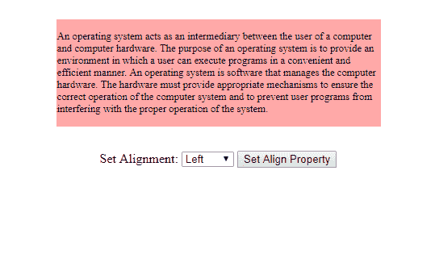
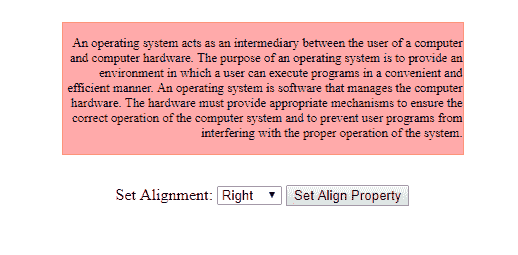

# HTML | DOM 样式文本对齐属性

> 原文:[https://www . geesforgeks . org/html-DOM-style-textalign-property/](https://www.geeksforgeeks.org/html-dom-style-textalign-property/)

DOM style **textAlign** 属性与 CSS 中的 **text-align** 属性非常相似，它为块元素的内部内容设置了对齐方式。
唯一的区别在于，就像任何其他的 *HTML DOM 属性*一样，我们可以使用 *JavaScript* 以编程方式处理它。

**语法**
我们可以用两种不同的方式使用 textAlign，一种是设置对齐方式，另一种是获取当前的对齐方式。

*   从当前的 DOM 对象中获取值。

    ```html
    object.style.textAlign
    ```

*   设置当前 DOM 对象的值。

    ```html
    object.style.textAlign = "left | right | center | justify | 
    initial | inherit";
    ```

**属性值:**

*   **左侧**:为默认值。内容向左对齐。
*   **右侧**:内容向右对齐。
*   **居中**:这将内容设置在中心，在左右边缘之间。
*   **对齐**:这在单词之间引入了额外的空格，使得该行的第一个单词向左对齐，最后一个单词向右对齐。
*   **继承**:它不做任何花哨的事情，而是将值设置为与其直接父级完全相同。

**示例:**

```html
<!DOCTYPE html>
<html>

<head> 
    <title>
        HTML | DOM Style textAlign Property
    </title>
    <style>
        #box-element {
            border: 1px solid #ff8888;
            background-color: #ffaaaa;
        }

        .screen-center {
            margin: 30px auto;
            width: 400px;
        }

        #controls {
            text-align: center;
        }

        #inside-content {
            font-size: 0.8rem;
        }
    </style>
</head>

<body>

    <div id="box-element" class="screen-center">
        <p id="inside-content">
          An operating system acts as an intermediary
          between the user of a computer and computer 
          hardware. The purpose of an operating system
          is to provide an environment in which a user
          can execute programs in a convenient and 
          efficient manner. An operating system is 
          software that manages the computer hardware. 
          The hardware must provide appropriate mechanisms 
          to ensure the correct operation of the computer
          system and to prevent user programs from 
          interfering with the proper operation of 
          the system.
        </p>
    </div>

    <div id="controls" class="screen-center">

        <label>Set Alignment: </label>

        <select id="alignment">
            <option value="left" default>Left</option>
            <option value="right">Right</option>
            <option value="center">Center</option>
            <option value="justify">Justify</option>
        </select>

        <button id="do-align">Set Align Property</button>
    </div>

    <script type="text/javascript">
        //  Collecting elements  
        let inside_content = document.getElementById(
          "inside-content");
        let align_option = document.getElementById(
          "alignment");
        let align_btn = document.getElementById(
          "do-align");

        //  Adding an event to the button    
        align_btn.onclick = function() {

            //    Get current value from the dropdown    
            let align_val = 
            align_option.options[align_option.selectedIndex].value;

            //    Set this value to alignment of the content
            inside_content.style.textAlign = align_val;
        }
    </script>
</body>

</html>
```

**输出:**

*   设置 alingn 属性前:< 
*   设置 alingn 属性后:
    

**支持的浏览器:**下面列出了*HTML | DOM Style textAlign Property*支持的浏览器:

*   谷歌 Chrome
*   微软公司出品的 web 浏览器
*   Mozilla Firefox
*   歌剧
*   旅行队