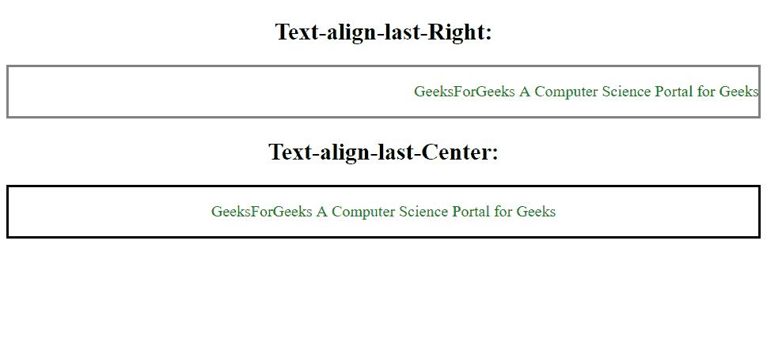
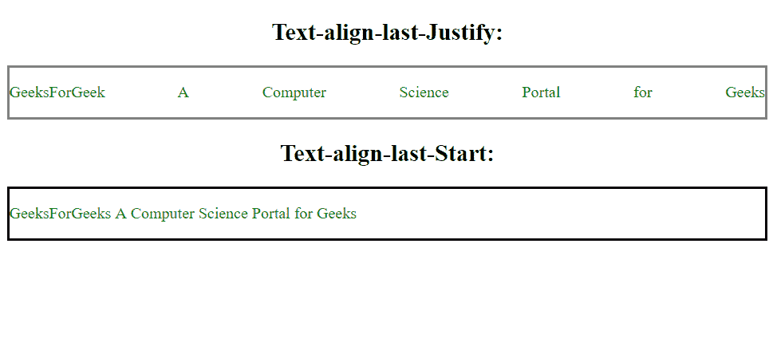

# HTML | DOM 样式文本列表属性

> 原文:[https://www . geesforgeks . org/html-DOM-style-textalignlast-property/](https://www.geeksforgeeks.org/html-dom-style-textalignlast-property/)

HTML DOM 中的 Style textAlignLast 属性用于设置文本最后一行的对齐方式。

**语法:**

*   返回 textAlignLast 属性:

    ```html
    object.style.textAlignLast
    ```

*   Set the textAlignLast property:

    ```html
    object.style.textAlignLast = "auto | left | right | center | 
    justify | start | end | initial | inherit"
    ```

    **属性值:**

    *   **自动:**最后一行在容器中对齐并左对齐。
    *   **左:**文本的最后一行左对齐。
    *   **右:**文本最后一行右对齐。
    *   **居中:**文本最后一行居中对齐。
    *   **对齐:**最后一行是对齐的(最后一行通过在单词之间插入额外的空格来占据容器的整个宽度)。
    *   **开始:**文本的最后一行左对齐(如果文本方向是从左到右)和右对齐(如果文本方向是从右到左)。
    *   **结束:**文本的最后一行是右对齐(如果文本方向是从左到右)和左对齐(如果文本方向是从右到左)。
    *   **初始值:**设置最后一行按初始值对齐。
    *   **继承:**最后一行从父元素继承其属性。

    **例 1:**

    ```html
    <!DOCTYPE html>
    <html>

    <head>
        <title>
            HTML | DOM Style textAlignLast Property
        </title>
        <style>
            .right {
                text-align-last: right;
                border: 2px solid grey;
            }

            .center {
                text-align-last: center;
                border: 2px solid black;
            }
        </style>
    </head>

    <body>

        <h2 style="text-align:center">
           Text-align-last-Right:
       </h2>
        <div class="right">
            <!-- text-align-last: right; property -->
            <p>
                <font color="green">
                    GeeksForGeek
               A Computer Science Portal for Geeks
          </font>
            </p>
        </div>

        <h2 style="text-align:center">
           Text-align-last-Center:
       </h2>
        <div class="center">
            <!-- text-align-last: center; property -->
            <p>
                <font color="green">
                    GeeksForGeek
             A Computer Science Portal for Geeks
          </font>
            </p>
        </div>
    </body>

    </html>
    ```

    **输出:**
    

    **例 2:**

    ```html
    <!DOCTYPE html>
    <html>

    <head>
        <title>
            HTML | DOM Style textAlignLast Property
        </title>
        <style>
            .justify {
                text-align-last: justify;
                border: 2px solid grey;
            }

            .start {
                text-align-last: start;
                border: 2px solid Green;
            }
        </style>
    </head>

    <body>

        <h2 style="text-align:center">
           Text-align-last-Justify:
       </h2>
        <div class="justify">
            <!-- text-align-last: justify; property -->
            <p>
                <font color="green">
                    GeeksForGeek
            A Computer Science Portal for Geeks
          </font>
            </p>
        </div>

        <h2 style="text-align:center">
           Text-align-last-Start:
       </h2>
        <div class="start">
            <!-- text-align-last: start; property -->
            <p>
                <font color="green">
                    GeeksForGeek
            A Computer Science Portal for Geeks
          </font>
            </p>

        </div>
    </body>

    </html>
    ```

    **输出:**
    

    **支持的浏览器:**列出*HTML | DOM Style textAlignLast Property*支持的浏览器为；嗷:

    *   谷歌 Chrome 47
    *   Internet Explorer 5.5
    *   火狐 49.0， 12.0 -moz-
    *   歌剧 34