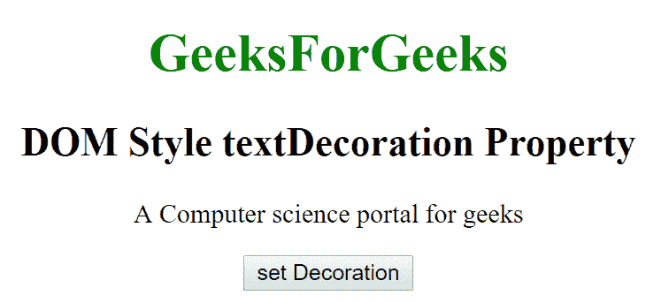
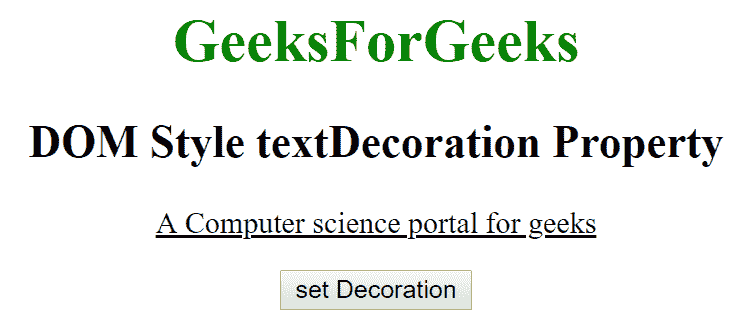
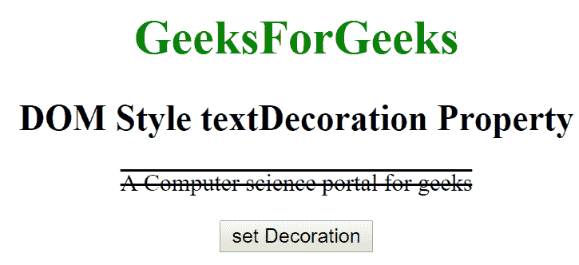

# HTML | DOM 样式文本装饰属性

> 原文:[https://www . geesforgeks . org/html-DOM-style-text decoration-property/](https://www.geeksforgeeks.org/html-dom-style-textdecoration-property/)

HTML DOM 中的**样式文本装饰**属性用于为文本设置一个或多个装饰。我们可以为由空格分隔的文本指定一个或多个文本装饰。它返回给文本的**文本装饰**属性。
**语法:**

*   它返回文本装饰属性。:

```html
object.style.textDecoration
```

*   用于设置文本装饰属性:

```html
object.style.textDecoration = "none|underline|overline|
line-through|blink|initial|inherit"
```

**房产价值:**

*   **无:**用于定义正常文本。这是一个默认值。
*   **下划线:**定义文本下的一行。
*   **跨线:**它定义了文本上方的一条线。
*   **穿越线:**它定义了一条穿越文本的线。
*   **初始值:**将文本装饰属性设置为默认值。
*   **inherit:** 该属性从其父元素继承而来。

**返回值:**返回一个字符串，代表给文本的修饰。
**示例-1:**

## 超文本标记语言

```html
<!DOCTYPE html>
<html>

<head>
    <title>DOM Style textDecoration Property </title>
</head>

<body>

    <center>
        <h1 style="color:green;">
                GeeksForGeeks
            </h1>
        <h2>DOM Style textDecoration Property </h2>
        <p id="gfg"> A Computer science
          portal for geeks</p>

        <button type="button" onclick="geeks()">
            set Decoration
        </button>

        <script>
            function geeks() {
                document.getElementById(
                  "gfg").style.textDecoration =
                  "underline";
            }
        </script>
    </center>
</body>

</html>
```

**输出:**

*   点击按钮前:



*   点击按钮后:



**示例-2:**

## 超文本标记语言

```html
<!DOCTYPE html>
<html>

<head>
  <title>
     DOM Style textDecoration Property
  </title>

</head>

<body>

    <center>
        <h1 style="color:green;">
                GeeksForGeeks
            </h1>
        <h2>DOM Style textDecoration Property </h2>
        <p id="gfg"> A Computer science portal for geeks
      </p>

        <button type="button" onclick="geeks()">
            set Decoration
        </button>

        <script>
            function geeks() {

                document.getElementById(
                  "gfg").style.textDecoration =
                  "line-through overline";
            }
        </script>
    </center>
</body>

</html>
```

**输出:**

*   点击按钮前:


*   点击按钮后:



**支持的浏览器:**T2 DOM Style text decoration 属性支持的浏览器如下:

*   谷歌 Chrome
*   微软公司出品的 web 浏览器
*   火狐浏览器
*   歌剧
*   苹果 Safari