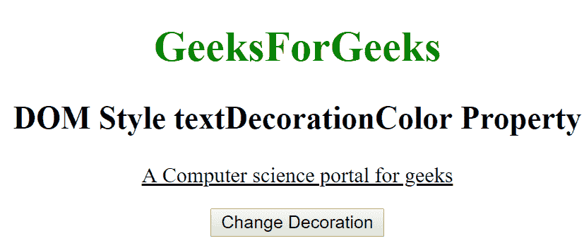

# HTML | DOM 样式文本装饰颜色属性

> 原文:[https://www . geesforgeks . org/html-DOM-style-text decorationcolor-property/](https://www.geeksforgeeks.org/html-dom-style-textdecorationcolor-property/)

HTML DOM 中的**样式文本装饰颜色**属性用于设置文本装饰的颜色，如*下划线*、*覆盖*和*贯穿线*。它还可以返回文本装饰颜色。

**语法:**

*   它返回文本装饰颜色属性。

    ```html
    object.style.textDecorationColor
    ```

*   它用于设置文本装饰颜色属性。

    ```html
    object.style.textDecorationColor = "color|initial|inherit"
    ```

**属性值:**

*   **颜色:**用于指定文字装饰的颜色。
*   **初始值:**它将文本装饰颜色属性设置为默认值。
*   **inherit:** 该属性从其父元素继承而来。

**返回值:**返回一个代表文字装饰颜色属性的字符串。

**示例-1:**

```html
<!DOCTYPE html>
<html>

<head>
    <title>DOM Style textDecorationColor Property </title>
    <style>
        #gfg {
            text-decoration: underline;
        }
    </style>

</head>

<body>

    <center>
        <h1 style="color:green;
                   width:40%;"> 
                GeeksForGeeks 
        </h1>
        <h2>DOM Style textDecorationColor Property </h2>

        <p id="gfg"> 
          A Computer science portal for geeks
        </p>

        <button type="button" onclick="geeks()">
            Chanege Decoration
        </button>

        <script>
            function geeks() {

                //  Set underline color.
                document.getElementById(
                  "gfg").style.textDecorationColor = 
                  "magenta";
            }
        </script>

    </center>
</body>

</html>
```

**输出:**

*   之前点击按钮:
    
*   点击按钮后:
    

**示例-2:**

```html
<!DOCTYPE html>
<html>

<head>
    <title>DOM Style textDecorationColor Property </title>
    <style>
        #gfg {
            text-decoration: underline;
        }
    </style>

</head>

<body>

    <center>
        <h1 style="color:green;
                   width:40%;"> 
                GeeksForGeeks 
            </h1>

        <h2>DOM StylestextDecorationColor Property </h2>
        <p id="gfg">
          A Computer science portal for geeks
        </p>

        <button type="button" onclick="geeks()">
            Chanege Decoration
        </button>

        <script>
            function geeks() {

                // Set text decoration color.
                document.getElementById(
                  "gfg").style.textDecorationColor = 
                  "green";
            }
        </script>
    </center>
</body>

</html>
```

**输出:**

*   之前点击按钮:
    
*   点击按钮后:
    

**支持的浏览器:**由*DOM Style textdecoration color*属性支持的浏览器如下:

*   谷歌 Chrome 57.0
*   Firefox 36.0
*   Opera 44.0
*   苹果 Safari 7.1