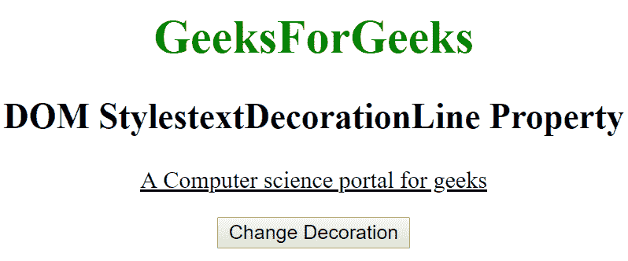
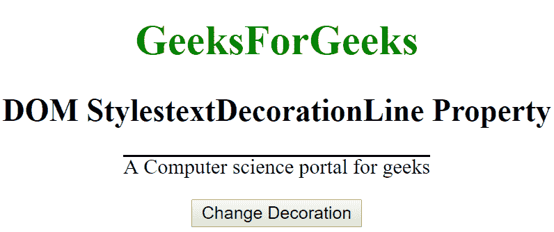
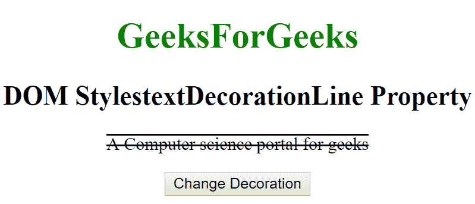

# HTML | DOM 样式文本装饰线条属性

> 原文:[https://www . geesforgeks . org/html-DOM-style-text decorationline-property/](https://www.geeksforgeeks.org/html-dom-style-textdecorationline-property/)

HTML DOM 中的**样式文本装饰线**属性用于设置线条的装饰。我们可以为一行指定任意数量的装饰。它返回给文本的修饰。

**语法:**

*   它返回文本装饰线属性。

```html
object.style.textDecorationLine
```

*   它用于设置文本装饰线属性。

```html
object.style.textDecorationLine = "none|underline|overline|
line-through|initial|inherit"
```

**属性值:**

*   **无:**用于指定文字装饰无线条。这是一个默认值。
*   **下划线:**用于指定文本下的行。
*   **跨线:**用于指定文本上显示的线。
*   **线通:**这是用来指定线是通过文字显示的。
*   **初始值:**它将 textDecorationLine 属性设置为默认值。
*   **inherit:** 该属性从其父元素继承而来。

**返回值:**返回一个表示元素的文本修饰行属性的字符串。

**示例-1:**

## 超文本标记语言

```html
<!DOCTYPE html>
<html>

<head>
    <title>DOM Style textDecorationLine Property </title>
    <style>
        #gfg {
            text-decoration: underline;
        }
    </style>

</head>

<body>

    <center>
        <h1 style="color:green;">
                GeeksForGeeks
            </h1>

        <h2>DOM StylestextDecorationLine Property </h2>
        <p id="gfg"> A Computer science portal for geeks</p>

        <button type="button" onclick="geeks()">
            Change Decoration
        </button>

        <script>
            function geeks() {

                //  Set overline.
                document.getElementById("gfg"
                 ).style.textDecorationLine = "overline";
            }
        </script>
    </center>
</body>

</html>
```

**输出:**

*   之前点击按钮:



*   点击按钮后:



**示例-2:**

## 超文本标记语言

```html
<!DOCTYPE html>
<html>

<head>
    <title>DOM Style textDecorationLine Property </title>
    <style>
        #gfg {
            text-decoration: underline;
        }
    </style>

</head>

<body>

    <center>
        <h1 style="color:green;">
                GeeksForGeeks
            </h1>
        <h2>DOM StylestextDecorationLine Property </h2>
        <p id="gfg"> A Computer science portal for geeks</p>

        <button type="button" onclick="geeks()">
            Change Decoration
        </button>

        <script>
            function geeks() {

                //  Set overline-through.
                document.getElementById("gfg"
                 ).style.textDecorationLine =
                  "overline line-through";
            }
        </script>
    </center>
</body>

</html>
```

**输出:**

*   之前点击按钮:


*   点击按钮后:



**支持的浏览器:**由*DOM Style textDecorationLine*属性支持的浏览器如下:

*   谷歌 Chrome 57.0
*   Firefox 36
*   Opera 44.0
*   苹果 Safari 7.0