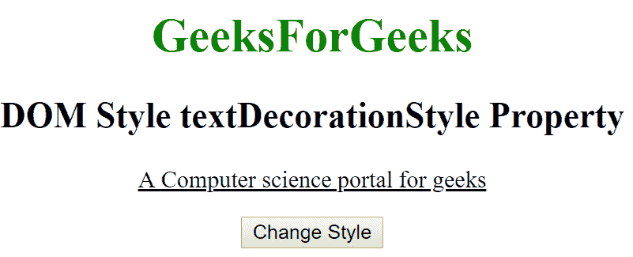
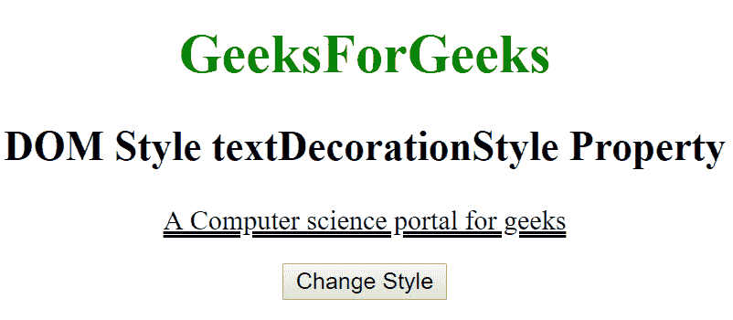
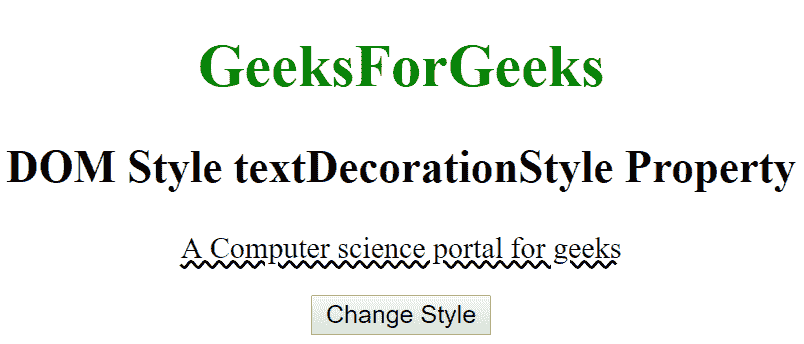

# HTML | DOM 样式文本装饰样式属性

> 原文:[https://www . geesforgeks . org/html-DOM-style-text decorationstyle-property/](https://www.geeksforgeeks.org/html-dom-style-textdecorationstyle-property/)

HTML DOM 中的**样式文本装饰样式**属性用于设置线条。可以像*单线*、*双线*、*波浪形*等多种样式显示线条。通过使用该属性，我们可以以指定的样式显示线条。
**语法:**

*   它返回 textDecorationStyle 属性。

```html
object.style.textDecorationStyle
```

*   它用于设置 textDecorationStyle 属性。

```html
object.style.textDecorationStyle = "solid|double|dotted|dashed|
wavy|initial|inherit"
```

**房产价值:**

*   **实线:**该属性用于将直线显示为单线。这是默认值。
*   **double:** 此属性用于将行显示为双线。
*   **虚线:**该属性用于将线显示为虚线。
*   **虚线:**该属性用于将直线显示为虚线。
*   **波浪:**该属性用于将线条显示为波浪线。
*   **初始值:**它将 textDecorationStyle 属性设置为默认值。
*   **inherit:** 该属性从其父元素继承而来。

**返回值:**

*   它返回一个字符串，该字符串表示元素的 textDecorationStyle 属性。

**示例-1:**

## 超文本标记语言

```html
<!DOCTYPE html>
<html>

<head>
    <title>DOM Style textDecorationStyle Property </title>
    <style>
            #gfg {
            text-decoration: underline;
    </style>

</head>

<body>

    <center>
        <h1 style="color:green;width:40%;">
                GeeksForGeeks
            </h1>

        <h2>DOM Style textDecorationStyle Property </h2>

        <p id="gfg">
          A Computer science portal for geeks
      </p>

        <button type="button" onclick="geeks()">
            Change Style
        </button>

        <script>
            function geeks() {

                // Set textDecorationStyle Property
                document.getElementById(
                  "gfg").style.textDecorationStyle =
                  "double";
            }
        </script>

    </center>
</body>

</html>
```

**输出:**

*   之前点击按钮:



*   点击按钮后:



**示例-2:**

## 超文本标记语言

```html
<!DOCTYPE html>
<html>

<head>
    <title>DOM Style textDecorationStyle Property </title>
    <style>
            #gfg {
            text-decoration: underline;
    </style>

</head>

<body>

    <center>
        <h1 style="color:green;width:40%;">
                GeeksForGeeks
            </h1>
        <h2>DOM Style textDecorationStyle Property </h2>

        <p id="gfg">
            A Computer science portal for geeks
        </p>

        <button type="button" onclick="geeks()">
            Change Style
        </button>

        <script>
            function geeks() {

                // Set textDecorationStyle Property
                document.getElementById(
                  "gfg").style.textDecorationStyle =
                  "wavy";
            }
        </script>
    </center>
</body>

</html>
```

**输出:**

*   之前点击按钮:


*   点击按钮后:



**支持的浏览器:**由**DOM Style textDecorationStyle**属性支持的浏览器如下:

*   谷歌 Chrome 57.0
*   Firefox 36.0
*   Opera 44.0