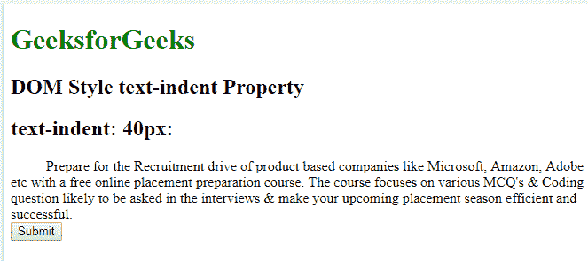
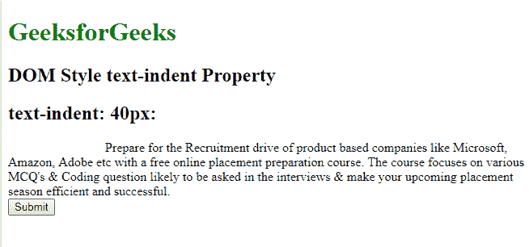
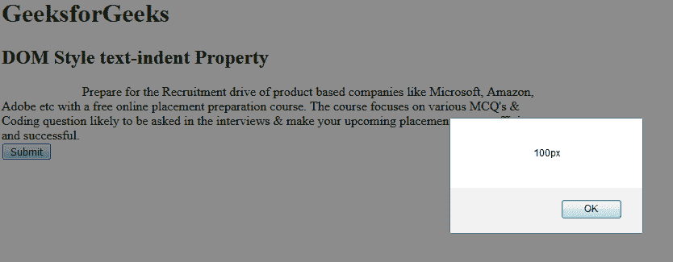

# HTML | DOM 样式文本缩进属性

> 原文:[https://www . geesforgeks . org/html-DOM-style-text indent-property/](https://www.geeksforgeeks.org/html-dom-style-textindent-property/)

**DOM 样式**文本缩进**属性**用于缩进每个文本块中的第一行。它也接受负值。如果该值为负，则第一行将向左缩进。

**语法:**

*   用于设置文本缩进属性:

    ```html
    object.style.textIndent = "length|%|initial|inherit"
    ```

*   用于获取 textIndent 属性:

    ```html
    object.style.textIndent
    ```

**属性:**

*   **长度:**用于以 px、pt、cm、em 等设置固定压痕。长度的默认值为 0。
*   **百分比(%):** 用于定义相对于元素宽度的缩进百分比。
*   **初始值:**用于将文本缩进属性设置为默认值。

**返回值:**它返回一个字符串值，该值代表每个文本块中第一行的缩进。
**例:**

```html
<!DOCTYPE html> 
<html> 
    <head> 
        <title> 
            DOM Style text-indent Property 
        </title> 

        <style> 
            #sudo { 
                text-indent: 40px; 
            } 

        </style> 
    </head> 

    <body> 
        <h1 style = "color:green;">GeeksforGeeks</h1> 
        <h2>DOM Style text-indent Property</h2> 

        <h2>text-indent: 40px:</h2> 
        <div id = "sudo"> 
            Prepare for the Recruitment drive of product 
            based companies like Microsoft, Amazon, Adobe 
            etc with a free online placement preparation 
            course. The course focuses on various MCQ's 
            & Coding question likely to be asked in the 
            interviews & make your upcoming placement 
            season efficient and successful. 
        </div> 
        <button type="button" onclick="myGeeks()">Submit</button>

     <!-- Script to change the textIndent to 120px from 40px-->
     <script>
   function myGeeks() {
     document.getElementById("sudo").style.textIndent = "120px";
       }
   </script>
        </body> 
</html>                     
```

**输出:**

*   点击按钮前:
    
*   点击按钮后:
    

**示例-2:** 获取文本缩进值。

```html
<!DOCTYPE html> 
<html> 
    <head> 
        <title> 
            DOM Style text-indent Property 
        </title> 
    </head> 

    <body> 
        <h1 style = "color:green;">GeeksforGeeks</h1> 
        <h2>DOM Style text-indent Property</h2> 

        <div id = "sudo" style="text-indent:100px;"> 
            Prepare for the Recruitment drive of product 
            based companies like Microsoft, Amazon, Adobe 
            etc with a free online placement preparation 
            course. The course focuses on various MCQ's 
            & Coding question likely to be asked in the 
            interviews & make your upcoming placement 
            season efficient and successful. 
        </div> 
        <button type="button" onclick="myGeeks()">Submit</button>

     <script>
   function myGeeks() {
     alert(document.getElementById("sudo").style.textIndent);
       }
   </script>
        </body> 
</html>                     
```

**输出:**

*   点击按钮前:
    
*   点击按钮后:
    

**支持的浏览器:***DOM Style text indent*支持的浏览器如下:

*   谷歌 Chrome
*   微软公司出品的 web 浏览器
*   火狐浏览器
*   歌剧
*   旅行队