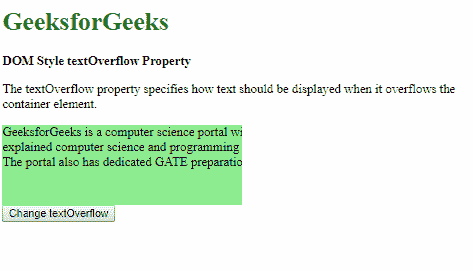
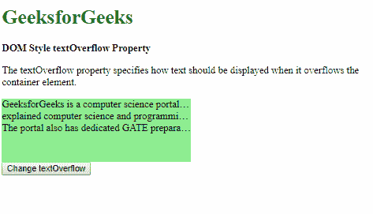
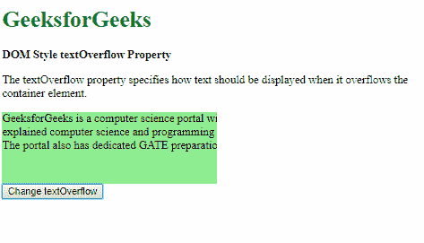
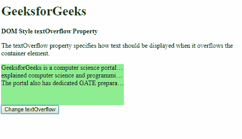

# HTML | DOM 样式文本溢出属性

> 原文:[https://www . geesforgeks . org/html-DOM-style-text overflow-property/](https://www.geeksforgeeks.org/html-dom-style-textoverflow-property/)

HTML DOM 中的 **Style textOverflow** 属性用于指定文本溢出包含元素框时的行为。

**语法:**

*   它返回 textOverflow 属性。

    ```html
    object.style.textOverflow
    ```

*   它用于设置 textOverflow 属性。

    ```html
    object.style.textOverflow = "clip|ellipsis|initial|inherit"
    ```

**返回值:**返回一个字符串值，代表元素的文本溢出属性。

**属性值:**

*   **clip:** It is used to clip the content if it overflows. It is the default value.

    **示例:**

    ```html
    <!DOCTYPE html>
    <html>

    <head>
        <title>
            DOM Style textOverflow Property
        </title>

        <style>
            .content {
                background-color: lightgreen;
                height: 100px;
                width: 300px;
                white-space: nowrap;
                overflow: hidden;
                text-overflow: ellipsis;
            }
        </style>
    </head>

    <body>
        <h1 style="color: green">
            GeeksforGeeks
        </h1>

        <b>DOM Style textOverflow Property</b>

        <p>
            The textOverflow property specifies how text
            should be displayed when it overflows the 
            container element.
        </p>

        <div class="content">
            GeeksforGeeks is a computer science portal with
            a huge variety of well written <br>explained 
            computer science and programming articles, 
            quizzes and interview questions. <br>The portal
            also has dedicated GATE preparation and 
            competitive programming sections.
        </div>

        <button onclick="setOverflow()">
            Change textOverflow
        </button>

        <!-- Script to set textOverflow to clip -->
        <script>
            function setOverflow() {
                elem = document.querySelector('.content');
                elem.style.textOverflow = 'clip';
            }
        </script>
    </body>

    </html>                    
    ```

    **输出:**
    **点击按钮前:**
    
    **点击按钮后:**
    

*   **ellipsis:** It is used to shows ellipsis when the text overflows.

    **示例:**

    ```html
    <!DOCTYPE html>
    <html>

    <head>
        <title>
            DOM Style textOverflow Property
        </title>

        <style>
            .content {
                background-color: lightgreen;
                height: 100px;
                width: 300px;
                white-space: nowrap;
                overflow: hidden;
            }
        </style>
    </head>

    <body>
        <h1 style="color: green">
            GeeksforGeeks
        </h1>

        <b>DOM Style textOverflow Property</b>

        <p>
            The textOverflow property specifies how text
            should be displayed when it overflows the 
            container element.
        </p>

        <div class="content">
            GeeksforGeeks is a computer science portal with
            a huge variety of well written <br>explained 
            computer science and programming articles, 
            quizzes and interview questions. <br>The portal
            also has dedicated GATE preparation and 
            competitive programming sections.
        </div>

        <button onclick="setOverflow()">
            Change textOverflow
        </button>

        <!-- Script to set textOverflow to clip -->
        <script>
            function setOverflow() {
                elem = document.querySelector('.content');
                elem.style.textOverflow = 'ellipsis';
            }
        </script>
    </body>

    </html>                    
    ```

    **输出:**
    **点击按钮前:**
    
    **点击按钮后:**
    

*   **initial:** It is used to set this property to its default value.

    **示例:**

    ```html
    <!DOCTYPE html>
    <html>

    <head>
        <title>
            DOM Style textOverflow Property
        </title>

        <style>
            .content {
                background-color: lightgreen;
                height: 100px;
                width: 300px;
                white-space: nowrap;
                overflow: hidden;
                text-overflow: ellipsis;
            }
        </style>
    </head>

    <body>
        <h1 style="color: green">
            GeeksforGeeks
        </h1>

        <b>DOM Style textOverflow Property</b>

        <p>
            The textOverflow property specifies how text
            should be displayed when it overflows the 
            container element.
        </p>

        <div class="content">
            GeeksforGeeks is a computer science portal with
            a huge variety of well written <br>explained 
            computer science and programming articles, 
            quizzes and interview questions. <br>The portal
            also has dedicated GATE preparation and 
            competitive programming sections.
        </div>

        <button onclick="setOverflow()">
            Change textOverflow
        </button>

        <!-- Script to set textOverflow to clip -->
        <script>
            function setOverflow() {
                elem = document.querySelector('.content');
                elem.style.textOverflow = 'initial';
            }
        </script>
    </body>

    </html>                    
    ```

    **输出:**
    **点击按钮前:**
    
    **点击按钮后:**
    

*   **inherit:** It inherits the property from its parent element.
    **Example:**

    ```html
    <!DOCTYPE html>
    <html>

    <head>
        <title>
            DOM Style textOverflow Property
        </title>

        <style>
            #parent {
                text-overflow: ellipsis;
            }
            .content {
                background-color: lightgreen;
                height: 100px;
                width: 300px;
                white-space: nowrap;
                overflow: hidden;
            }
        </style>
    </head>

    <body>
        <h1 style="color: green">
            GeeksforGeeks
        </h1>

        <b>DOM Style textOverflow Property</b>

        <p>
            The textOverflow property specifies how text
            should be displayed when it overflows the
            container element.
        </p>

        <div id="parent">
            <div class="content">
                GeeksforGeeks is a computer science portal with
                a huge variety of well written <br>explained 
                computer science and programming articles,
                quizzes and interview questions. <br>The portal
                also has dedicated GATE preparation and 
                competitive programming sections.
            </div>
        </div>

        <button onclick="setOverflow()">
            Change textOverflow
        </button>

        <!-- Script to set textOverflow to inherit -->
        <script>
            function setOverflow() {
                elem = document.querySelector('.content');
                elem.style.textOverflow = 'inherit';
            }
        </script>
    </body>

    </html>                    
    ```

    **输出:**
    **点击按钮前:**
    
    **点击按钮后:**
    

**支持的浏览器:***文本溢出*属性支持的浏览器如下:

*   谷歌 Chrome
*   微软公司出品的 web 浏览器
*   火狐浏览器
*   苹果 Safari
*   歌剧