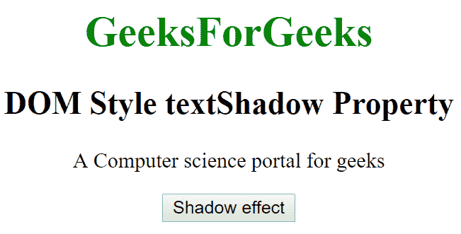
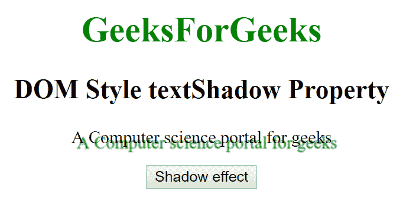
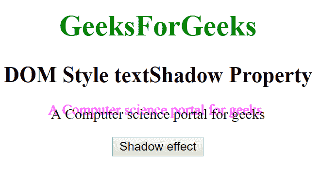

# HTML | DOM 样式文本阴影属性

> 原文:[https://www . geesforgeks . org/html-DOM-style-textshadow-property/](https://www.geeksforgeeks.org/html-dom-style-textshadow-property/)

HTML DOM 中的**样式文本阴影**属性用于设置文本的阴影效果。我们可以使用这个属性设置多个阴影效果。此属性还可以返回文本的阴影效果。

**语法:**

*   它返回 textShadow 属性。

    ```html
    object.style.textShadow
    ```

*   它用来设置 textShadow 属性。

    ```html
    object.style.textShadow = "none|h-shadow v-shadow blur color|
    initial|inherit"
    ```

**属性值:**

*   **无:**该属性使得不绘制阴影。这是默认值。
*   **h 阴影:**用于定位水平阴影，允许负值。这是必填字段
*   **v 形阴影:**用于定位垂直阴影，允许负值。这是必填字段。
*   **模糊:**可选，指定模糊距离。
*   **颜色:**可选，用于指定阴影的颜色。
*   **初始值:**它将 textShadow 属性设置为默认值。
*   **inherit:** 该属性从其父元素继承而来。

**返回值:**

*   它返回一个字符串，该字符串表示一个元素的 textShadow 属性的阴影效果的逗号分隔列表。

**示例-1:**

```html
<!DOCTYPE html>
<html>

<head>
    <title>DOM Style textShadow Property </title>
    <style>

    </style>

</head>

<body>

    <center>
        <h1 style="color:green;width:40%;"> 
                GeeksForGeeks 
            </h1>
        <h2>DOM Style textShadow Property </h2>

        <p id="gfg"> 
          A Computer science portal for geeks
      </p>

        <button type="button" onclick="geeks()">
            Change Style
        </button>

        <script>
            function geeks() {

                //  Set textShadow in green color.
                document.getElementById(
                  "gfg").style.textShadow = 
                  "5px 5px 1px green";
            }
        </script>
    </center>
</body>

</html>
```

**输出:**

*   之前点击按钮:
    *   After Click on the button:
    

    **示例-2:**

    ```html
    <!DOCTYPE html>
    <html>

    <head>
        <title>DOM Style textShadow Property </title>
        <style>

        </style>

    </head>

    <body>

        <center>
            <h1 style="color:green;width:40%;"> 
               GeeksForGeeks 
            </h1>
            <h2>DOM Style textShadow Property </h2>

            <p id="gfg"> 
              A Computer science portal for geeks
            </p>

            <button type="button" onclick="geeks()">
                Shadow effect
            </button>

            <script>
                function geeks() {

                    //  Set textShadow in magenta color.
                    document.getElementById(
                      "gfg").style.textShadow = 
                      "-3px -5px 1px magenta";
                }
            </script>
        </center>
    </body>

    </html>
    ```

    **输出:**

    *   之前点击按钮:
        
    *   点击按钮后:
        

    **支持的浏览器:**T2 DOM Style textShadow 属性支持的浏览器如下:

    *   谷歌 Chrome
    *   Internet Explorer 10.0
    *   火狐浏览器
    *   歌剧
    *   旅行队