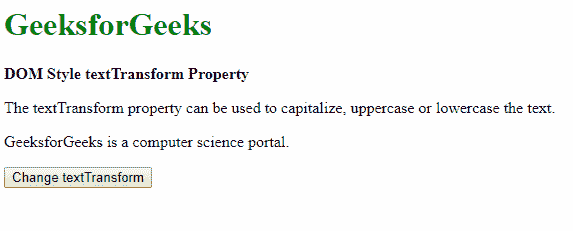
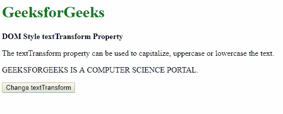
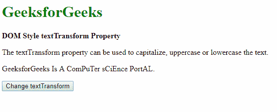
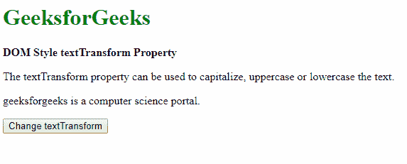
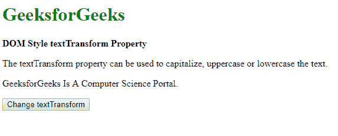
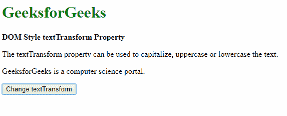

# HTML | DOM 样式文本转换属性

> 原文:[https://www . geesforgeks . org/html-DOM-style-text transform-property/](https://www.geeksforgeeks.org/html-dom-style-texttransform-property/)

HTML DOM 中的**样式**文本转换**属性**用于设置或返回文本的大写。它可用于使所需文本大写、小写或大写每个单词的第一个字符。

**语法:**

*   它返回 textTransform 属性。

    ```html
    object.style.textTransform
    ```

*   它用于设置文本转换属性。

    ```html
    object.style.textTransform = "capitalize|uppercase|lowercase|
    none|initial|inherit"
    ```

**返回值:**它返回一个字符串值，表示元素中文本的转换

**属性值:**

*   **capitalize:** This value capitalizes the first letter of every word of the text.

    **示例:**

    ```html
    <!DOCTYPE html>
    <html>

    <head>
        <title>
            DOM Style textTransform Property
        </title>
    </head>

    <body>
        <h1 style="color: green">
            GeeksforGeeks
        </h1>

        <b>DOM Style textTransform Property</b>

        <p>
            The textTransform property can be used
            to capitalize, uppercase or lowercase
            the text.
        </p>

        <p class="content">
            GeeksforGeeks is a computer science portal.
        </p>

        <button onclick="setTransform()">
            Change textTransform
        </button>

        <!-- Script to capitalize first character
            of each word -->
        <script>
            function setTransform() {
                elem = document.querySelector('.content');
                elem.style.textTransform = 'capitalize';
            }
        </script>
    </body>

    </html>                    
    ```

    **输出:**

    *   点击按钮前:
        
    *   点击按钮后:
        
*   **uppercase:** This value transforms every letter of the text to uppercase.

    **示例:**

    ```html
    <!DOCTYPE html>
    <html>

    <head>
        <title>
            DOM Style textTransform Property
        </title>
    </head>

    <body>
        <h1 style="color: green">
            GeeksforGeeks
        </h1>

        <b>DOM Style textTransform Property</b>

        <p>
            The textTransform property can be used
            to capitalize, uppercase or lowercase
            the text.
        </p>

        <p class="content">
            GeeksforGeeks is a computer science portal.
        </p>

        <button onclick="setTransform()">
            Change textTransform
        </button>

        <!-- Script to capitalize each character -->
        <script>
            function setTransform() {
                elem = document.querySelector('.content');
                elem.style.textTransform = 'uppercase';
            }
        </script>
    </body>

    </html>                    
    ```

    **输出:**

    *   点击按钮前:
        
    *   点击按钮后:
        
*   **lowercase:** This value transforms every letter of the text to lowercase.

    **示例:**

    ```html
    <!DOCTYPE html>
    <html>

    <head>
        <title>
            DOM Style textTransform Property
        </title>
    </head>

    <body>
        <h1 style="color: green">
            GeeksforGeeks
        </h1>

        <b>DOM Style textTransform Property</b>

        <p>
            The textTransform property can be used to
            capitalize, uppercase or lowercase the text.
        </p>

        <p class="content">
            GeeksforGeeks Is A ComPuTer sCiEnce PortAL.
        </p>

        <button onclick="setTransform()">
            Change textTransform
        </button>

        <script>
            function setTransform() {
                elem = document.querySelector('.content');
                elem.style.textTransform = 'lowercase';
            }
        </script>
    </body>

    </html>            
    ```

    **输出:**

    *   点击按钮前:
        
    *   点击按钮后:
        
*   **none:** It is the default value that specifies no transformation takes place.

    **示例:**

    ```html
    <!DOCTYPE html>
    <html>

    <head>
        <title>
            DOM Style textTransform Property
        </title>

        <style>
            .content {
                width: 500px;

                /* Set text-transform before to
                observe effect of 'none' */
                text-transform: capitalize;
            }
        </style>
    </head>

    <body>
        <h1 style="color: green">
            GeeksforGeeks
        </h1>

        <b>DOM Style textTransform Property</b>

        <p>
            The textTransform property can be used
            to capitalize, uppercase or lowercase
            the text.
        </p>

        <p class="content">
            GeeksforGeeks is a computer science portal.
        </p>

        <button onclick="setTransform()">
            Change textTransform
        </button>

        <!-- Script to convert lower case
            of each word -->
        <script>
            function setTransform() {
                elem = document.querySelector('.content');
                elem.style.textTransform = 'none';
            }
        </script>
    </body>

    </html>                    
    ```

    **输出:**

    *   点击按钮前:
        
    *   点击按钮后:
        
*   **initial:** This is used to set this property to its default value.

    **示例:**

    ```html
    <!DOCTYPE html>
    <html>

    <head>
        <title>
            DOM Style textTransform Property
        </title>

        <style>
            .content {
                width: 500px;

                /* Set text-transform before to
                observe effect of 'none' */
                text-transform: capitalize;
            }
        </style>
    </head>

    <body>
        <h1 style="color: green">
            GeeksforGeeks
        </h1>

        <b>DOM Style textTransform Property</b>

        <p>
            The textTransform property can be used
            to capitalize, uppercase or lowercase
            the text.
        </p>

        <p class="content">
            GeeksforGeeks is a computer science portal.
        </p>

        <button onclick="setTransform()">
            Change textTransform
        </button>

        <!-- Script to change lower case
            of each word -->
        <script>
            function setTransform() {
                elem = document.querySelector('.content');
                elem.style.textTransform = 'initial';
            }
        </script>
    </body>

    </html>                    
    ```

    **输出:**

    *   点击按钮前:
        
    *   点击按钮后:
        
*   **inherit:** It inherits the property from its parent element.

    **示例:**

    ```html
    <!DOCTYPE html>
    <html>

    <head>
        <title>
            DOM Style textTransform Property
        </title>

        <style>
            #parent {

                /* Set text-transform of parent to
                observe effect of 'inherit' */
                text-transform: uppercase;
            }
            .content {
                width: 500px;

                /* Set text-transform to initial to prevent
                auto inheritance of parent */
                text-transform: initial;
            }
        </style>
    </head>

    <body>
        <h1 style="color: green">
            GeeksforGeeks
        </h1>

        <b>DOM Style textTransform Property</b>

        <p>
            The textTransform property can be used to 
            capitalize, uppercase or lowercase the text.
        </p>

        <div id="parent">
            <p class="content">
                GeeksforGeeks is a computer science portal.
            </p>
        </div>

        <button onclick="setTransform()">
            Change textTransform
        </button>

        <script>
            function setTransform() {
                elem = document.querySelector('.content');
                elem.style.textTransform = 'inherit';
            }
        </script>
    </body>

    </html>                    
    ```

    **输出:**

    *   点击按钮前:
        
    *   点击按钮后:
        

**支持的浏览器:***DOM Style textTransform 属性*支持的浏览器如下:

*   谷歌 Chrome
*   微软公司出品的 web 浏览器
*   火狐浏览器
*   歌剧
*   苹果 Safari