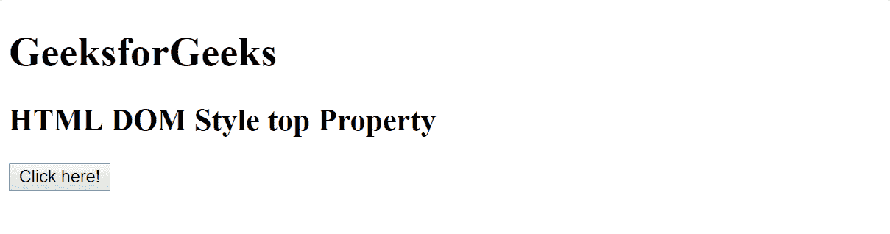
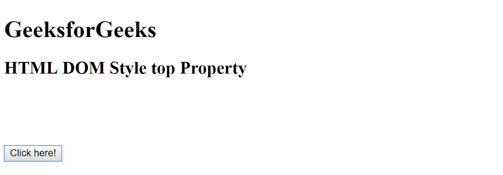
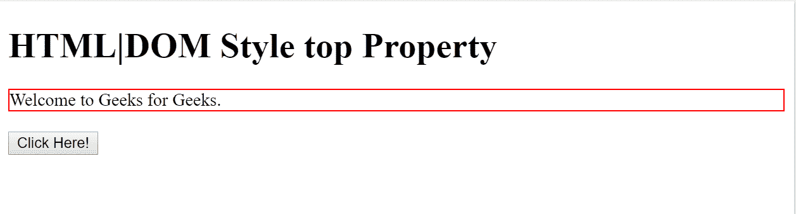
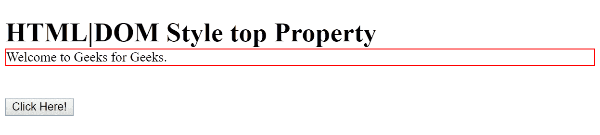

# HTML | DOM 样式顶级属性

> 原文:[https://www.geeksforgeeks.org/html-dom-style-top-property/](https://www.geeksforgeeks.org/html-dom-style-top-property/)

HTML DOM 中的 Style top 属性用于设置或返回定位元素的顶部位置，包括填充、滚动条、边框和边距。
**语法:**

*   用于返回顶层属性:

    ```html
    object.style.top
    ```

*   用于设置顶级属性:

    ```html
    object.style.top = "auto|length|%|initial|inherit"
    ```

**属性值描述**:

*   **自动-** 该值由浏览器自动设置默认顶值。
*   **长度-** 该值以指定的长度单位设置最大值。该指定长度可以是正的，也可以是负的。
*   **%-** 百分比值以父元素宽度的指定百分比设置顶值。
*   **初始值-** 该值将 top 属性设置为浏览器的默认值。
*   **inherit-** 该值将 top 属性设置为其父元素的值。

**返回值:**一个字符串，代表定位元素的顶部位置。

**例 1:**

```html
<!DOCTYPE html>
<html>

<head> 
    <title>
        HTML | DOM Style top Property
    </title>
    <style>
        #myBtn {
            position: absolute;
        }
    </style>
</head>

<body>
    <h1>GeeksforGeeks</h1>

    <h2> 
        HTML DOM Style top Property 
    </h2>

    <button type="button" id="myBtn" 
            onclick="myFunction()">Click here!
    </button>

    <script>
        function myFunction() {
            document.getElementById("myBtn")
            .style.top = "200px";
        }
    </script>

</body>

</html>
```

**输出:**

*   之前点击按钮:
    

*   After Click on the button (Note that click here button moved down):
    

    **例 2:**

    ```html
    <!DOCTYPE html>
    <html>

    <head>
        <title>
            HTML | DOM Style top Property
        </title>
        <style>
            #GfG {
                border: 1px solid #FF0000;
                position: relative;
            }
        </style>
    </head>

    <body>

        <h1> HTML|DOM Style top Property</h2>

        <div id="GfG">Welcome to Geeks for Geeks.</div>
        <br>

        <button type="button" onclick="myFunction()">
          Click Here!
        </button>

        <script>
    function myFunction() {
      document.getElementById("GfG")
      .style.top = "-20px";
    }
    </script>

    </body>
    </html>
    ```

    **输出:**

    *   之前点击按钮:
        *   After click on the button:
    

    **支持的浏览器:***DOM style top 属性*支持的浏览器如下:

    *   谷歌 Chrome
    *   微软公司出品的 web 浏览器
    *   火狐浏览器
    *   歌剧
    *   旅行队