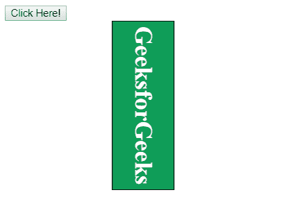
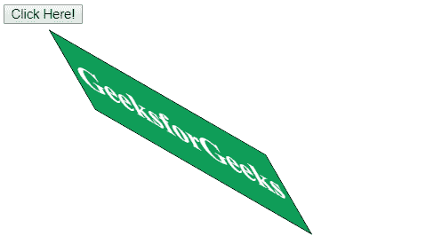

# HTML | DOM 样式转换属性

> 原文:[https://www . geesforgeks . org/html-DOM-style-transform-property/](https://www.geeksforgeeks.org/html-dom-style-transform-property/)

HTML DOM 中的样式**变换**属性用于变换对象。transform 属性允许旋转、缩放、移动、倾斜元素等。它可以使用 2D 或三维变换。

**语法:**

*   它返回转换属性。

    ```html
    object.style.transform
    ```

*   它用于设置转换属性。

    ```html
    object.style.transform = "none|transform-functions|initial|
    inherit"
    ```

**返回值:**返回一个字符串值，代表元素的变换属性

**属性值:**

| 价值 | 描述 |
| --- | --- |
| 没有人 | 没有转变发生。 |
| 矩阵(x，x，x，x，x，x，x，x) | 指定二维类型的矩阵变换。需要 6 个值。 |
| matrix3d(x，x，x，x，x，x，x，x，x，x，x) | 指定三维类型的矩阵变换。它需要 9 个值。 |
| 翻译（x， y） | 指定 X 轴和 Y 轴上的平移。 |
| 平移 3d(x、y、z) | 指定在 X、Y 和 Z 轴上的平移。 |
| translate ex(x) | 指定仅在 X 轴上的平移。 |
| 平移(y) | 指定仅在 Y 轴上的平移。 |
| 平移(z) | 仅指定 Z 轴上的平移。 |
| 旋转(角度) | 指定旋转角度。 |
| 旋转角度 | 指定与旋转角度对应的 X 轴旋转。 |
| roatatey(角度) | 指定与旋转角度对应的沿 Y 轴的旋转。 |
| 保护(角度) | 指定与旋转角度对应的沿 Z 轴的旋转。 |
| 刻度(x，y) | 指定沿 X 轴和 Y 轴的比例变换。 |
| scale3d(x，y，z) | 指定沿 X、Y 和 Z 轴的比例变换。 |
| 播放列表(x) | 指定沿 X 轴的比例变换。 |
| scaleY(y) | 指定沿 Y 轴的比例变换。 |
| 播放列表(z) | 指定沿 Z 轴的比例变换。 |
| scale3d(x，y，z) | 指定沿 X、Y 和 Z 轴的比例变换。 |
| 歪斜(角度，角度) | 指定与倾斜角度相对应的 X 轴和 Y 轴的倾斜变换。 |
| 偏斜(角度) | 指定沿 X 轴的倾斜变换，对应于倾斜角度。 |
| 倾斜(角度) | 指定与倾斜角度相对应的沿 Y 轴的倾斜变换。 |
| 偏斜(角度) | 指定与倾斜角度相对应的沿 Z 轴的倾斜变换。 |
| 透视(x) | 指定元素的透视。 |
| 最初的 | 将元素初始化为默认值。 |
| 继承 | 从其父元素继承值。 |

**示例 1:** 此示例描述了元素的旋转。

```html
<!DOCTYPE html>
<html>

<head>

    <title>
        HTML DOM Style transform Property
    </title>

    <!-- script to use Style transform Property -->
    <script>
        function myGeeks() {
            document.getElementById("GFG").style.transform
                    = "rotate(90deg)"; 
        }
    </script>

    <!-- CSS style to create div element -->
    <style> 
        #GFG {
            margin: 70px;
            border: 1px solid black;
            width: 220px;
            height: 80px;
            background-color: #0f9d58;
            text-align:center;
            color: white;
        }
    </style>
</head>

<body>
    <button onclick = "myGeeks()">
        Click Here!
    </button>

    <div id = "GFG">
        <h1>GeeksforGeeks</h1>
    </div>
</body>

</html>                    
```

**输出:**

*   之前点击按钮:
    *   After Click on the button:
    

    **示例 2:** 本示例描述了偏斜属性值。

    ```html
    <!DOCTYPE html>
    <html>

    <head>

        <title>
            HTML DOM Style transform Property
        </title>

        <!-- script to use Style transform Property -->
        <script>
            function myGeeks() {
                document.getElementById("GFG").style.transform
                        = "skew(30deg, 30deg)"; 
            }
        </script>

        <!-- CSS style to create div element -->
        <style> 
            #GFG {
                margin: 70px;
                border: 1px solid black;
                width: 220px;
                height: 80px;
                background-color: #0f9d58;
                text-align:center;
                color: white;
            }
        </style>
    </head>

    <body>
        <button onclick = "myGeeks()">
            Click Here!
        </button>

        <div id = "GFG">
            <h1>GeeksforGeeks</h1>
        </div>
    </body>

    </html>                    
    ```

    **输出:**

    *   之前点击按钮:
        
    *   点击按钮后:
        

    **支持的浏览器:***DOM Style 转换属性*支持的浏览器如下:

    *   谷歌 Chrome 36.0
    *   Internet Explorer 10.0、9.0 msTransform
    *   Firefox 16.0
    *   Opera 23.0