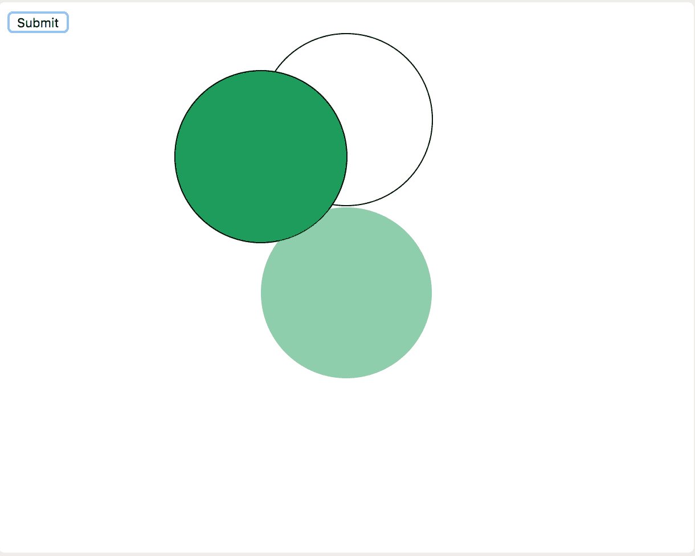

# HTML | DOM 样式转换原点属性

> 原文:[https://www . geesforgeks . org/html-DOM-style-transformorigin-property/](https://www.geeksforgeeks.org/html-dom-style-transformorigin-property/)

每个 HTML 元素在屏幕上都有一些位置。使用坐标几何描述该位置，坐标几何使用 *x 轴*和 *y 轴*。**HTML DOM Style transformOrigin**属性用于更改 *HTML div* 的位置。
对 2D 和 3D 转换都有帮助。

**语法:**

*   要设置 transforformern 属性:

    ```html
    object.style.transformOrigin="x-value y-value"
    ```

*   要返回 transforformern 属性:

    ```html
    object.style.transformOrigin
    ```

**返回值:**它返回一个字符串值，该值代表元素的转换源属性

**Property Values:**

*   **x 轴:**x 轴的放置值。*   **y 轴:**y 轴的放置值。*   **z 轴:**3D 中 z 轴的放置值。*   **初始值:**设置元素默认值。*   **inherit:** Inherit from its parent element

    **示例:**变换圆 2 的原点。

    ```html
    <!DOCTYPE html>
    <html>

    <head>
        <title>
            HTML | DOM Style transformOrigin Property
        </title>
        <script>
            //the following script will find element 
            // whose id is circle2 and transform
            //it's postition to origin
            function myFunction() {
                document.getElementById(
                  "circle2").style.transformOrigin = 
                  "0 0";
            }
        </script>

        <style>
            #circle1 {
                height: 150px;
                width: 150px;
                margin: auto;
                border: 1px solid black;
                border-radius: 50%;
            }

            #circle2 {
                width: 150px;
                height: 150px;
                border: 1px solid black;
                background-color: #0f9d58;
                transform: rotate(45deg);
                border-radius: 50%;
            }

            #circle3 {
                position: absolute;
                width: 150px;
                height: 150px;
                border: #0f9d58;
                background-color: #0f9d58;
                opacity: 0.5;
                border-radius: 50%;
            }
        </style>
    </head>

    <body>
        <button onclick="myFunction()">
          Submit
      </button>

        <div id="circle1">
            <div id="circle2"></div>
            <div id="circle3"></div>
        </div>
    </body>

    </html>
    ```

    **输出**

    *   点击按钮前:
        
    *   点击
        按钮后

    **注:**游猎用**“webkittranformorigin”**代替**“transformOrigin”**。

    **支持的浏览器:**下面列出了*HTML | DOM Style transformOrigin 属性*支持的浏览器:

    *   谷歌 Chrome
    *   边缘
    *   火狐浏览器
    *   歌剧