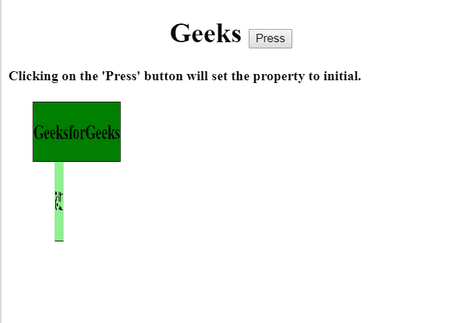

# HTML | DOM 样式转换样式属性

> 原文:[https://www . geesforgeks . org/html-DOM-style-transform style-property/](https://www.geeksforgeeks.org/html-dom-style-transformstyle-property/)

**transformStyle 属性**用于*设置*或*返回*，这是嵌套元素在 3D 空间中用于其**渲染的不同方式。**

**语法:**

*   它返回转换样式:

    ```html
    object.style.transformStyle
    ```

*   它设置了 transformStyle:

    ```html
    object.style.transformStyle = "flat|preserve-3d|initial|inherit"
    ```

**属性:**

*   **flat:** 为默认属性值。但是，三维位置不会被子元素保留。
*   **保留-3d:** 它使子元素能够保留它们的 3d 位置。
*   **初始值:**它将 transformStyle 设置为默认值。
*   **继承:**继承父元素的 transformStyle 属性值。

**返回值:**返回一个字符串，代表元素的变换样式属性。

**示例-1:** 显示平坦特性。

```html
<!DOCTYPE html>
<html>

<head>
    <title>
        HTML | DOM Style transformStyle Property
    </title>
    <style>
        #DIV1 {
            padding: 0.4px;
            position: absolute;
            border: 1px solid black;
            background-color: green;
            -webkit-transform: rotateY(100deg);
            transform: rotateY(50deg);
        }

        #DIV2 {
            padding: 5px;
            position: absolute;
            border: 1px solid black;
            background-color: lightgreen;
            -webkit-transform: rotateY(0deg);
            transform: rotateY(100deg);
        }
    </style>
</head>

<body>
    <h1>
      <center>
        Geeks 
        <button onclick="gfg()">
          Press
        </button>
      </center> 
    </h1>

    <h4>
      Clicking on the 'Press' button 
      will set the property to flat.
    </h4>

    <div id="DIV1">
        <h2>GeeksforGeeks</h2>
        <div id="DIV2">
            <h1>12345</h1>
        </div>
    </div>

    <script>
        function gfg() {

            //  Set transform style for Apple Safari.
            document.getElementById(
                "DIV1").style.WebkitTransformStyle = "flat";

            //  Set "falt" transform style.
            document.getElementById(
                "DIV2").style.transformStyle = "flat";
        }
    </script>
</body>

</html>
```

**输出:**

*   点击按钮前:
    
*   点击按钮后:
    

**示例-2:** 显示保留 3D 属性。

```html
<!DOCTYPE html>
<html>

<head>
    <title>
        HTML | DOM Style transformStyle Property
    </title>

    <style>
        #DIV1 {
            padding: 0.4px;
            position: absolute;
            border: 1px solid black;
            background-color: green;
            -webkit-transform: rotateY(100deg);
            transform: rotateY(50deg);
        }

        #DIV2 {
            padding: 5px;
            position: absolute;
            border: 1px solid black;
            background-color: lightgreen;
            -webkit-transform: rotateY(0deg);
            transform: rotateY(100deg);
        }
    </style>
</head>

<body>
    <h1>
       <center>
         Geeks 
         <button onclick="gfg()">
           Press
         </button>
      </center> 
    </h1>

    <h4>
      Clicking on the 'Press' button 
      will set the property to preserve 3D.
    </h4>

    <div id="DIV1">
        <h2>GeeksforGeeks</h2>
        <div id="DIV2">
            <h1>12345</h1>
        </div>
    </div>

    <script>
        function gfg() {

            // Set Transform style property for Apple Safari.
            document.getElementById(
                    "DIV1").style.WebkitTransformStyle =
                "preserve-3d";

            //  Set "preserve-3d"
            document.getElementById(
                    "DIV2").style.transformStyle =
                "preserve-3d";
        }
    </script>
</body>

</html>
```

**输出:**

*   点击按钮前:
    

**实施例-3:** 显示初始性质。

```html
<!DOCTYPE html>
<html>

<head>
    <title>
        HTML | DOM Style transformStyle Property
    </title>
    <style>
        #DIV1 {
            padding: 0.4px;
            position: absolute;
            border: 1px solid black;
            background-color: green;
            -webkit-transform: rotateY(100deg);
            transform: rotateY(50deg);
        }

        #DIV2 {
            padding: 5px;
            position: absolute;
            border: 1px solid black;
            background-color: lightgreen;
            -webkit-transform: rotateY(0deg);
            transform: rotateY(100deg);
        }
    </style>

    <body>
        <h1>
           <center>
             Geeks 
             <button onclick="gfg()">
               Press
             </button>
           </center> 
         </h1>

         <h4>
          Clicking on the 'Press' button 
          will set the property to initial.
         </h4>

         <div id="DIV1">
            <h2>GeeksforGeeks</h2>
            <div id="DIV2">
                <h1>12345</h1>
            </div>
         </div>

        <script>
            function gfg() {

                //  Set Transform style property for Apple Safari
                document.getElementById(
                        "DIV1").style.WebkitTransformStyle =
                    "initial";

                //  Set "initial" Transform style
                document.getElementById(
                        "DIV2").style.transformStyle =
                    "initial";
            }
        </script>

    </body>

</html>
```

**输出:**

*   点击按钮前:
    
*   点击按钮后:
    

**示例-4:** 显示继承属性。

```html
<!DOCTYPE html>
<html>

<head>
    <title>
        HTML | DOM Style transformStyle Property
    </title>
    <style>
        #DIV1 {
            padding: 0.4px;
            position: absolute;
            border: 1px solid black;
            background-color: green;
            -webkit-transform: rotateY(100deg);
            transform: rotateY(50deg);
        }

        #DIV2 {
            padding: 5px;
            position: absolute;
            border: 1px solid black;
            background-color: lightgreen;
            -webkit-transform: rotateY(0deg);
            transform: rotateY(100deg);
        }
    </style>

</head>

<body>
    <h1>
      <center>Geeks 
        <button onclick="gfg()">
          Press
        </button>
      </center>
    </h1>

    <h4>
      Clicking on the 'Press' button 
      will set the property to inherit.
    </h4>

    <div id="DIV1">
        <h2>GeeksforGeeks</h2>
        <div id="DIV2">
            <h1>12345</h1></div>
    </div>

    <script>
        function gfg() {

            // Set Transform property for Apple Safari.
            document.getElementById(
                    "DIV1").style.WebkitTransformStyle =
                "inherit";

            //  Set "inherit" transform property.
            document.getElementById(
                    "DIV2").style.transformStyle =
                "inherit";
        }
    </script>
</body>

</html>
```

**输出:**

*   点击按钮前:
    
*   点击按钮后:
    

**注意:** Apple Safari 不支持此属性。

**浏览器支持:***DOM style transform style 属性*支持的浏览器如下:

*   谷歌 Chrome
*   微软公司出品的 web 浏览器
*   火狐浏览器
*   歌剧