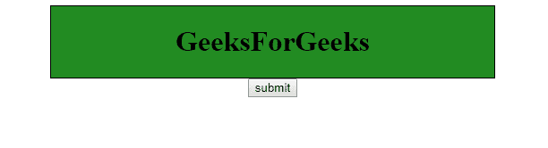

# HTML | DOM 样式转换属性

> 原文:[https://www . geesforgeks . org/html-DOM-style-transition-property/](https://www.geeksforgeeks.org/html-dom-style-transition-property/)

**HTML DOM Style** 属性用于更改任何 DIV 元素的外观。每当鼠标悬停在该元素上时，它就会改变外观。

**语法**

*   返回过渡属性:

    ```html
    object.style.transition
    ```

*   用于设置过渡属性:

    ```html
    object.style.transition = "property duration timing-function 
    delay|initial|inherit"
    ```

**返回值:**它返回一个表示元素过渡属性的字符串

**属性值:**

| 价值 | 描述 |
| transitionProperty | 过渡效果的 CSS 属性的名称。 |
| 过渡持续时间 | 完成过渡需要多少时间 |
| transitionTimingFunction | 转变速度 |
| 传输延迟 | 过渡起点 |
| 最初的 | 设置为默认值 |
| 继承 | 从其父元素继承 |

**示例:**在本例中，我们正在创建一个 div 标签，其 CSS 在样式标签中定义，当您在单击提交按钮后将鼠标悬停在 div 标签上时，CSS 将从 myDIV CSS 更改为 myDIV:悬停 CSS。

```html
<!DOCTYPE html>
<html>

<head>
    <!--this style tag defines two CSS
    the first one is the CSS define for
    the button whose id is myDiv. first
    css will show when the page is load.
    second css is used when someone 
    hover the mouse on the Div -->
    <style>
        #myDIV {
            border: 1px solid black;
            background-color: #0f9d58;
            width: 220px;
            height: 100;

        }

        #myDIV:hover {
            background-color: #228B22;
            width: 500px;
        }
    </style>
</head>

<body>
    <center>
    <div id="myDIV">
        <h1>GeeksForGeeks</h1>
    </div>
    <button onclick="myFunction()">submit</button>
    <script>
        // this function will find a button whose id
        // is myDIV and assign its new css according 
        // to the css define in css section
        function myFunction() {
            document.getElementById(
            "myDIV").style.WebkitTransition = "width 3s";

            // here all means that the transition
            // is used for all property.

            // 2s means that hover effect will complete
            // in 2s its the transaction duration time.
            document.getElementById(
            "myDIV").style.transition = "width 3s";
        }
    </script>
</center>
</body>

</html>                    
```

**输出**

*   悬停前:
    
*   鼠标悬停后点击提交
    

**注意**过渡时长只能为*非负数*，不能为零，否则不会显示交易效果。

*   **无:**无属性获得交易效果*   **all:** 这是默认值所有属性都会得到交易效果。*   **初始值:**将该属性设置为默认值。*   **继承:**从其父元素继承该属性。

    **Supported Browsers:**

    *HTML | DOM Style transition Property*

    *   谷歌 Chrome
    *   边缘
    *   火狐浏览器
    *   歌剧
    *   苹果 Safari