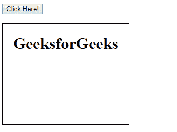
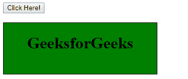

# HTML | DOM 样式转换延迟属性

> 原文:[https://www . geesforgeks . org/html-DOM-style-transition delay-property/](https://www.geeksforgeeks.org/html-dom-style-transitiondelay-property/)

HTML DOM 中的 transitionDelay 属性用于指定转换开始执行的时间(以秒或毫秒为单位)。延迟是指在开始过渡效果之前要等待的时间。

**语法:**

*   它返回 transitionDelay 属性。

    ```html
    object.style.transitionDelay
    ```

*   它设置 transitionDelay 属性。

    ```html
    object.style.transitionDelay = "time|initial|inherit"
    ```

**返回值:**它返回一个字符串值，代表元素的转换延迟属性

**属性值:**

*   **time:** It specifies the length of time (in seconds or milliseconds) to start transition animation.
    **Syntax:**

    ```html
    object.style.transitionDelay = "time";
    ```

    **示例:**

    ```html
    <!DOCTYPE html>
    <html>

    <head>
        <title>
            HTML DOM Style transitionDelay Property
        </title>

        <!-- CSS property for transition animation -->
        <style> 
            #GFG {
                border: 1px solid black;
                background-color: white;
                width: 250px;
                height: 200px;
                overflow: auto;
                -webkit-transition: all 3s;
                transition: all 3s;
                text-align:center;
            }

            #GFG:hover {
                background-color: green;
                width: 300px;
                height: 100px;

                text-align:center;
            }
        </style>
    </head>

    <body>

        <button onclick="myGeeks()">
            Click Here!
        </button>

        <br><br>

        <div id = "GFG">
            <h1>GeeksforGeeks</h1>
        </div>

        <!-- script for transition delay -->
        <script>
            function myGeeks() {
                document.getElementById("GFG").style.WebkitTransitionDelay
                        = "3s"; 

                document.getElementById("GFG").style.transitionDelay
                        = "3s";     
            }
        </script>
    </body>

    </html>                    
    ```

    **输出:**
    **点击按钮前:**
    
    **点击按钮后:**过渡延时:3 秒
    

*   **initial:** It sets the transitionDelay property to its default value.
    **Syntax:**

    ```html
    object.style.transitionDelay = "initial";
    ```

    **示例:**

    ```html
    <!DOCTYPE html>
    <html>

    <head>
        <title>
            HTML DOM Style transitionDelay Property
        </title>

        <!-- CSS property for transition animation -->
        <style> 
            #GFG {
                border: 1px solid black;
                background-color: white;
                width: 250px;
                height: 200px;
                overflow: auto;
                -webkit-transition: all 3s;
                transition: all 3s;
                text-align:center;
            }

            #GFG:hover {
                background-color: green;
                width: 300px;
                height: 100px;

                text-align:center;
            }
        </style>
    </head>

    <body>

        <button onclick="myGeeks()">
            Click Here!
        </button>

        <br><br>

        <div id = "GFG">
            <h1>GeeksforGeeks</h1>
        </div>

        <!-- script for transition delay -->
        <script>
            function myGeeks() {
                document.getElementById("GFG").style.WebkitTransitionDelay
                        = "initial"; 

                document.getElementById("GFG").style.transitionDelay
                        = "initial";     
            }
        </script>
    </body>

    </html>                            
    ```

    **输出:**
    **点击按钮前:**
    
    **点击按钮后:**过渡延时:0 秒。因为默认转换延迟是 0 秒。
    

*   **inherit:** The transitionDelay property is inherited from its parent.
    **Syntax:**

    ```html
    object.style.transitionDelay = "inherit";
    ```

    **例 3:**

    ```html
    <!DOCTYPE html>
    <html>

    <head>
        <title>
            HTML DOM Style transitionDelay Property
        </title>

        <!-- CSS property for transition animation -->
        <style> 
            #GFG {
                border: 1px solid black;
                background-color: white;
                width: 250px;
                height: 200px;
                overflow: auto;
                -webkit-transition: all 3s;
                transition: all 3s;
                text-align:center;
            }

            #main {
                transition-delay:2s;
                -webkit-transition-delay:2s
            }
            #GFG:hover {
                background-color: green;
                width: 300px;
                height: 100px;

                text-align:center;
            }
        </style>
    </head>

    <body>

        <button onclick="myGeeks()">
            Click Here!
        </button>

        <br><br>

        <div id = "main">
            <div id = "GFG">
                <h1>GeeksforGeeks</h1>
            </div>
        </div>

        <!-- script for transition delay -->
        <script>
            function myGeeks() {
                document.getElementById("GFG").style.WebkitTransitionDelay
                        = "inherit"; 

                document.getElementById("GFG").style.transitionDelay
                        = "inherit";     
            }
        </script>
    </body>

    </html>                    
    ```

    **输出:**
    **点击按钮前:**
    
    **点击按钮后:**过渡延时:2 秒。因为父类包含 2 秒的转换延迟。
    

**返回值:**返回一个代表元素 transitionDelay 属性的字符串值。

**支持的浏览器:**T2 DOM transitionDelay 属性支持的浏览器如下:

*   谷歌 Chrome 26.0
*   Internet Explorer 10.0
*   Firefox 16.0
*   Safari 6.1、3.1 WebkitTransitionDelay
*   歌剧 12.1