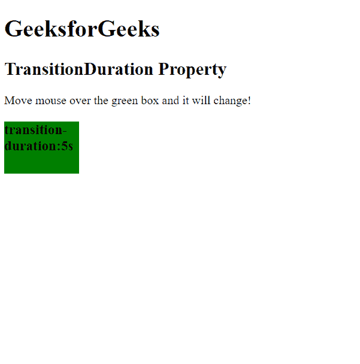
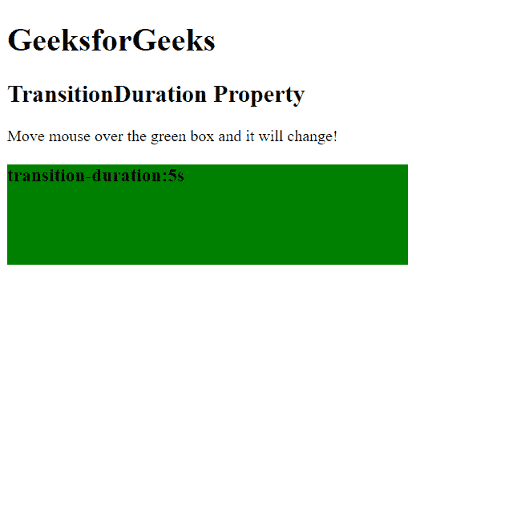

# HTML | DOM 样式转换持续时间属性

> 原文:[https://www . geesforgeks . org/html-DOM-style-transitionduration-property/](https://www.geeksforgeeks.org/html-dom-style-transitionduration-property/)

HTML DOM 中的**样式过渡持续时间**属性用于**设置**或**返回**完成过渡效果的时间长度(以秒或毫秒为单位)。

**语法:**

*   返回 transitionDuration 属性:

    ```html
    object.style.transitionDuration
    ```

    *   Set the transitionDuration:

    ```html
    object.style.transitionDuration = "time|initial|inherit"
    ```

    **属性值:**

    *   **时间:**用于指定完成转场效果需要多少时间。默认值为 0(无过渡效果)。
    *   **初始:**将元素设置为其初始位置。
    *   **inherit:** 用于从其父元素设置属性。

    **示例:**设置**过渡持续时间**属性。

    ```html
    <!DOCTYPE html>
    <html>

    <head>
        <title>
            HTML | DOM Style transitionDuration Property
        </title>
        <style>
            #element {
                width: 100px;
                height: 70px;
                background: green;
                transition-property: width;
            }

            #element:hover {
                width: 400px;
                height: 100px;
            }
        </style>
    </head>

    <body>
        <h1>GeeksforGeeks</h1>

        <h2>TransitionDuration Property</h2>
        <p>
          Move mouse over the green box and it will change!
      </p>

        <div id="element">
            <h3>transition-duration:5s</h3>
        </div>

        <script>
            function myFunction() {

                // Set transitionDuration 5 second.
                document.getElementById(
                  "element").style.transitionDuration =
                  "5s";
            }
            myFunction()
        </script>
    </body>

    </html>
    ```

    **输出:**

    *   过渡前:
        
    *   过渡后:
        

    **支持的浏览器:**由 *HTML | DOM 样式转换持续时间属性*支持的浏览器如下:

    *   谷歌 Chrome 26
    *   Internet Explorer 10
    *   Firefox 16
    *   歌剧 12.1
    *   Safari 6.1