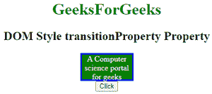

# HTML | DOM 样式转换属性属性

> 原文:[https://www . geesforgeks . org/html-DOM-style-transitionproperty-property/](https://www.geeksforgeeks.org/html-dom-style-transitionproperty-property/)

HTML DOM 中的**样式转换属性**属性用于设置转换效果的 CSS 属性名称。当用户悬停在某个元素上时，可能会出现这种情况。它返回元素的 **transitionProperty** 属性。
**语法:**

*   它返回 transitionProperty 属性。

```html
object.style.transitionProperty
```

*   它用于设置 transitionProperty 属性。

```html
object.style.transitionProperty = "none | all | property | 
initial | inherit"
```

**房产价值:**

*   **无:**过渡效果不会应用到任何元素。
*   **全部:**所有元素都会获得过渡效果。这是一个默认值。
*   **属性:**用于为过渡效果的 CSS 属性名称指定逗号分隔的值。
*   **初始值:**将 transitionProperty 属性设置为默认值。
*   **inherit:** 该属性从其父元素继承而来。

**返回值:**返回一个代表元素 transitionProperty 属性的字符串。
**示例-1:**

## 超文本标记语言

```html
<!DOCTYPE html>
<html>

<head>
    <title>DOM Style transitionProperty Property </title>
    <style>
        #gfg {
            border: 3px solid blue;
            background-color: green;
            width: 100px;
            height: 50px;
            -webkit-transition: all 2s;
            <!-- for safari 3.1 to 6.0-->
          transition: all 2s;
        }

        #gfg:hover {
            background-color: green;
            width: 200px;
            height: 100px;
        }
    </style>
</head>

<body>

    <center>
        <h1 style="color:green;">
                GeeksForGeeks
            </h1>
        <h2>DOM Style transitionProperty  Property </h2>

        <div id="gfg" style="color:white">
          A Computer science portal for geeks
       </div>

        <button type="button" onclick="geeks()">
            Click
        </button>

        <script>
            function geeks() {
                document.getElementById(
                  "gfg").style.transitionProperty = "all";

                //  for safari 3.1 to 6.0
                document.getElementById(
                  "gfg").style.WebkitTransitionProperty = "all";
            }
        </script>
    </center>
</body>

</html>
```

**输出:**

*   悬停前:



*   悬停后:


**示例-2:**

## 超文本标记语言

```html
<!DOCTYPE html>
<html>

<head>
    <title>DOM Style transitionProperty Property </title>
    <style>
        #gfg {
            border: 3px solid blue;
            background-color: green;
            width: 100px;
            height: 50px;
            -webkit-transition: all 2s;
            <!-- for safari -->
            transition: all 2s;
        }

        #gfg:hover {
            background-color: green;
            width: 200px;
            height: 100px;
        }
    </style>
</head>

<body>

    <center>
        <h1 style="color:green;">
                GeeksForGeeks
            </h1>
        <h2>DOM Style transitionProperty  Property </h2>

        <div id="gfg" style="color:white">
          A Computer science portal for geeks
      </div>

        <button type="button" onclick="geeks()">
            Click
        </button>

        <script>
            function geeks() {

                document.getElementById(
                  "gfg").style.transitionProperty =
                  "width, height";

                document.getElementById(
                  "gfg").style.WebkitTransitionProperty =
                  "width, height";
            }
        </script>
    </center>
</body>

</html>
```

**输出:**

*   悬停前:


*   悬停后:


**支持的浏览器:**T2 DOM Style transitionProperty 属性支持的浏览器如下:

*   谷歌 Chrome 26.0
*   Internet Explorer 10.0
*   Firefox 16.0
*   歌剧 12.1
*   苹果 Safari 6.1