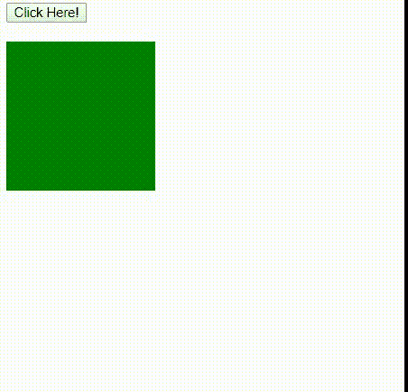
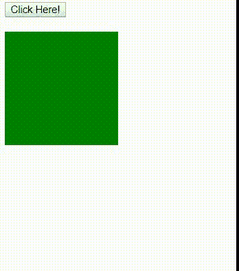

# HTML | DOM 样式转换即时功能属性

> 原文:[https://www . geesforgeks . org/html-DOM-style-transitiontimefunction-property/](https://www.geeksforgeeks.org/html-dom-style-transitiontimingfunction-property/)

**DOM 样式过渡时间功能**属性允许过渡效果在其持续时间内改变速度。过渡效果提供了一种在更改属性时控制动画速度的方法。

**语法:**

*   设置属性:

    ```html
    object.style.transitionTimingFunction = "ease|linear|ease-in|
    ease-out|ease-in-out"
    ```

    *   To get the property:

    ```html
    object.style.transitionTimingFunction
    ```

    **返回值:**它返回一个字符串，代表元素的转换定时函数属性

    **属性值:**

    *   **缓和:**指定开始缓慢，然后快速，然后缓慢的过渡效果。
    *   **线性:**指定从开始到结束速度相同的过渡效果。
    *   **缓和:**指定缓慢开始的过渡效果。
    *   **缓和:**指定一个缓慢结束的过渡效果。
    *   **缓和:指定缓慢开始和结束的过渡效果。**

    **例 1:** 本例描述线性属性值。

    ```html
    <!DOCTYPE html>
    <html>

    <head> 
        <title>
            HTML | DOM Style transitionTimingFunction property
        </title>
        <style> 

            #GFG {
              background-color: green;
              width: 150px;
              height: 150px;
              overflow: auto;

              /* For Safari Browser */
              -webkit-transition: all 2s;
              transition: all 2s;
            }

            #GFG:hover {
              width: 300px;
              height: 300px;
            }
        </style>
    </head>

    <body>

        <button onclick = "myGeeks()">
            Click Here!
        </button>

        <br><br>

        <div id = "GFG">
        </div>

        <script>
        function myGeeks() {

            /* For Safari Browser */
            document.getElementById("GFG").style.WebkitTransitionTimingFunction
                    = "linear";
            document.getElementById("GFG").style.transitionTimingFunction
                    = "linear"; 
        }
        </script>

    </body>

    </html>
    ```

    **输出:**
    

    **示例 2:** 本示例描述了缓和属性值。

    ```html
    <!DOCTYPE html>
    <html>

    <head>
        <title>
            HTML | DOM Style transitionTimingFunction property
        </title>
        <style> 

            #GFG {
              background-color: green;
              width: 150px;
              height: 150px;
              overflow: auto;

              /* For Safari Browser */
              -webkit-transition: all 2s;
              transition: all 2s;
            }

            #GFG:hover {
              width: 300px;
              height: 300px;
            }
        </style>
    </head>

    <body>

        <button onclick = "myGeeks()">
            Click Here!
        </button>

        <br><br>

        <div id = "GFG">
        </div>

        <script>
        function myGeeks() {

            /* For Safari Browser */
            document.getElementById("GFG").style.WebkitTransitionTimingFunction
                    = "ease-in";
            document.getElementById("GFG").style.transitionTimingFunction
                    = "ease-in"; 
        }
        </script>

    </body>

    </html>
    ```

    **输出:**
    

    **注意:**在 safari 浏览器中使用 WebkitTransitionTimingFunction 作为关键字。

    **支持的浏览器:**以下是*HTML | DOM Style transitiontimefunction 属性*支持的浏览器:

    *   谷歌 Chrome 26.0
    *   Internet Explorer 10.0
    *   Mozilla Firefox 16.0
    *   歌剧 12.1
    *   Safari 6.1、3.1 WebKittrantinationTimingFunction