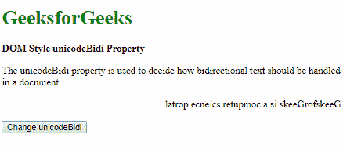
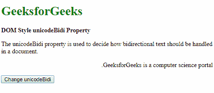
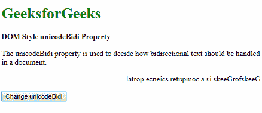
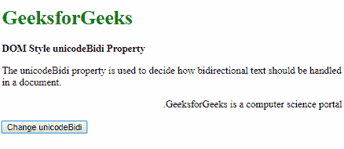

# HTML | DOM 样式 unicodeBidi 属性

> 原文:[https://www . geeksforgeeks . org/html-DOM-style-unicodebidi-property/](https://www.geeksforgeeks.org/html-dom-style-unicodebidi-property/)

HTML DOM 中的 **Style unicodeBidi 属性**与方向属性一起使用，确定多方向文本的显示方式。它覆盖默认的 Unicode 算法，并赋予开发人员控制文本嵌入的权限。

**语法:**

*   它返回 unicodeBidi 属性。

    ```html
    object.style.unicodeBidi
    ```

*   它用于设置 unicodeBidi 属性。

    ```html
    object.style.unicodeBidi = "embed|bidi-override|normal|initial|
    inherit"
    ```

**返回值:**返回一个字符串值，代表双向算法的嵌入级别。

**属性值:**

*   **embed:** This value is used to create an additional level of embedding.

    **示例:**

    ```html
    <!DOCTYPE html>
    <html>

    <head>
        <title>
            DOM Style unicodeBidi Property
        </title>

        <style>
            .content {
                direction: rtl;
                unicode-bidi: bidi-override;
            }
        </style>
    </head>

    <body>
        <h1 style="color: green">
            GeeksforGeeks
        </h1>

        <b>DOM Style unicodeBidi Property</b>

        <p>
            The unicodeBidi property is used to decide
            how bidirectional text should be handled
            in a document.
        </p>

        <p class="content">
            GeeksforGeeks is a computer science portal.
        </p>

        <button onclick="setUnicodeBidi()">
            Change unicodeBidi
        </button>

        <!-- Script to use Style unicodeBidi Property -->
        <script>
            function setUnicodeBidi() {
                elem = document.querySelector('.content');
                elem.style.unicodeBidi = 'embed';
            }
        </script>
    </body>

    </html>                    
    ```

    **输出:**

    *   点击按钮前:
        
    *   点击按钮后:
        
*   **bidi-override:** This value is used to create an additional level of embedding. It also reorders the text based on the direction specified on the direction property.

    **示例:**

    ```html
    <!DOCTYPE html>
    <html>

    <head>
        <title>
            DOM Style unicodeBidi Property
        </title>

        <style>
            .content {
                direction: rtl;
            }
        </style>
    </head>

    <body>
        <h1 style="color: green">
            GeeksforGeeks
        </h1>

        <b>DOM Style unicodeBidi Property</b>

        <p>
            The unicodeBidi property is used to decide
            how bidirectional text should be handled
            in a document.
        </p>

        <p class="content">
            GeeksforGeeks is a computer science portal.
        </p>

        <button onclick="setUnicodeBidi()">
            Change unicodeBidi
        </button>

        <!-- Script to use Style unicodeBidi Property -->
        <script>
            function setUnicodeBidi() {
                elem = document.querySelector('.content');
                elem.style.unicodeBidi = 'bidi-override';
            }
        </script>
    </body>

    </html>                    
    ```

    **输出:**

    *   点击按钮前:
        
    *   点击按钮后:
        
*   **normal:** This value does not create any additional level of embedding. It is the default value.

    **示例:**

    ```html
    <!DOCTYPE html>
    <html>

    <head>
        <title>
            DOM Style unicodeBidi Property
        </title>

        <style>
            .content {
                direction: rtl;
                unicode-bidi: bidi-override;
            }
        </style>
    </head>

    <body>
        <h1 style="color: green">
            GeeksforGeeks
        </h1>

        <b>DOM Style unicodeBidi Property</b>

        <p>
            The unicodeBidi property is used to decide
            how bidirectional text should be handled
            in a document.
        </p>

        <p class="content">
            GeeksforGeeks is a computer science portal.
        </p>

        <button onclick="setUnicodeBidi()">
            Change unicodeBidi
        </button>

        <!-- Script to use Style unicodeBidi Property -->
        <script>
            function setUnicodeBidi() {
                elem = document.querySelector('.content');
                elem.style.unicodeBidi = 'normal';
            }
        </script>
    </body>

    </html>                    
    ```

    **Output:**
*   点击按钮前:
    
*   点击按钮后:
    

*   **initial:** It is used to set this property to its default value.

    **示例:**

    ```html
    <!DOCTYPE html>
    <html>

    <head>
        <title>
            DOM Style unicodeBidi Property
        </title>

        <style>
            .content {
                direction: rtl;
                unicode-bidi: bidi-override;
            }
        </style>
    </head>

    <body>
        <h1 style="color: green">
            GeeksforGeeks
        </h1>

        <b>DOM Style unicodeBidi Property</b>

        <p>
            The unicodeBidi property is used to decide
            how bidirectional text should be handled
            in a document.
        </p>

        <p class="content">
            GeeksforGeeks is a computer science portal.
        </p>

        <button onclick="setUnicodeBidi()">
            Change unicodeBidi
        </button>

        <!-- Script to use Style unicodeBidi Property -->
        <script>
            function setUnicodeBidi() {
                elem = document.querySelector('.content');
                elem.style.unicodeBidi = 'initial';
            }
        </script>
    </body>

    </html>                    
    ```

    **输出:**

    *   点击按钮前:
        
    *   点击按钮后:
        *   **inherit:** It inherits the property from its parent element.

    **示例:**

    ```html
    <!DOCTYPE html>
    <html>

    <head>
        <title>
            DOM Style unicodeBidi Property
        </title>

        <style>
            #parent {
                unicode-bidi: bidi-override;
            }
            .content {
                direction: rtl;
            }
        </style>
    </head>

    <body>
        <h1 style="color: green">
            GeeksforGeeks
        </h1>

        <b>DOM Style unicodeBidi Property</b>

        <p>
            The unicodeBidi property is used to
            decide how bidirectional text should
            be handled in a document.
        </p>

        <div id="parent">
            <p class="content">
                GeeksforGeeks is a computer
                science portal.
            </p>
        </div>

        <button onclick="setUnicodeBidi()">
            Change unicodeBidi
        </button>

        <!-- Script to use Style unicodeBidi Property -->
        <script>
            function setUnicodeBidi() {
                elem = document.querySelector('.content');
                elem.style.unicodeBidi = 'inherit';
            }
        </script>
    </body>

    </html>                    
    ```

    **输出:**

    *   点击按钮前:
        
    *   点击按钮后:
        

    **支持的浏览器:**以下列出了 *DOM Style unicodeBidi 属性*支持的浏览器:

    *   谷歌 Chrome
    *   微软公司出品的 web 浏览器
    *   火狐浏览器
    *   歌剧
    *   苹果 Safari