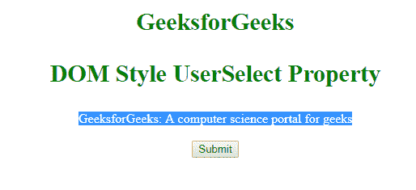

# HTML | DOM 样式用户选择属性

> 原文:[https://www . geesforgeks . org/html-DOM-style-user select-property/](https://www.geeksforgeeks.org/html-dom-style-userselect-property/)

**DOM Style 用户选择属性**用于设置或返回用户是否可以选择文本。

**语法:**

*   它用于返回属性:

```html
object.style.userSelect
```

*   它用于设置属性:

```html
object.style.userSelect = "auto|none|text|all"
```

**属性:**

*   **自动:**有默认值，即用户可以选择文本。
*   **无:**用于阻止用户选择文本，表示用户不能自行选择文本。
*   **文本:**该属性允许用户选择文本。它不提供阻止用户选择文本。
*   **all:** 用于只需鼠标一键选择文本，而不是双击。

**返回值:**返回一个字符串值，代表是否可以选择元素的文本。
**例-1:**

## 超文本标记语言

```html
<!DOCTYPE html>
<html>

<head>
    <title> DOM Style user-select property</title>
    <style>
        div {
            -webkit-user-select: auto;
            -moz-user-select: auto;
            -ms-user-select: auto;
            user-select: auto;
        }

        h1,
        h3 {
            color: green;
            font-size: 30px;
        }

        body {
            text-align: center;
        }
    </style>
</head>

<body>
    <h1>GeeksforGeeks</h1>
    <h3>DOM Style UserSelect Property</h3>
    <div id="GFG">GeeksforGeeks:
      A computer science portal for geeks</div>
    <br>

    <button onclick="myGeeks()">Submit</button>

    <script>
        function myGeeks() {
            var x = document.getElementById("GFG");

            // Chrome, Safari, Opera
            x.style.WebkitUserSelect = "none";

            // Firefox
            x.style.MozUserSelect = "none";

            // IE 10+
            x.style.msUserSelect = "none";

            // Standard syntax
            x.style.userSelect = "none";
        }
    </script>
</body>

</html>
```

**输出:**

*   点击按钮前:



*   点击按钮后:


**示例-2:**

## 超文本标记语言

```html
<!DOCTYPE html>
<html>

<head>
    <title> DOM Style user-select property</title>
    <style>
        h1,
        h3 {
            color: green;
            font-size: 30px;
        }

        body {
            text-align: center;
        }
    </style>
</head>

<body>
    <h1>GeeksforGeeks</h1>
    <h3>DOM Style UserSelect Property</h3>
    <div id="GFG" style="user-select:auto;">
        GeeksforGeeks: A computer science portal for geeks
    </div>
    <br>

    <button onclick="myGeeks()">Submit</button>
    <script>
        function myGeeks() {
            alert(document.getElementById(
              "GFG").style.userSelect);
        }
    </script>
</body>

</html>
```

**输出:**

*   点击按钮前:


*   点击按钮后:


**注意:**双击某些文本将被选中/高亮显示，但该属性可用于防止这种情况。
**支持的浏览器:**DOM Style 用户选择支持的浏览器如下:

*   谷歌 Chrome
*   微软公司出品的 web 浏览器
*   火狐浏览器
*   歌剧
*   旅行队