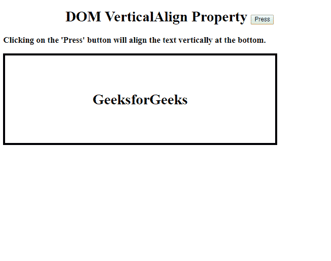
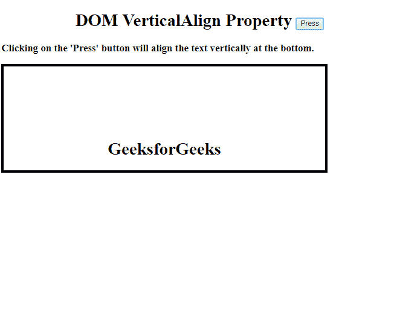
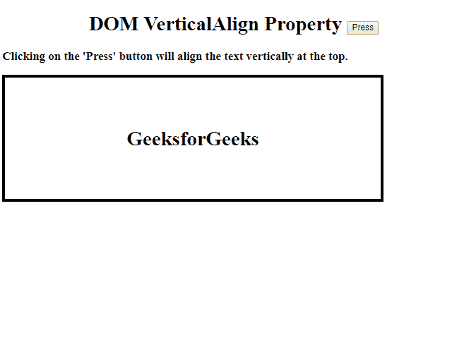
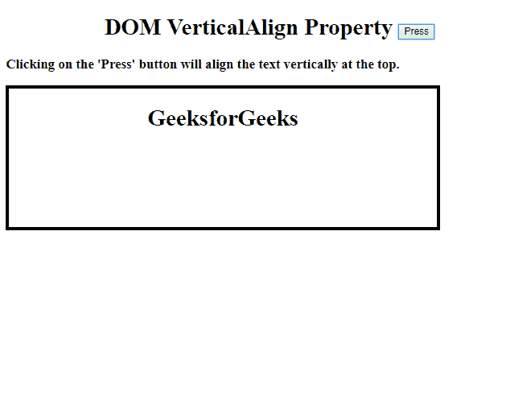
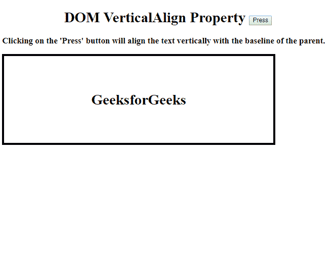
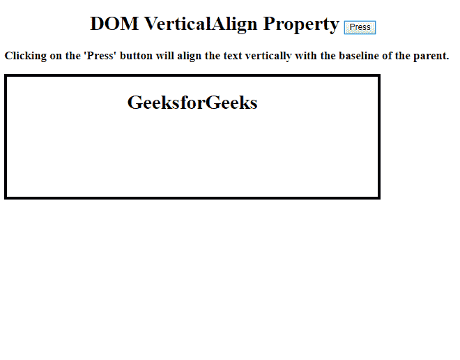
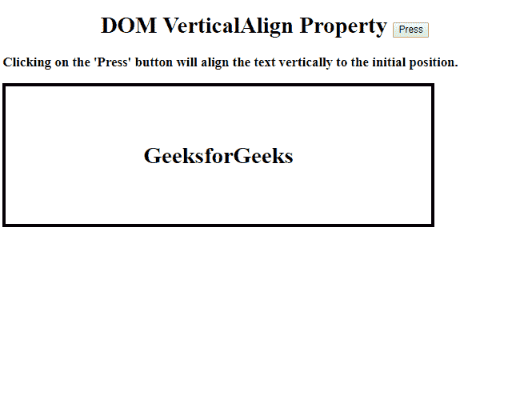
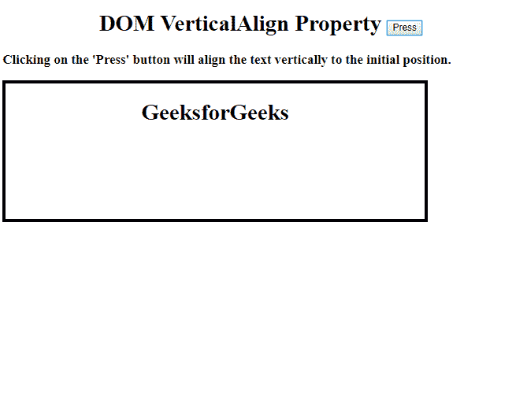
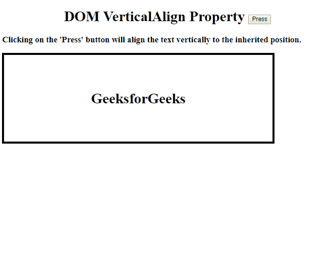
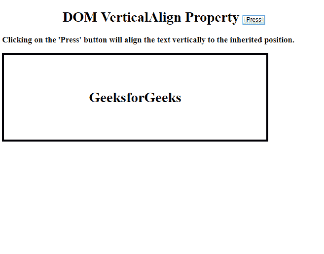

# HTML | DOM 样式垂直对齐属性

> 原文:[https://www . geeksforgeeks . org/html-DOM-style-verticalalign-property/](https://www.geeksforgeeks.org/html-dom-style-verticalalign-property/)

此属性用于设置或返回元素中内容的垂直对齐方式。

**语法:**

*   返回垂直对齐:

    ```html
    object.style.verticalAlign
    ```

*   设置垂直对齐:

    ```html
    object.style.verticalAlign = value
    ```

**属性:**

| 价值 | 描述 |
| 长度 | 它用于将柠檬抬高或降低一定的长度。 |
| % | 它用于提高或降低元素在“行高”属性中的百分比。 |
| 基线 | 它是默认属性，用于将元素的基线与父元素的基线对齐。 |
| 潜水艇 | 它用于将元素作为下标对齐。 |
| 极好的 | 它用于将元素对齐为上标。 |
| 顶端 | 它用于将元素的顶部与线上最高元素的顶部对齐。 |
| 文本-顶部 | 它用于将元素的顶部与父元素的字体顶部对齐。 |
| 中间 | 它用于将元素放置在父元素的中间。 |
| 底部 | 它用于将元素的底部与线上最低的元素对齐。 |
| 文本底部 | 它用于将元素的底部与父元素的字体底部对齐 |
| 最初的 | 它用于将 VerticalAlign 属性设置为默认值。 |
| 继承 | 它用于从其父元素继承属性值。 |

**返回值:**用于返回一个字符串，表示元素中内容的垂直对齐方式。

**示例-1:显示底部属性**

```html
<!DOCTYPE html>
<html>
<head>
    <head>
       HTML | DOM Style verticalAlign Property
    </head>
</head>
<body>
    <h1>
      <center>
       DOM VerticalAlign Property <button onclick="align()">Press
        </button>
      </center> 
  </h1>

   <h3>Clicking on the 'Press' button will align
     the text vertically at the bottom.</h3>

    <style>
        table {
            border: 4px solid black;
            height: 200px;
            width: 600px;
        }
    </style>

    <table>
        <tr>
            <td id="myTd">
                <center>
                  <h1>GeeksforGeeks</h1>
              </center>
          </td>
  </tr>
</table>
<br>

<script>
function align() {

  // Set align bottom.
  document.getElementById(
    "myTd").style.verticalAlign=
    "bottom";
}
</script>

</body>
</html>
```

**输出:**

*   点击按钮前:
    
*   点击按钮后:
    

**示例-2:显示顶部属性**

```html
<!DOCTYPE html>
<html>
<head>
    <head>
       HTML | DOM Style verticalAlign Property
    </head>
</head>
<body>
    <h1>
      <center>
      DOM VerticalAlign Property <button onclick="align()">Press
        </button>
      </center> 
  </h1>

    <h3>Clicking on the 'Press' button will
      align the text vertically at the top.</h3>

    <style>
        table {
            border: 4px solid black;
            height: 200px;
            width: 600px;
        }
    </style>

    <table>
        <tr>
          <td id="myTd">
            <h1>
              <center>GeeksforGeeks</center>
            <h1>
          </td>
       </tr>
    </table>
    <br>

<script>
function align() {

  // Set align top.
  document.getElementById(
    "myTd").style.verticalAlign=
    "top";
}
</script>

</body>
</html>
```

**输出:**

*   点击按钮前:
    
*   点击按钮后:
    

**示例-3:显示基线属性**

```html
<!DOCTYPE html>
<html>
<head>
    <head>
       HTML | DOM Style verticalAlign Property
    </head>
</head>
<body>
    <h1>
      <center>
      DOM VerticalAlign Property <button onclick="align()">Press
        </button>
      </center> 
  </h1>

    <h3>Clicking on the 'Press' button will align the
      text vertically with the baseline of the parent.</h3>
    <style>
        table {
            border: 4px solid black;
            height: 200px;
            width: 600px;
        }
    </style>

    <table>
        <tr>
            <td id="myTd">
                <h1>
                  <center>
                    GeeksforGeeks
                  </center>
                  <h1>
                </td>
  </tr>
</table>
<br>

<script>
function align() {

  // Set align baseline
  document.getElementById(
    "myTd").style.verticalAlign=
    "baseline";
}
</script>

</body>
</html>
```

**输出:**

**点击按钮前:**


**点击按钮后:**


**示例-4:显示初始属性**

```html
<!DOCTYPE html>
<html>
<head>
    <head>
       HTML | DOM Style verticalAlign Property
    </head>
</head>
<body>
    <h1>
      <center>
        DOM VerticalAlign Property <button onclick="align()">Press
        </button>
      </center>
  </h1>

  <h3>Clicking on the 'Press' button will align
    the text vertically to the initial position.</h3>

    <style>
        table {
            border: 4px solid black;
            height: 200px;
            width: 600px;
        }
    </style>

    <table>
        <tr>
            <td id="myTd">
                <h1>
                  <center>
                    GeeksforGeeks
                  </center>
                  <h1>
                 </td>
             </tr>
       </table>
       <br>

<script>
function align() {

  // Set align initial
  document.getElementById(
    "myTd").style.verticalAlign=
    "initial";
}
</script>

</body>
</html>
```

**输出:**

*   点击按钮前:
    
*   点击按钮后:
    

**示例-5:显示继承属性**

```html
<!DOCTYPE html>
<html>
<head>
    <head>
       HTML | DOM Style verticalAlign Property
    </head>
</head>
<body>
    <h1>
      <center>
        DOM VerticalAlign Property <button onclick="align()">Press
        </button>
      </center> 
  </h1>

 <h3>Clicking on the 'Press' button will align the
   text vertically to the inherited position.</h3>

    <style>
        table {
            border: 4px solid black;
            height: 200px;
            width: 600px;
        }
    </style>

<table>
     <tr>
        <td id="myTd">
             <h1>
               <center>
                 GeeksforGeeks
               </center>
              <h1>
            </td>
          </tr>
</table>
<br>

<script>
function align() {

  // Set align inherit 
  document.getElementById(
    "myTd").style.verticalAlign=
    "inherit";
}
</script>

</body>
</html>
```

**输出:**

*   点击按钮前:
    
*   点击按钮后:
    

**浏览器支持:**T2 DOM vertical align Property 支持的浏览器如下:

*   谷歌 Chrome
*   微软公司出品的 web 浏览器
*   火狐浏览器
*   歌剧
*   狩猎