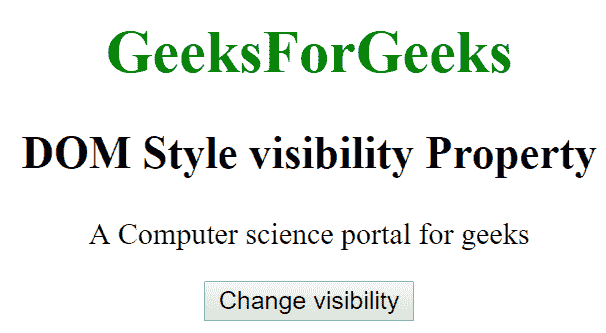
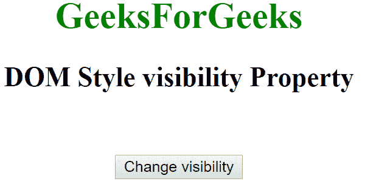
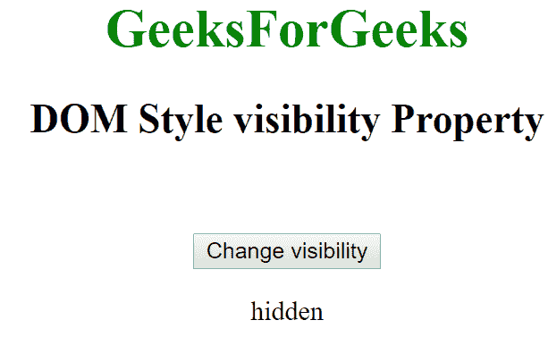

# HTML | DOM 样式可见性属性

> 原文:[https://www . geesforgeks . org/html-DOM-style-visibility-property/](https://www.geeksforgeeks.org/html-dom-style-visibility-property/)

HTML DOM 中的**样式可见性**属性用于设置元素的*可见性。用于*隐藏*或*显示*元素。它返回给元素的可见性属性。*

**语法:**

*   它返回可见性属性。

```html
object.style.visibility
```

*   它用于设置可见性属性。

```html
object.style.visibility = "visible | hidden | collapse | initial | inherit"
```

**房产价值:**

*   **可见:**用于指定元素可见。这是一个默认值。
*   **隐藏:**元素不可见，但影响布局。
*   **折叠:**用于表格行或单元格时隐藏元素。
*   **初始值:**将可见性属性设置为默认值。
*   **inherit:** 该属性从其父元素继承而来。

**返回值:**返回一个字符串，代表元素要显示或不显示的内容。

**示例-1:**

## 超文本标记语言

```html
<!DOCTYPE html>
<html>
<body>

    <center>
        <h1 style="color:green;">
                GeeksForGeeks
            </h1>
        <h2>DOM Style visibility Property </h2>
        <p id="gfg"> A Computer science portal for geeks</p>

        <button type="button" onclick="geeks()">
            Change visibility
        </button>

        <script>
            function geeks() {
                document.getElementById(
                  "gfg").style.visibility = "hidden";
            }
        </script>
    </center>
</body>

</html>
```

**输出:**

*   **点击按钮前:**



*   **点击按钮后:**



**示例-2:**

## 超文本标记语言

```html
<!DOCTYPE html>
<html>
<body>

    <center>
        <h1 style="color:green;;">
                GeeksForGeeks
            </h1>
        <h2>DOM Style visibility Property </h2>
        <p id="gfg" style="visibility:hidden;">
          A Computer science portal for geeks</p>

        <button type="button" onclick="geeks()">
            Change visibility
        </button>
        <p id="y"></p>

        <script>
            function geeks() {
                var x = document.getElementById(
                  "gfg").style.visibility;

                document.getElementById('y').innerHTML = x;
            }
        </script>
    </center>
</body>

</html>
```

**输出:**

*   **点击按钮前:**


*   **点击按钮后:**



**支持的浏览器:**由 **DOM Style 可见性**属性支持的浏览器如下:

*   谷歌 Chrome
*   微软公司出品的 web 浏览器
*   火狐浏览器
*   歌剧
*   苹果 Safari