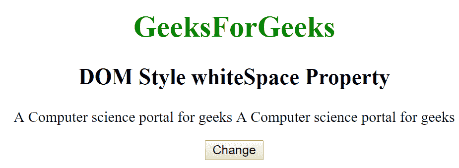
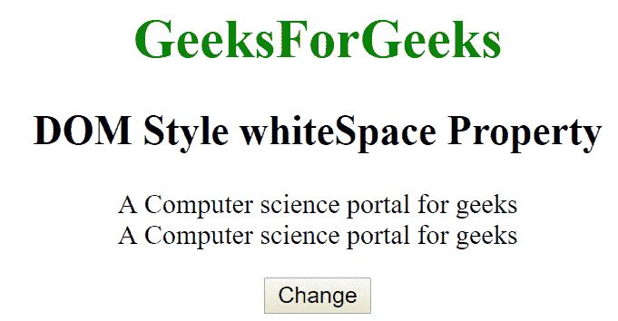
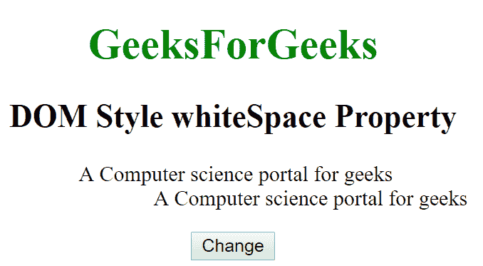

# HTML | DOM 样式空白属性

> 原文:[https://www . geeksforgeeks . org/html-DOM-style-空白-property/](https://www.geeksforgeeks.org/html-dom-style-whitespace-property/)

HTML DOM 中的 Style 空白属性用于设置文本内容的空白。它返回给文本的空白属性。

**语法:**

*   它返回空白属性。

```html
object.style.whiteSpace
```

*   它用于设置空白属性。

```html
object.style.whiteSpace = "normal|nowrap|pre|initial|inherit"
```

**属性值:**

*   **normal:** 用于将空白折叠成单个空白，并将文本换行。这是一个默认值。
*   **nowrap:** 用于将空白折叠成单个空白，没有文本换行。
*   **pre:** 用于定义预格式化文本。
*   **行前:**用于将空格折叠为单个空格，并在线闸上换行。
*   **预换行:**用于在线闸上保留空格和换行。
*   **初始值:**它将空白属性设置为默认值。
*   **inherit:** 该属性从其父元素继承而来。

**返回值:**返回一个代表元素空白属性的字符串。

**例 1:**

## 超文本标记语言

```html
<!DOCTYPE html>
<html>
    <head>
        <title>
            DOM Style whiteSpace Property
        </title>
    </head>

    <body>
        <center>
            <h1 style = "color:green;">
                GeeksForGeeks
            </h1>

            <h2>
                DOM Style whiteSpace Property
            </h2>

            <p id = "gfg">
                A Computer science portal for geeks
                A Computer science portal for geeks
            </p>

            <button type = "button" onclick = "geeks()">
                Change
            </button>

            <script>
                function geeks() {
                    document.getElementById("gfg").style.whiteSpace
                                = "pre-line";
                }
            </script>
        </center>
    </body>
</html>                                   
```

**输出:**
**之前点击按钮:**



**点击按钮后:**



**例 2:**

## 超文本标记语言

```html
<!DOCTYPE html>
<html>
    <head>
        <title>
            DOM Style whiteSpace Property
        </title>
    </head>

    <body>
        <center>
            <h1 style = "color:green;">
                GeeksForGeeks
            </h1>

            <h2>
                DOM Style whiteSpace Property
            </h2>

            <p id = "gfg">A Computer science portal for geeks
                A Computer science portal for geeks
            </p>

            <button type = "button" onclick = "geeks()">
                Change
            </button>

            <script>
                function geeks() {
                    document.getElementById("gfg").style.whiteSpace
                                = "pre-wrap";
                }
            </script>
        </center>
    </body>
</html>                                
```

**输出:**
**之前点击按钮:**


**点击按钮后:**



**支持的浏览器:**由 *DOM Style 空白*属性支持的浏览器如下:

*   苹果 Safari
*   谷歌 Chrome
*   火狐浏览器
*   微软公司出品的 web 浏览器
*   歌剧