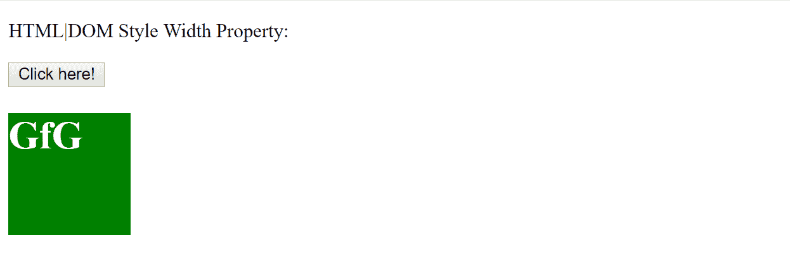
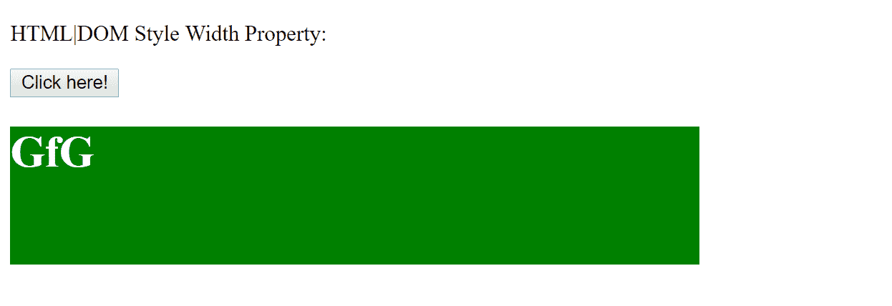
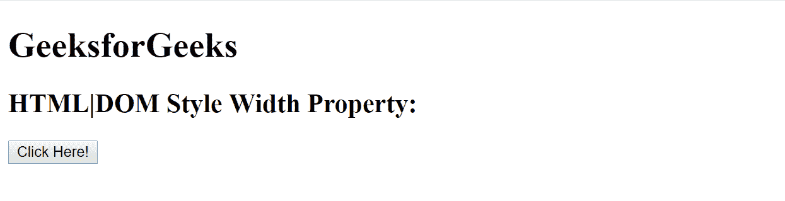
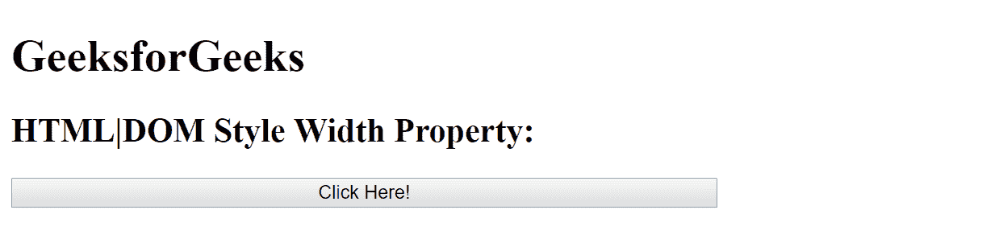

# HTML | DOM 样式宽度属性

> 原文:[https://www . geesforgeks . org/html-DOM-style-width-property/](https://www.geeksforgeeks.org/html-dom-style-width-property/)

HTML DOM 中的 Style width 属性用于设置或返回元素的宽度，元素可以是块级元素，也可以是位置固定的元素。

**语法:**

*   用于返回宽度属性:

    ```html
    object.style.width
    ```

*   用于设置宽度属性:

    ```html
    object.style.width = "auto|length|%|initial|inherit"
    ```

**属性值描述**

*   **自动-** 该值由浏览器自动设置默认宽度值。
*   **长度-** 该值以指定的长度单位设置宽度值。
*   **%-** 百分比值以父元素宽度的指定百分比设置宽度值。
*   **初始值-** 该值将宽度属性设置为浏览器的默认值。
*   **inherit-** 该值将 width 属性设置为其父元素的值。

**返回值:**表示元素宽度的字符串。

**例 1:**

```html
<!DOCTYPE html>
<html>

<head>
    <style>
        #GfG {
            width: 100px;
            height: 100px;
            background-color: green;
            color: white;
        }
    </style>
</head>

<body>

    <p>HTML|DOM Style Width Property:</p>

    <button onclick="myFunction()">Click here!</button>

    <div id="GfG">
        <h1>GfG</h1>
    </div>

    <script>
        function myFunction() {
            document.getElementById("GfG")
            .style.width = "500px";
        }
    </script>

</body>

</html>
```

**输出:**

*   **之前点击按钮:**
    

*   **After click on the button:**
    

    **例 2:**

    ```html
    <!DOCTYPE html>
    <html>

    <body>

        <h1>GeeksforGeeks</h1>

        <h2>HTML|DOM Style Width Property:</h2>

        <button type="button" id="myBtn" 
                onclick="myFunction()">Click Here!</button>

        <script>
            function myFunction() {
                document.getElementById("myBtn")
                .style.width = "500px";
            }
        </script>

    </body>

    </html>
    ```

    **输出:**

    *   **之前点击按钮:**
        *   **After click on the button:**
    

    **支持的浏览器:***DOM 样式宽度属性*支持的浏览器如下:

    *   谷歌 Chrome
    *   微软公司出品的 web 浏览器
    *   火狐浏览器
    *   旅行队
    *   歌剧