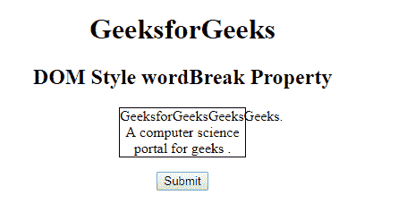
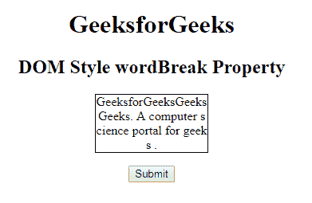

# HTML | DOM 样式断字属性

> 原文:[https://www . geesforgeks . org/html-DOM-style-word break-property/](https://www.geeksforgeeks.org/html-dom-style-wordbreak-property/)

**DOM Style **断字**属性**用于设置或返回断字属性。断字属性用于指定当单词到达行尾时如何断字。文本中的换行符可以出现在某个**断字**属性中。

**语法:**

*   用于返回断字属性:

    ```html
    object.style.wordBreak 
    ```

*   用于设置断字属性:

    ```html
    object.style.wordBreak = "normal|break-all|keep-all|initial|
    inherit" 
    ```

**返回值:**返回一个字符串值，代表元素的断字属性。

**属性值:**

*   **正常:**该属性使用默认的换行规则。
*   **断字:**用于任意字符处断字，防止溢出。
*   **保留全部:**与值正常相同。
*   **断字:**用于任意点断字，防止溢出。
*   **初始值:**将属性设置为默认值。

**示例-1:**

```html
<!DOCTYPE html> 
<html> 
    <head> 
        <style> 
            p { 
                width: 140px; 
                border: 1px solid #000000; 
            } 

            #gfg { 
                word-break: normal; 
            } 
        </style> 
    </head> 
    <body> 
        <center> 
            <h1>GeeksforGeeks</h1> 
            <h2>DOM Style wordBreak Property </h2> 
            <p id="gfg">GeeksforGeeksGeeksGeeks. 
            A computer science portal for geeks .</p> 
            <button onclick="myGeeks()">Submit</button>

                <script>
               function myGeeks() {
         document.getElementById("gfg").style.wordBreak = "break-all";
                }
      </script>
        </center> 
    </body> 
</html>                     
```

**点击按钮前:**


**点击按钮后:**


**示例-2 :**

```html
<!DOCTYPE html> 
<html> 
    <head> 
        <style> 
            p { 
                width: 140px; 
                border: 1px solid #000000; 
            } 

            #gfg { 
                word-break: break-all; 
            } 
        </style> 
    </head> 
    <body> 
        <center> 
            <h1>GeeksforGeeks</h1> 
            <h2>DOM Style wordBreak Property </h2> 
            <p id="gfg">GeeksforGeeksGeeksGeeks. 
            A computer science portal for geeks .</p> 
            <button onclick="myGeeks()">Submit</button>

                <script>
            function myGeeks() {
        document.getElementById("gfg").style.wordBreak = "normal";
                }
    </script>
        </center> 
    </body> 
</html>                    
```

**输出:**
**点击按钮前:**


**点击按钮后:**


**支持的浏览器:**T2 DOM Style 断字属性支持的浏览器如下:

*   谷歌 Chrome
*   微软公司出品的 web 浏览器
*   火狐浏览器
*   歌剧
*   旅行队