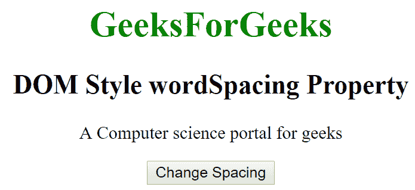
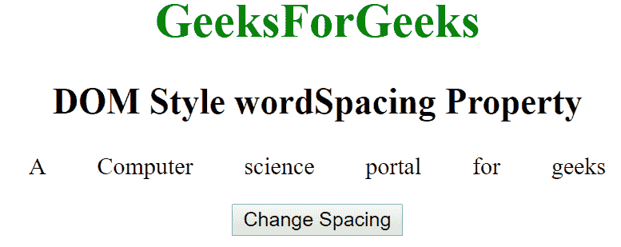
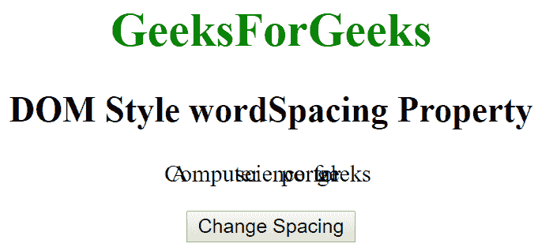

# 超文本标记语言| DOM 样式单词起搏属性

> 原文:[https://www . geesforgeks . org/html-DOM-style-wordspace-property/](https://www.geeksforgeeks.org/html-dom-style-wordspacing-property/)

HTML DOM 中的 Style **单词间距**属性用于设置单词之间的间距。它也可以用来指定单词之间的间距。它返回文本中单词之间的间距。
**语法:**

*   它返回单词空间属性。

```html
object.style.wordSpacing 
```

*   它用于设置单词间距属性。

```html
object.style.wordSpacing  =  "normal|length|initial|inherit"
```

**房产价值:**

*   **正常:**用于指定单词之间的正常间距。这是一个默认值。
*   **长度:**用于以长度单位指定单词之间的间距。它可以允许负值。
*   **初始值:**将单词起搏属性设置为默认值。
*   **inherit:** 该属性从其父元素继承而来。

**返回值:**返回一个字符串，代表文本中单词之间的间距。
**示例-1:**

## 超文本标记语言

```html
<!DOCTYPE html>
<html>

<head>
    <title>DOM Style wordSpacing Property </title>
</head>

<body>

    <center>
        <h1 style="color:green;">
                GeeksForGeeks
            </h1>
        <h2>DOM Style wordSpacing Property </h2>
        <p id="gfg"> A Computer science portal for geeks</p>

        <button type="button" onclick="geeks()">
            Change Decoration
        </button>

        <script>
            function geeks() {
                document.getElementById("gfg").style.wordSpacing
                                                       = "30px";
            }
        </script>
    </center>
</body>

</html>        
```

**输出:**

*   点击按钮前:



*   点击按钮后:



**示例-2:**

## 超文本标记语言

```html
<!DOCTYPE html>
<html>

<head>
    <title>DOM Style wordSpacing Property </title>
    <style>

    </style>

</head>

<body>

    <center>
        <h1 style="color:green;;">
                GeeksForGeeks
            </h1>
        <h2>DOM Styles wordSpacingProperty </h2>
        <p id="gfg"> A Computer science portal for geeks</p>

        <button type="button" onclick="geeks()">
            Change Decoration
        </button>

        <script>
            function geeks() {
                document.getElementById("gfg").style.wordSpacing
                                                      = "-20px";
            }
        </script>
    </center>
</body>

</html>
```

**输出:**

*   点击按钮前:


*   点击按钮后:



**支持的浏览器:**T2 DOM Style words pace 属性支持的浏览器如下:

*   谷歌 Chrome
*   微软公司出品的 web 浏览器
*   火狐浏览器
*   歌剧
*   苹果 Safari