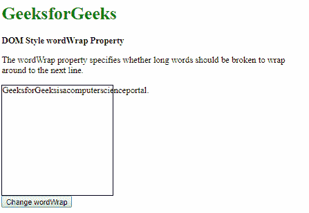
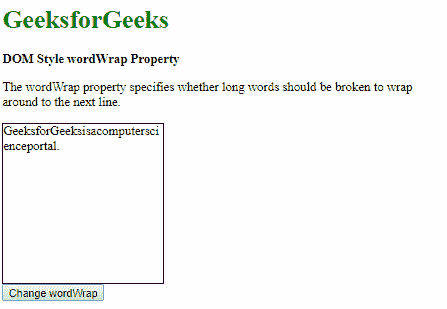
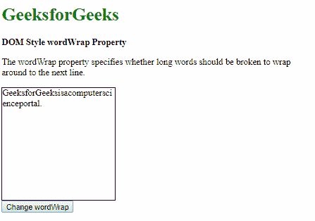

# HTML | DOM 样式文字包装属性

> 原文:[https://www . geesforgeks . org/html-DOM-style-word wrap-property/](https://www.geeksforgeeks.org/html-dom-style-wordwrap-property/)

HTML DOM 中的**Style worwrap 属性**用于**设置**或**返回**是否要断*长词绕到下一行*。

**语法:**

*   获取单词包装属性

    ```html
    object.style.wordWrap
    ```

*   设置文字环绕属性

    ```html
    object.style.wordWrap = "normal|break-word|initial|inherit"
    ```

**属性值:**

*   **normal:** This is used to break long words only at the break points.

    **返回值:**返回一个字符串值，代表元素的换行属性

    **示例-1:**

    ```html
    <!DOCTYPE html>
    <html>

    <head>
        <title>
          DOM Style wordWrap Property
        </title>
        <style>
            .content {
                border: 1px solid;
                height: 200px;
                width: 200px;
                word-wrap: break-word;
            }
        </style>
    </head>

    <body>
        <h1 style="color: green">
          GeeksforGeeks
        </h1>
        <b>
          DOM Style wordWrap Property
        </b>
        <p>
          The wordWrap property specifies whether
          long words should be broken to wrap 
          around to the next line.
        </p>

        <div class="content">
            GeeksforGeeksisacomputerscienceportal.
        </div>
        <button onclick="setWordWrap()">
          Change wordWrap
        </button>

        <!-- Script to set wordWrap to normal -->
        <script>
            function setWordWrap() {
                elem = document.querySelector('.content');
                elem.style.wordWrap = 'normal';
            }
        </script>
    </body>

    </html>
    ```

    **输出:**

    *   点击按钮前:
        
    *   点击按钮后:
        
*   **break-word:** This is used to allow unbreakable words to be broken to the next line.

    **示例-2:**

    ```html
    <!DOCTYPE html>
    <html>

    <head>
        <title>
          DOM Style wordWrap Property
        </title>
        <style>
            .content {
                border: 1px solid;
                height: 200px;
                width: 200px;
            }
        </style>
    </head>

    <body>
        <h1 style="color: green">
          GeeksforGeeks
        </h1>
        <b>
          DOM Style wordWrap Property
        </b>
        <p>
            The wordWrap property specifies
          whether long words should be broken
          to wrap around to the next line.
        </p>
        <div class="content">
            GeeksforGeeksisacomputerscienceportal.
        </div>
        <button onclick="setWordWrap()">
          Change wordWrap
        </button>

        <!-- Script to set wordWrap to break-word -->
        <script>
            function setWordWrap() {

                elem = document.querySelector('.content');
                elem.style.wordWrap = 'break-word';
            }
        </script>
    </body>

    </html>
    ```

    **输出:**

    *   点击按钮前:
        
    *   点击按钮后:
        
*   **initial:** This is used to set the property to its default value.

    **示例-3:**

    ```html
    <!DOCTYPE html>
    <html>

    <head>
        <title>
          DOM Style wordWrap Property
        </title>
        <style>
            .content {
                border: 1px solid;
                height: 200px;
                width: 200px;
                word-wrap: break-word;
            }
        </style>
    </head>

    <body>
        <h1 style="color: green">
          GeeksforGeeks
        </h1>
        <b>DOM Style wordWrap Property</b>
        <p>
            The wordWrap property specifies 
          whether long words should be broken
          to wrap around to the next line.
        </p>
        <div class="content">
          GeeksforGeeksisacomputerscienceportal.
        </div>
        <button onclick="setWordWrap()">
          Change wordWrap
        </button>

        <!-- Script to set wordWrap to initial -->
        <script>
            function setWordWrap() {
              elem = document.querySelector('.content');
              elem.style.wordWrap = 'initial';
            }
        </script>
    </body>

    </html>
    ```

    **输出:**

    *   Before clicking the button:

        

    *   After clicking the button:

        

*   **inherit:** This is used to inherit the value from the parent of the element.

    **示例-4:**

    ```html
    <!DOCTYPE html>
    <html>

    <head>
        <title>
          DOM Style wordWrap Property
        </title>
        <style>
            #parent {
                word-wrap: break-word;
            }

            .content {
                border: 1px solid;
                height: 200px;
                width: 200px;
                word-wrap: normal;
            }
        </style>
    </head>

    <body>
        <h1 style="color: green">
          GeeksforGeeks
        </h1>
        <b>
          DOM Style wordWrap Property
        </b>
        <p>
            The wordWrap property specifies whether 
          long words should be broken to wrap around
          to the next line.
        </p>
        <div id="parent">
            <div class="content">
                GeeksforGeeksisacomputerscienceportal.
            </div>
        </div>
        <button onclick="setWordWrap()">
          Change wordWrap
        </button>

        <!-- Script to set wordWrap to inherit -->
        <script>
            function setWordWrap() {

                elem = document.querySelector('.content');
                elem.style.wordWrap = 'inherit';
            }
        </script>
    </body>

    </html>
    ```

    **输出:**

    *   点击按钮前:
        
    *   点击按钮后:
        

**支持的浏览器:**T2 DOM Style word wrap 属性支持的浏览器如下:

*   谷歌 Chrome
*   火狐浏览器
*   微软公司出品的 web 浏览器
*   歌剧
*   旅行队