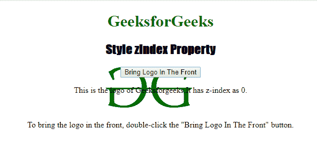
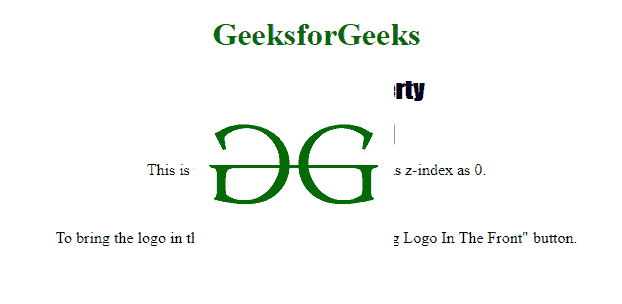

# HTML | DOM 样式 zIndex 属性

> 原文:[https://www . geesforgeks . org/html-DOM-style-zindex-property/](https://www.geeksforgeeks.org/html-dom-style-zindex-property/)

**Style zIndex** 属性用于设置或返回定位元素的堆栈顺序。具有*较低堆叠顺序*的元素将落后于具有*较高堆叠顺序*的另一个元素。
例如，堆叠顺序为(1)的元素将位于堆叠顺序为(0)的元素之前。
当用户想要创建重叠元素时，通常使用 Style zIndex 属性。

**语法:**

*   获取属性:

    ```html
    object.style.zIndex;
    ```

*   设置属性:

    ```html
    object.style.zIndex = "auto|number|initial|inherit"
    ```

**属性值:**

*   **auto:** 用于让浏览器决定元素的堆叠顺序。
*   **number:** 它使用一个整数来定义元素的堆栈顺序。
*   **初始值:**用于设置默认值。
*   **继承:**用于从其父代继承财产。

**返回值:**返回一个字符串值，代表一个元素的堆栈顺序。

下面的程序说明了 Style zIndex 属性:
**示例:**更改一个< img >元素的堆栈顺序。

```html
<!DOCTYPE html>
<html>

<head>
    <title>Style zIndex Property</title>
    <style>
        #MyImage {
            position: absolute;
            left: 200px;
            top: 80px;
            z-index: -1
        }

        h1 {
            color: green;
        }

        h2 {
            font-family: Impact;
        }

        body {
            text-align: center;
        }
    </style>
</head>

<body>
<center>
    <h1>GeeksforGeeks</h1>
    <h2>Style zIndex Property</h2>

    

    <button type="button" ondblclick="stack()">
      Bring Logo In The Front
    </button>

    <p>This is the logo of Geeksforgeeks.It has z-index as 0.</p>
    <br>
    <p>To bring the logo in the front,
    double-click the "Bring Logo In The Front" button.</p>

    <script>
        function stack() {
            document.getElementById("MyImage").style.zIndex = "1";
        }
    </script>
</center>
</body>

</html>
```

**输出:**

*   点击按钮前:
    
*   双击按钮后:
    

**支持的浏览器:**以下列出了*HTML | DOM Style zIndex Property*支持的浏览器:

*   谷歌 Chrome
*   微软公司出品的 web 浏览器
*   火狐浏览器
*   歌剧
*   苹果 Safari