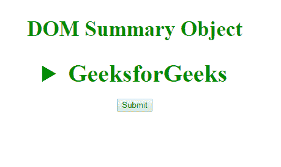
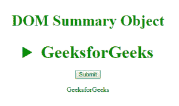
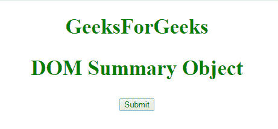
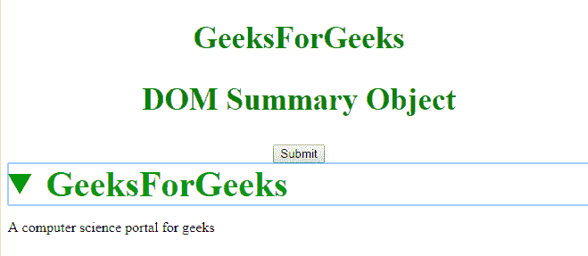

# HTML | DOM 汇总对象

> 原文:[https://www.geeksforgeeks.org/html-dom-summary-object/](https://www.geeksforgeeks.org/html-dom-summary-object/)

**DOM 摘要对象**用于表示 HTML [<摘要>](https://www.geeksforgeeks.org/html-5-summary-tag/) 元素。*摘要*元素由 **getElementById()访问。**

**语法:**

```html
document.getElementById("ID"); 
```

其中**“id”**是分配给“汇总”标签的 ID。

**示例-1:**

```html
<!DOCTYPE html>
<html>

<head>
    <title>DOM Summary Object</title>
    <style>
        h2 {
            color: green;
            font-size: 35px;
        }

        summary {
            font-size: 40px;
            color: #090;
            font-weight: bold;
        }
    </style>
</head>

<body>
    <center>
        <h2>DOM Summary Object </h2>

        <details>
          <!-- assigning id to summary tag. -->
          <summary id="GFG">GeeksforGeeks</summary>
          <p>A computer science portal for geeks</p>
          <div>It is a computer science portal 
            where you can learn programming.</div>
        </details>

        <br>
        <button onclick="myGeeks()">Submit</button>
        <p id="sudo"></p>
        <script>
            function myGeeks() {
                // Accessing summary tag 
                var x = document.getElementById("GFG").innerHTML;
                // display text content present in summary tag
                document.getElementById("sudo").innerHTML = x;
            }
        </script>
    </center>
</body>
</html>             
```

**输出:**
**点击按钮前:**


**点击按钮后:**


**示例-2:** 可以使用 **document.createElement 方法创建汇总对象。**

```html
<!DOCTYPE html> 
<html> 

<head> 
    <title>DOM Summary Object</title> 
    <style> 
       h1  {
         color:green;
         font-size:35px;
         }
        h2 { 
            color: green; 
            font-size: 35px; 
        } 

        summary { 
            font-size: 40px; 
            color: #090; 
            font-weight: bold; 
        } 
    </style> 
</head> 

<body> 
    <center> 
       <h1>GeeksForGeeks</h1>
        <h2>DOM Summary Object </h2>
        <br> 
        <button onclick="myGeeks()">Submit</button> 
        <script> 
            function myGeeks() { 

        //  Creating details object.    
        var g = document.createElement("DETAILS");
        document.body.appendChild(g);

  //  Creating summary object.
  var summary = document.createElement("SUMMARY");
  var text1 = document.createTextNode("GeeksForGeeks");
  summary.appendChild(text1);

   var para = document.createElement("P");
   var text2 = document.createTextNode(
   "A computer science portal for geeks");
  para.appendChild(text2);

  g.appendChild(summary);
  g.appendChild(para);         
            } 
        </script> 
    </center> 
</body> 

</html>             
```

**输出:**

**点击按钮前:**


**点击按钮后:**


**支持的浏览器:****DOM 汇总对象**支持的浏览器如下:

*   谷歌 Chrome
*   微软公司出品的 web 浏览器
*   火狐浏览器
*   旅行队
*   歌剧