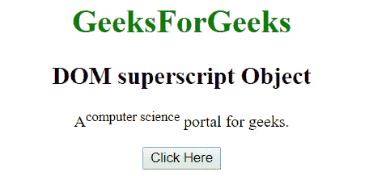
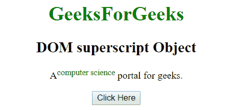
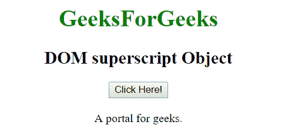
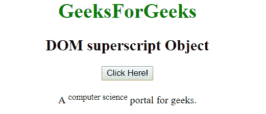

# HTML | DOM 上标对象

> 原文:[https://www.geeksforgeeks.org/html-dom-superscript-object/](https://www.geeksforgeeks.org/html-dom-superscript-object/)

HTML DOM 中的上标对象用来表示 HTML sup 元素。上标元素可以通过使用 getElementById()来访问。
**语法:**

```html
document.getElementById("id") 
```

其中 id 被分配给<sup>标签。
**例:**</sup> 

## 超文本标记语言

```html
<!DOCTYPE html>
<html>
    <head>
        <title>
            HTML DOM superscript Object
        </title>
    </head>

    <body style = "text-align:center">

        <h1 style = "color:green;" >
            GeeksForGeeks
        </h1>

        <h2>DOM superscript Object</h2>

<p>A<sup id="sup_scr">computer science</sup>
        portal for geeks.</p>

        <button onclick="Geeks()">Click Here</button>

        <!-- script to set style in superscript object -->
        <script>
            function Geeks() {
                var txt = document.getElementById("sup_scr");
                txt.style.color = "green";
            }
        </script>
</body>
</html>                   
```

**输出:**
**之前点击按钮:**



**点击按钮后:**



**示例 2:** 可以使用 document.createElement 方法创建上标对象。

## 超文本标记语言

```html
<!DOCTYPE html>
<html>
    <head>
        <title>
            HTML DOM superscript Object
        </title>
    </head>

    <body style = "text-align:center">

        <h1 style = "color:green;" >
            GeeksForGeeks
        </h1>

        <h2>DOM superscript Object</h2>

        <button onclick = "Geeks()">
            Click Here!
        </button>

        <br><br>

        <div>A <span id = "p"></span> portal for geeks.</div>

        <script>
        function Geeks() {
            var txt = document.createElement("SUP");
            var t = document.createTextNode("computer science");
            txt.appendChild(t);
            document.getElementById("p").appendChild(txt);
        }
        </script>
</body>
</html>                   
```

**输出:**
**之前点击按钮:**



**点击按钮后:**



**支持的浏览器:**

*   歌剧
*   微软公司出品的 web 浏览器
*   谷歌 Chrome
*   火狐浏览器
*   苹果 Safari