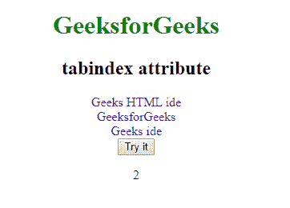

# HTML | DOM tabIndex 属性

> 原文:[https://www.geeksforgeeks.org/html-dom-tabindex-property/](https://www.geeksforgeeks.org/html-dom-tabindex-property/)

**tabIndex 属性**用于返回元素的 tabIndex 属性的值。tabindex 属性指定元素的制表符顺序(当制表符按钮用于导航时使用。)

**语法:**

*   **返回 tabIndex 属性:**

```html
HTMLElementObject.tabIndex
```

*   **设置 tabIndex 属性:**

```html
HTMLElementObject.tabIndex = number
```

**属性值:**

*   **编号:**定义元素的跳转顺序。

**返回值:**返回一个代表元素 tab 键顺序的数值。
**注意:**如果数字为负数，该元素将从标签顺序中删除。
**例:**

## 超文本标记语言

```html
<!DOCTYPE html>
<html>

<head>
    <title>HTML DOM tabIndex Property</title>

    <style>
        body {
            text-align:center;
        }
        h1 {
            color:green;
        }
        a {
            text-decoration:none;
        }
    </style>
</head>

<body>
    <h1>GeeksforGeeks</h1>

    <h2>tabindex attribute</h2>

    <a href="https://ide.geeksforgeeks.org/tryit.php"
            tabindex="2">
        Geeks HTML ide
    </a>
    <br>

    <a href="https://www.geeksforgeeks.org/"
                tabindex="1">
        GeeksforGeeks
    </a>
    <br>

    <a href="https://ide.geeksforgeeks.org/"
            tabindex="3">
        Geeks ide
    </a><br>

    <button onclick="gfgFun()">Try it</button>
    <p id="gfg"></p>

    <script>
        function gfgFun() {
            var gfgvar = document.getElementsByTagName(
                        "A")[0].tabIndex;

            document.getElementById("gfg").innerHTML
                        = gfgvar;
        }
    </script>
</body>

</html>
```

**输出:**



**支持的浏览器:**HTML DOM tabIndex 属性支持的浏览器如下:

*   铬
*   火狐浏览器
*   微软公司出品的 web 浏览器
*   歌剧
*   旅行队