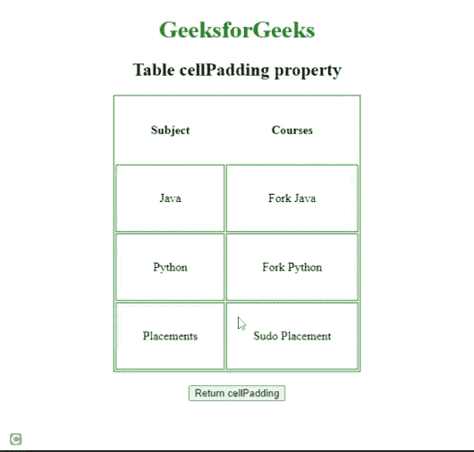

# HTML DOM 表格单元格填充属性

> 原文:[https://www . geesforgeks . org/html-DOM-table-cell padding-property/](https://www.geeksforgeeks.org/html-dom-table-cellpadding-property/)

**HTML DOM Table*****cell padding*****属性用于设置或返回 [< table >](https://www.geeksforgeeks.org/html-tables/) 元素的 ***cellpadding*** 属性的值。 ***细胞填充*** 属性用于定义细胞内容和细胞壁之间的空间。**

****语法:****

*   **它用于返回表*单元格填充*属性。

    ```html
    TableObject.cellPadding
    ```** 
*   **用于设置表格*单元格填充*属性。

    ```html
    TableObject.cellPadding = "number"
    ```** 

****属性值:**它包含一个**数字**值，以像素为单位表示细胞壁和细胞内容之间的空间。**

****示例 1:** 下面的 HTML 代码展示了，如何返回表 *cellPadding* 属性。**

## **超文本标记语言**

```html
<!DOCTYPE html>
<html>

<head>
    <title>
        Table cellPadding property in HTML
    </title>

    <style>
        table,
        td {
            border: 1px solid green;
        }

        h1 {
            color: green;
        }

        body {
            text-align: center;
        }
    </style>
</head>

<body>
    <h1>GeeksforGeeks</h1>
    <h2>Table cellPadding Property</h2>

    <table id="tableID" align="center"
        cellpadding="35">

        <thead>
            <tr>
                <th>Subject</th>
                <th>Courses</th>
            </tr>
        </thead>
        <tr>
            <td>Java</td>
            <td>Fork Java</td>
        </tr>
        <tr>
            <td>Python</td>
            <td>Fork Python</td>
        </tr>
        <tr>
            <td>Placements</td>
            <td>Sudo Placement</td>
        </tr>
    </table>
    <br>

    <button ondblclick="doubleClick()">
        Return cellPadding
    </button>

    <p id="paraID"></p>

    <script>
        function doubleClick() {
            var w = document.getElementById(
                "tableID").cellPadding;

            document.getElementById(
                "paraID").innerHTML = w + "px";
        }
    </script>
</body>

</html>
```

****输出:****

****

****示例 2:** 下面的 HTML 代码说明了如何设置表格*单元格填充*属性。**

## **超文本标记语言**

```html
<!DOCTYPE html>
<html>

<head>
    <title>
        Table cellPadding Property in HTML
    </title>

    <style>
        table,
        td {
            border: 1px solid green;
        }

        h1 {
            color: green;
        }

        body {
            text-align: center;
        }
    </style>
</head>

<body>
    <h1>GeeksforGeeks</h1>
    <h2>Table cellPadding property</h2>

    <table id="tableID" align="center" 
        cellpadding="35">

        <thead>
            <tr>
                <th>Subject</th>
                <th>Courses</th>
            </tr>
        </thead>
        <tr>
            <td>Java</td>
            <td>Fork Java</td>
        </tr>
        <tr>
            <td>Python</td>
            <td>Fork Python</td>
        </tr>
        <tr>
            <td>Placements</td>
            <td>Sudo Placement</td>
        </tr>
    </table>
    <br>

    <button ondblclick="doubleClick()">
        Return cellPadding
    </button>

    <p id="paraID"></p>

    <script>
        function doubleClick() {
            var w = document.getElementById(
                "tableID").cellPadding = "15";

            document.getElementById(
                "paraID").innerHTML = w + "px";
        }
    </script>
</body>

</html>
```

****输出:****

****

****支持的浏览器:****

*   **谷歌 Chrome**
*   **火狐浏览器**
*   **歌剧**
*   **苹果 Safari**
*   **微软公司出品的 web 浏览器**