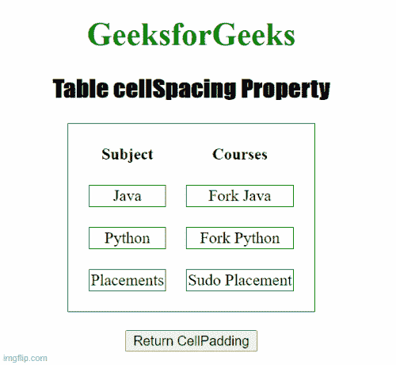

# HTML DOM 表格单元格间距属性

> 原文:[https://www . geesforgeks . org/html-DOM-table-cellspacing-property/](https://www.geeksforgeeks.org/html-dom-table-cellspacing-property/)

**HTML DOM 表格单元格间距属性**用于设置或返回<表格>元素的**单元格间距**属性的值。**单元格间距**属性用于定义单元格之间的间距。

**语法**

*   它返回单元格间距属性。

```html
TableObject.cellSpacing
```

*   它用于设置单元格间距属性。

```html
TableObject.cellSpacing = "pixels"
```

**属性值:**包含数值，表示两个单元格之间的空间数量，以像素为单位。

**返回值:**返回一个数值，以像素为单位表示单元格之间的间距。

**示例 1:** 下面的代码返回表格单元格间距属性。

## 超文本标记语言

```html
<!DOCTYPE html>
<html>

<head>
    <title>
        Table cellSpacing Property in HTML
    </title>

    <style>
        table,
        td {
            border: 1px solid green;
        }

        h1 {
            color: green;
        }

        h2 {
            font-family: Impact;
        }

        body {
            text-align: center;
        }
    </style>
</head>

<body>
    <h1>GeeksforGeeks</h1>
    <h2>Table cellSpacing Property</h2>

    <table id="GFG" align="center" cellspacing="20">
        <thead>
            <tr>
                <th>Subject</th>
                <th>Courses</th>
            </tr>
        </thead>
        <tr>
            <td>Java</td>
            <td>Fork Java</td>
        </tr>
        <tr>
            <td>Python</td>
            <td>Fork Python</td>
        </tr>
        <tr>
            <td>Placements</td>
            <td>Sudo Placement</td>
        </tr>
    </table>
    <br />

    <button ondblclick="Table_Caption()">
        Return CellPadding
    </button>

    <p id="sudo"></p>

    <script>
        function Table_Caption() {
            var w = document.getElementById(
                    "GFG").cellSpacing;

            document.getElementById(
                "sudo").innerHTML = w + "PX";
        }
    </script>
</body>

</html>
```

**输出:**



**示例 2:** 下面的 HTML 代码说明了如何设置单元格间距属性。

## 超文本标记语言

```html
<!DOCTYPE html>
<html>

<head>
    <title>
        Table cellSpacing Property in HTML
    </title>

    <style>
        table,
        td {
            border: 1px solid green;
        }

        h1 {
            color: green;
        }

        h2 {
            font-family: Impact;
        }

        body {
            text-align: center;
        }
    </style>
</head>

<body>
    <h1>GeeksforGeeks</h1>
    <h2>Table cellSpacing Property</h2>

    <table id="GFG" align="center" cellspacing="20">
        <thead>
            <tr>
                <th>Subject</th>
                <th>Courses</th>
            </tr>
        </thead>
        <tr>
            <td>Java</td>
            <td>Fork Java</td>
        </tr>
        <tr>
            <td>Python</td>
            <td>Fork Python</td>
        </tr>
        <tr>
            <td>Placements</td>
            <td>Sudo Placement</td>
        </tr>
    </table>
    <br />

    <button ondblclick="Table_Caption()">
        Return CellPadding
    </button>

    <p id="sudo"></p>

    <script>
        function Table_Caption() {

            // Pixel set
            var w = (document.getElementById(
                "GFG").cellSpacing = "5");

            document.getElementById(
                "sudo").innerHTML = w + "PX";
        }
    </script>
</body>

</html>
```

**输出:**


**支持的浏览器:**

*   谷歌 Chrome
*   火狐浏览器
*   苹果 Safari
*   微软公司出品的 web 浏览器
*   歌剧