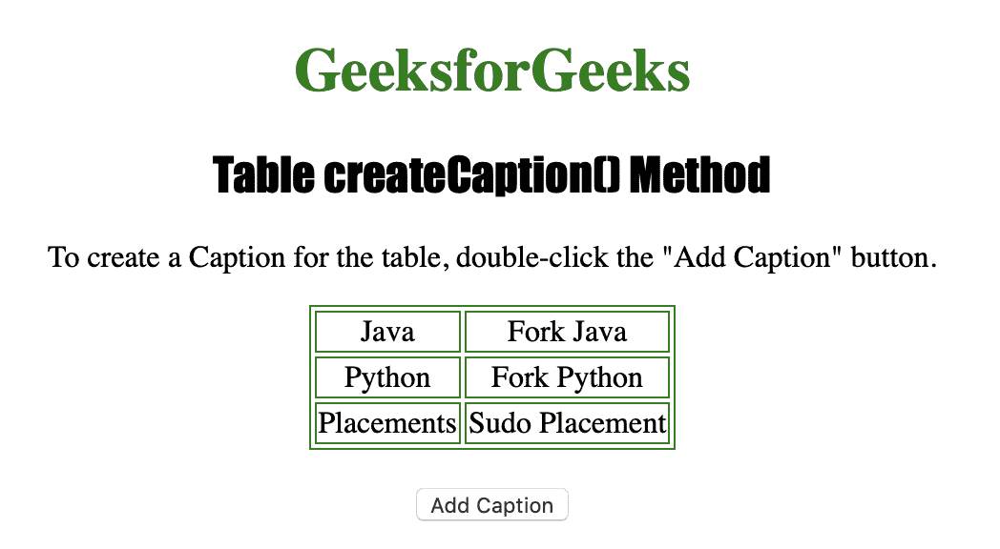
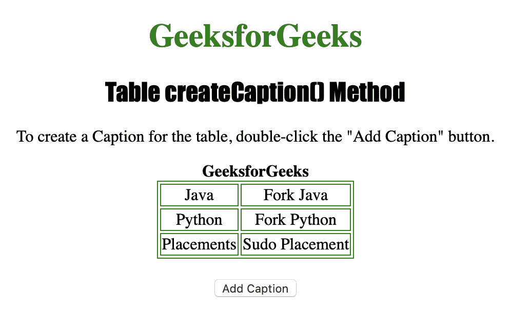

# HTML | DOM 表 createCaption()方法

> 原文:[https://www . geesforgeks . org/html-DOM-table-create caption-method/](https://www.geeksforgeeks.org/html-dom-table-createcaption-method/)

在表格中使用**表格创建标题()方法**创建空的 **<标题>** 。如果已经有 **<字幕>元素**就不管用了。在这种情况下， **createCaption()** 方法返回现有的。
**语法**

```html
tableObject.createCaption()
```

**返回值:**新创建的(或现有的)<标题>元素

下面的程序说明了 Table createCaption()方法:
**示例-1:** 创建一个< caption >元素。

## 超文本标记语言

```html
<!DOCTYPE html>
<html>

<head>
    <title>Table createCaption()
      Method in HTML</title>
    <style>
        table,
        td {
            border: 1px solid green;
        }

        h1 {
            color: green;
        }

        h2 {
            font-family: Impact;
        }

        body {
            text-align: center;
        }
    </style>
</head>

<body>

    <h1>GeeksforGeeks</h1>
    <h2>Table createCaption() Method</h2>

<p>To create a Caption for the table,
      double-click the "Add Caption" button.
  </p>

    <table id="Courses"
           align="center">
        <tr>
            <td>Java</td>
            <td>Fork Java</td>
        </tr>
        <tr>
            <td>Python</td>
            <td>Fork Python</td>
        </tr>
        <tr>
            <td>Placements</td>
            <td>Sudo Placement</td>
        </tr>

    </table>
    <br>

    <button ondblclick="Add_Caption()">
      Add Caption
  </button>

    <script>
        function Add_Caption() {

           // Creating caption.
           var MyTable =
            document.getElementById(
              "Courses").createCaption();

          // Caption value.
          MyTable.innerHTML =
              "<strong>GeeksforGeeks</strong>";
        }
    </script>

</body>

</html>
```

**输出:**
**点击按钮前:**



**点击按钮后:**



**支持的浏览器:**

*   苹果 Safari
*   微软公司出品的 web 浏览器
*   火狐浏览器
*   谷歌 Chrome
*   歌剧