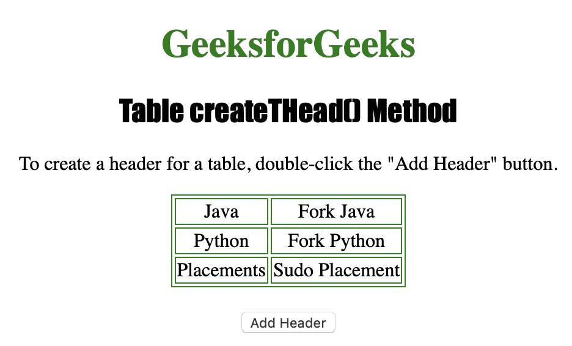
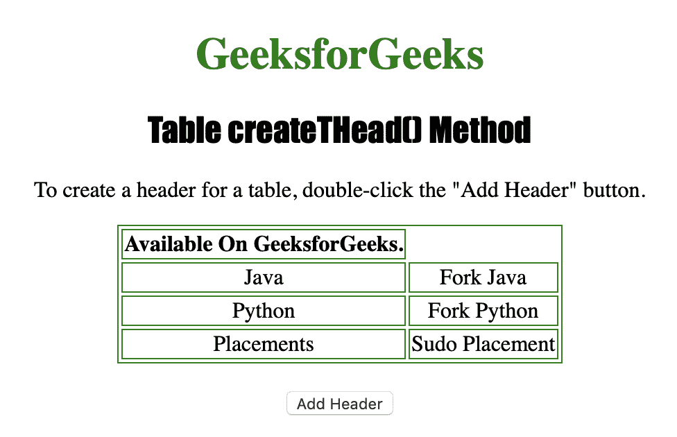

# HTML | DOM 表 createTHead()方法

> 原文:[https://www . geesforgeks . org/html-DOM-table-create the ad-method/](https://www.geeksforgeeks.org/html-dom-table-createthead-method/)

**表格创建方法**用于创建一个空的 **<和>** 元素，并将其添加到表格中。如果一个 **<和>** 元素已经存在，它不会创建新的 **<和>** 元素。在这种情况下，createThead()方法返回现有的一个。
**<和>** 元素内部必须有一个或多个标签。
**语法**

```html
tableObject.createTHead()
```

**返回值:**返回新创建的或现有的<和>元素

下面的程序说明了 Table createTHead()方法:
**示例:**创建一个< thead >元素。

## 超文本标记语言

```html
<!DOCTYPE html>
<html>

<head>
    <title>
      Table createTHead() Method in HTML
  </title>

    <style>
        table,
        td {
            border: 1px solid green;
        }

        h1 {
            color: green;
        }

        h2 {
            font-family: Impact;
        }

        body {
            text-align: center;
        }
    </style>
</head>

<body>

    <h1>GeeksforGeeks</h1>
    <h2>Table createTHead() Method</h2>

<p>To create a header for a table,
      double-click the "Add Header" button.</p>

    <table id="Courses"
           align="center">
        <tr>
            <td>Java</td>
            <td>Fork Java</td>
        </tr>
        <tr>
            <td>Python</td>
            <td>Fork Python</td>
        </tr>
        <tr>
            <td>Placements</td>
            <td>Sudo Placement</td>
        </tr>

    </table>
    <br>

    <button ondblclick="table_head()">
      Add Header
  </button>

    <script>
        function table_head() {

            var MyTable =
                document.getElementById("Courses");

            // Create heading of table.
            var MyHeader = MyTable.createTHead();
            var MyRow = MyHeader.insertRow(0);
            var MyCell = MyRow.insertCell(0);
            MyCell.innerHTML =
              "<strong>Available On GeeksforGeeks.</strong>";
        }
    </script>

</body>

</html>
```

**输出:**
**点击按钮前:**



**点击按钮后:**



**支持的浏览器:**

*   苹果 Safari
*   微软公司出品的 web 浏览器
*   火狐浏览器
*   谷歌 Chrome
*   歌剧