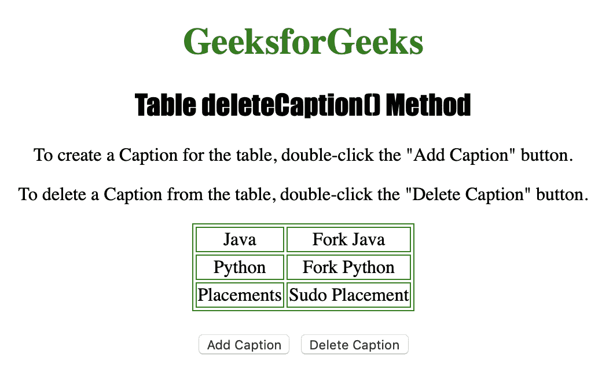
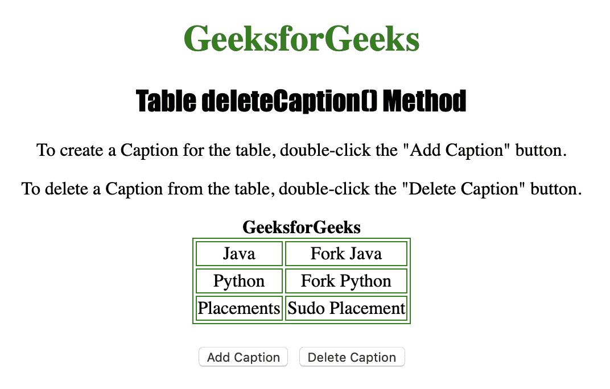

# HTML | DOM 表删除标题()方法

> 原文:[https://www . geesforgeks . org/html-DOM-table-delete caption-method/](https://www.geeksforgeeks.org/html-dom-table-deletecaption-method/)

**表格删除标题()方法**用于删除一个 **<标题>** 元素，*将其内容从表格*中删除。
只有当 **<字幕>** 元素已经存在时才能使用。

**语法:**

```html
tableObject.deleteCaption()
```

下面的程序说明了 Table deleteCaption()方法:
**示例:**删除一个< caption >元素。

```html
<!DOCTYPE html>
<html>

<head>
    <title>Table deleteCaption() Method in HTML
  </title>
    <style>
        table,
        td {
            border: 1px solid green;
        }

        h1 {
            color: green;
        }

        h2 {
            font-family: Impact;
        }

        body {
            text-align: center;
        }
    </style>
</head>

<body>

    <h1>GeeksforGeeks</h1>
    <h2>Table deleteCaption() Method</h2>

    <p>To create a Caption for the table, 
      double-click the "Add Caption" button.</p>

    <p>To delete a Caption from the table, 
      double-click the "Delete Caption" button.</p>

    <table id="Courses" 
           align="center">
        <tr>
            <td>Java</td>
            <td>Fork Java</td>
        </tr>
        <tr>
            <td>Python</td>
            <td>Fork Python</td>
        </tr>
        <tr>
            <td>Placements</td>
            <td>Sudo Placement</td>
        </tr>

    </table>
    <br>

    <button ondblclick="Add_Caption()">
      Add Caption
  </button>

    <button ondblclick="Delete_Caption()">
      Delete Caption
  </button>

    <script>
        function Add_Caption() {

            //  Create caption.
            var MyTable = 
             document.getElementById(
               "Courses").createCaption();

            MyTable.innerHTML = 
              "<strong>GeeksforGeeks</strong>";
        }

        function Delete_Caption() {

           // Delete caption.
            document.getElementById(
              "Courses").deleteCaption();
        }
    </script>

</body>

</html>
```

**输出:**

*   **点击【添加标题】按钮前:**
    
*   **点击【添加标题】按钮后:**
    
*   **点击【删除字幕】按钮后:**
    

**支持的浏览器:**

*   苹果 Safari
*   微软公司出品的 web 浏览器
*   火狐浏览器
*   谷歌 Chrome
*   歌剧