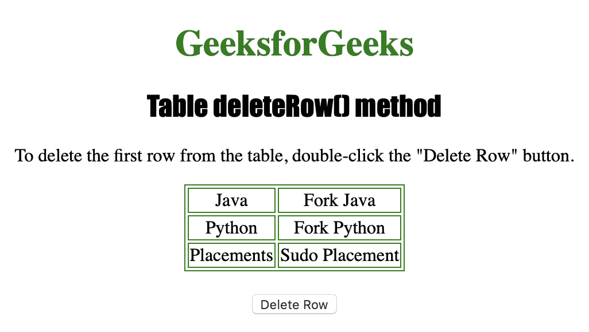
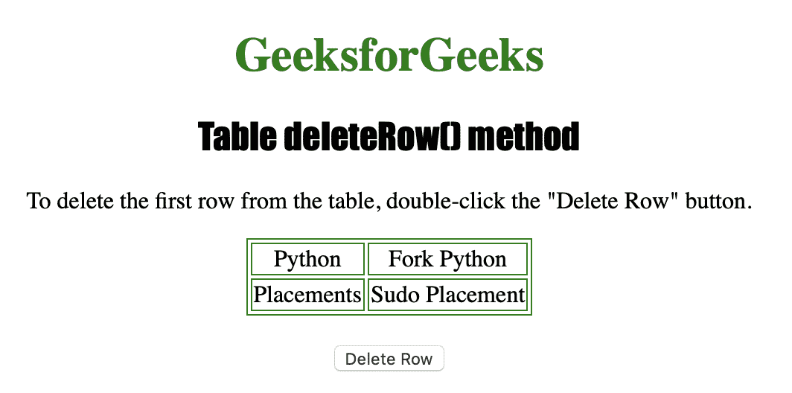

# HTML | DOM 表 deleteRow()方法

> 原文:[https://www . geesforgeks . org/html-DOM-table-delete row-method/](https://www.geeksforgeeks.org/html-dom-table-deleterow-method/)

**表格删除行()方法**用于从表格中删除一个 **< tr >** 元素。换句话说，**表删除行()方法**用于**删除表中*指定索引处的行***。

**语法**

```html
tableObject.deleteRow(index)
```

**使用的参数**

*   **索引:**用于指定要删除的行的位置。值 0 导致删除第一行，而-1 可用于删除最后一行。

下面的程序说明了 Table deleteRow()方法:
**示例-1:** 从表格中删除第一行。

```html
<!DOCTYPE html>
<html>

<head>
    <title>Table deleteRow() method in HTML</title>
    <style>
        table,
        td {
            border: 1px solid green;
        }

        h1 {
            color: green;
        }

        h2 {
            font-family: Impact;
        }

        body {
            text-align: center;
        }
    </style>
</head>

<body>

    <h1>GeeksforGeeks</h1>
    <h2>Table deleteRow() method</h2>

    <p>To delete the first row from the table,
      double-click the "Delete Row" button.</p>

    <table id="Courses" align="center">
        <tr>
            <td>Java</td>
            <td>Fork Java</td>
        </tr>
        <tr>
            <td>Python</td>
            <td>Fork Python</td>
        </tr>
        <tr>
            <td>Placements</td>
            <td>Sudo Placement</td>
        </tr>

    </table>
    <br>

    <button ondblclick="row()">
      Delete Row
  </button>

    <script>
        function row() {

          // delete row (index-0).
          document.getElementById("Courses").deleteRow(0);
        }
    </script>

</body>

</html>
```

**输出:**


**点击**
按钮后

**支持的浏览器:**

*   苹果 Safari
*   微软公司出品的 web 浏览器
*   火狐浏览器
*   谷歌 Chrome
*   歌剧