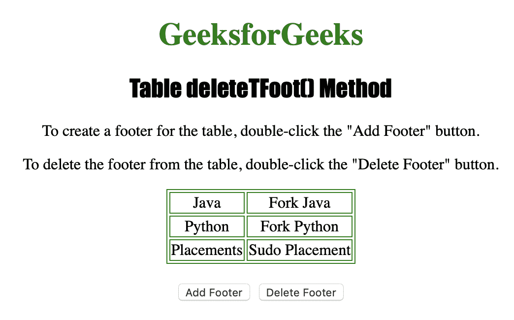
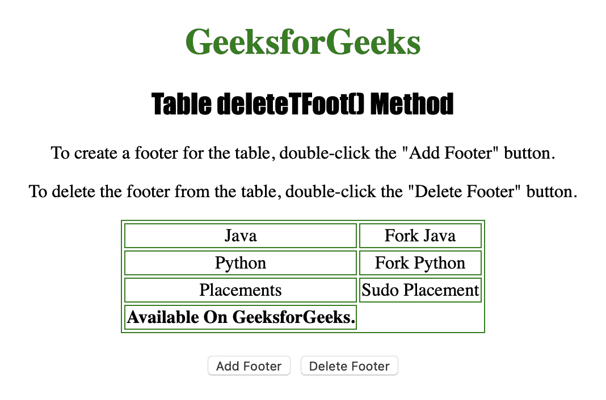

# HTML | DOM 表 deleteTFoot()方法

> 原文:[https://www . geesforgeks . org/html-DOM-table-deletetfoot-method/](https://www.geeksforgeeks.org/html-dom-table-deletetfoot-method/)

**表格删除方法**用于**从表格中删除一个<表格>元素及其内容。
只有当 **< tfoot >** 元素已经存在时才能使用。**

**语法**

```html
tableObject.deleteTFoot()
```

下面的程序说明了 Table deleteTFoot()方法:
**示例-1:** 删除一个 **< tfoot >** 元素。

```html
<!DOCTYPE html>
<html>

<head>
    <title>
      Table deleteTFoot() Method in HTML
  </title>
    <style>
        table,
        td {
            border: 1px solid green;
        }

        h1 {
            color: green;
        }

        h2 {
            font-family: Impact;
        }

        body {
            text-align: center;
        }
    </style>
</head>

<body>

    <h1>GeeksforGeeks</h1>
    <h2>Table deleteTFoot() Method</h2>

    <p>To create a footer for the table, 
      double-click the "Add Footer" button.</p>

    <p>To delete the footer from the table, 
      double-click the "Delete Footer" button.</p>

    <table id="Courses" 
           align="center">
        <tr>
            <td>Java</td>
            <td>Fork Java</td>
        </tr>
        <tr>
            <td>Python</td>
            <td>Fork Python</td>
        </tr>
        <tr>
            <td>Placements</td>
            <td>Sudo Placement</td>
        </tr>

    </table>
    <br>

    <button ondblclick="Add_foot()">
      Add Footer
  </button>

    <button ondblclick="Delete_foot()">
      Delete Footer
  </button>

    <script>
        function Add_foot() {

            var MyTable = 
                document.getElementById("Courses");

            var MyFooter = MyTable.createTFoot();
            var MyRow = MyFooter.insertRow(0);
            var MyCell = MyRow.insertCell(0);

            MyCell.innerHTML =
              "<b>Available On GeeksforGeeks.</b>";
        }

        function Delete_foot() {

            // Delete footer.
            document.getElementById(
              "Courses").deleteTFoot();
        }
    </script>

</body>

</html>
```

**输出:**

**点击【添加页脚】按钮前:**


**点击【添加页脚】按钮后:**


**点击【删除页脚】按钮后:**


**支持的浏览器:**

*   苹果 Safari
*   微软公司出品的 web 浏览器
*   火狐浏览器
*   谷歌 Chrome
*   歌剧