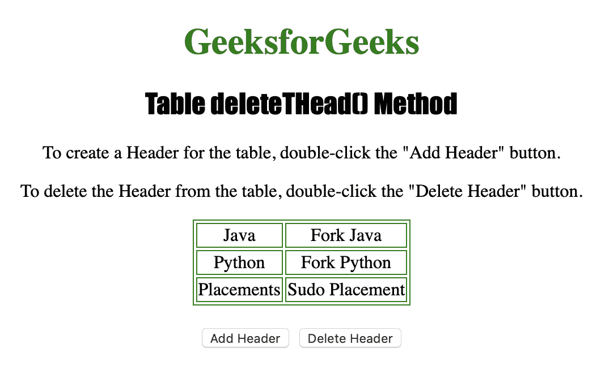
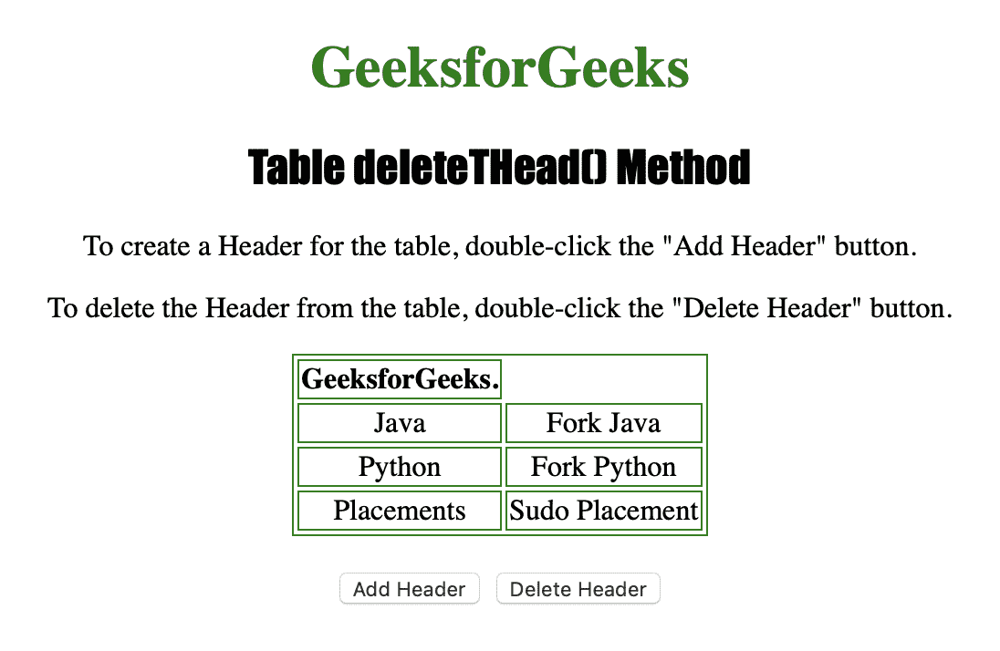

# HTML | DOM 表格删除(方法)

> 原文:[https://www . geesforgeks . org/html-DOM-table-delete thead-method/](https://www.geeksforgeeks.org/html-dom-table-deletethead-method/)

**表格删除方法**用于从表格中删除一个 **<和>** 元素及其内容。
只有当 **<和>** 元素已经存在时才能使用。

**语法**

```html
tableObject.deleteTHead()
```

下面的程序说明了**表删除**方法:
**示例-1:** 删除一个 **<和>** 元素。

```html
<!DOCTYPE html>
<html>

<head>
    <title>Table deleteTHead() Method in HTML
  </title>
    <style>
        table,
        td {
            border: 1px solid green;
        }

        h1 {
            color: green;
        }

        h2 {
            font-family: Impact;
        }

        body {
            text-align: center;
        }
    </style>
</head>

<body>

    <h1>GeeksforGeeks</h1>
    <h2>Table deleteTHead() Method</h2>

    <p>To create a Header for the table, 
      double-click the "Add Header" button.</p>

    <p>To delete the Header from the table,
      double-click the "Delete Header" button.</p>

    <table id="Courses" align="center">
        <tr>
            <td>Java</td>
            <td>Fork Java</td>
        </tr>
        <tr>
            <td>Python</td>
            <td>Fork Python</td>
        </tr>
        <tr>
            <td>Placements</td>
            <td>Sudo Placement</td>
        </tr>

    </table>
    <br>

    <button ondblclick="Add_Head()">
      Add Header
  </button>

    <button ondblclick="Delete_Head()">
      Delete Header
  </button>

    <script>
        function Add_Head() {
            var MyTable = 
            document.getElementById("Courses");

            // Creating table.
            var MyHeader = 
                MyTable.createTHead();
            var MyRow = MyHeader.insertRow(0);
            var MyCell = MyRow.insertCell(0);
            MyCell.innerHTML = 
              "<strong>GeeksforGeeks.</strong>";
        }

        function Delete_Head() {

            // Delete thead.
            document.getElementById(
              "Courses").deleteTHead();
        }
    </script>

</body>

</html>
```

**输出:**

*   **点击【添加表头】按钮前:**
    
*   **点击【添加表头】按钮后:**
    
*   **点击【删除表头】按钮后:**
    

**支持的浏览器:**

*   苹果 Safari
*   微软公司出品的 web 浏览器
*   火狐浏览器
*   谷歌 Chrome
*   歌剧