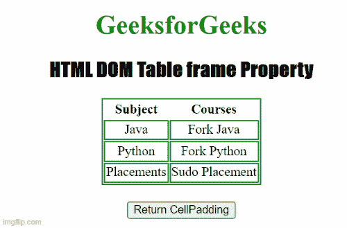

# HTML DOM 表格框架属性

> 原文:[https://www . geesforgeks . org/html-DOM-table-frame-property/](https://www.geeksforgeeks.org/html-dom-table-frame-property/)

[**HTML DOM Table**](https://www.geeksforgeeks.org/html-dom-table-object/)**frame**属性用于设置或返回 ***frame*** 元素的 [<表格>](https://www.geeksforgeeks.org/html-tables/) 属性的值。 ***框架*** 属性用于指定外部边框的可见性。

**语法**

它用于返回框架属性。

```html
tableObject.frame; 
```

用于设置*帧*属性。

```html
tableObject.frame="values"; 
```

**属性值:**

*   **void:** 用于隐藏外边框。
*   **上图:**用于显示外侧上边框。
*   **如下:**用于显示外侧下边框。
*   **hsides:** 用于显示外侧上下边框。
*   **vsides** :用于显示外侧左右边框。
*   **lhs:** 用于显示外侧左边框。
*   **rhs:** 用于显示外侧右边框。
*   **框**:用于显示边框的所有边。
*   **边框:**用于显示所有外部边框。

**示例:**下面的 HTML 代码返回表格*框架*属性。

## 超文本标记语言

```html
<!DOCTYPE html>
<html>

<head>
    <style>
        table,
        td {
            border: 1px solid green;
        }

        h1 {
            color: green;
        }

        h2 {
            font-family: Impact;
        }

        body {
            text-align: center;
        }
    </style>
</head>

<body>

    <h1>GeeksforGeeks</h1>
    <h2>HTML DOM Table frame Property</h2>

    <table id="tableID" align="center" 
        summary="courses@GeeksforGeeks" 
        frame="void">

        <thead>
            <tr>
                <th>Subject</th>
                <th>Courses</th>
            </tr>
        </thead>
        <tr>
            <td>Java</td>
            <td>Fork Java</td>
        </tr>
        <tr>
            <td>Python</td>
            <td>Fork Python</td>
        </tr>
        <tr>
            <td>Placements</td>
            <td>Sudo Placement</td>
        </tr>
    </table>
    <br>

    <button ondblclick="dblClick()">
        Return CellPadding
    </button>

    <p id="paraID"></p>

    <script>
        function dblClick() {
            var w = document
            .getElementById("tableID").frame;

            document.getElementById(
                "paraID").innerHTML = w;
        }
    </script>
</body>

</html>
```

**输出:**



**支持的浏览器:**

*   谷歌 Chrome
*   微软公司出品的 web 浏览器
*   歌剧
*   旅行队
*   火狐浏览器