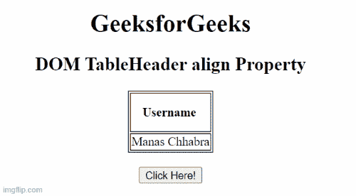

# HTML DOM 表格表头对齐属性

> 原文:[https://www . geesforgeks . org/html-DOM-table-header-align-property/](https://www.geeksforgeeks.org/html-dom-table-header-align-property/)

**HTML DOM TableHeader*****align*****属性用于设置或返回表头内容的水平对齐。HTML 5 不支持。**

****语法:****

*   **它返回*对齐*属性。**

```html
TableHeaderobject.align
```

*   **它设置*对齐*属性。**

```html
TableHeaderObject.align = "left|right|center|justify|char"
```

****属性值:****

*   ****左:**设置文本左对齐。**
*   ****右:**设置文本右对齐。**
*   ****居中:**设置文本居中对齐。**
*   ****对齐:**拉伸段落文本，使所有行的宽度相等。**
*   ****字符:**它将文本对齐设置为特定字符。**

****返回值:**返回一个字符串值，代表第<个>元素的水平对齐。**

****示例 1:** 下面的代码说明了如何返回 TableHeader *align* 属性。**

## **超文本标记语言**

```html
<!DOCTYPE html>
<html>

<head>
    <!-- Style to set border -->
    <style>
        table,
        th,
        td {
            border: 1px solid black;
        }
    </style>
</head>

<body>
    <center>
        <h1>GeeksforGeeks</h1>
        <h2>
            DOM TableHeader align Property
        </h2>
        <table>
            <tr>
                <th id="table" style="padding:15px"
                    align="left">
                    Username
                </th>
            </tr>
            <tr>
                <td>Manas Chhabra</td>
            </tr>
        </table>
        <br>

        <button onclick="clickbtn()">
            Click Here!
        </button>

        <p id="paraID"
            style="font-size:25px;color:green"></p>

        <!-- Script to access th element -->
        <script>
            function clickbtn() {
                var tab = document.getElementById(
                    "table").align;

                document.getElementById("paraID")
                    .innerHTML = tab;
            }
        </script>
</body>

</html>
```

****输出:****

****

****示例 2:** 下面的代码说明了如何设置 TableHeader *align* 属性。**

## **超文本标记语言**

```html
<!DOCTYPE html>
<html>

<head>
    <!-- Style to set border -->
    <style>
        table,
        th,
        td {
            border: 1px solid black;
        }
    </style>
</head>

<body>
    <center>
        <h1>GeeksforGeeks</h1>
        <h2>
            DOM TableHeader align Property
        </h2>
        <table>
            <tr>
                <th id="table"
                    style="padding:15px" align="left">
                    Username
                </th>
            </tr>
            <tr>
                <td>Manas Chhabra</td>
            </tr>
        </table>
        <br>

        <button onclick="click1()">
            Click Here!
        </button>

        <p id="paraID" style=
            "font-size:25px;color:green">
        </p>

    </center>

    <!-- script to access th element -->
    <script>
        function click1() {
            var tab = document.getElementById(
                    "table").align = "right";

            document.getElementById("sudo")
                .innerHTML = tab;
        }
    </script>
</body>

</html>
```

****输出:****

****

****支持的浏览器:****

*   **谷歌 Chrome**
*   **火狐浏览器**
*   **微软边缘**
*   **歌剧**
*   **旅行队**
*   **微软公司出品的 web 浏览器**